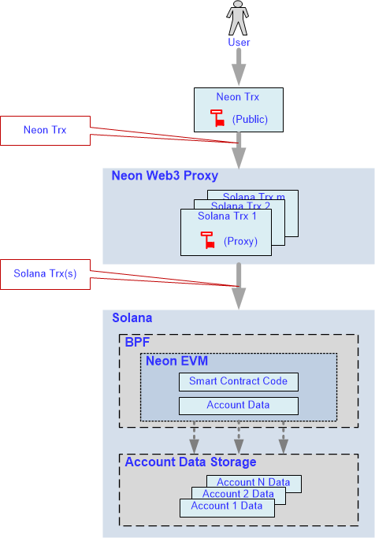
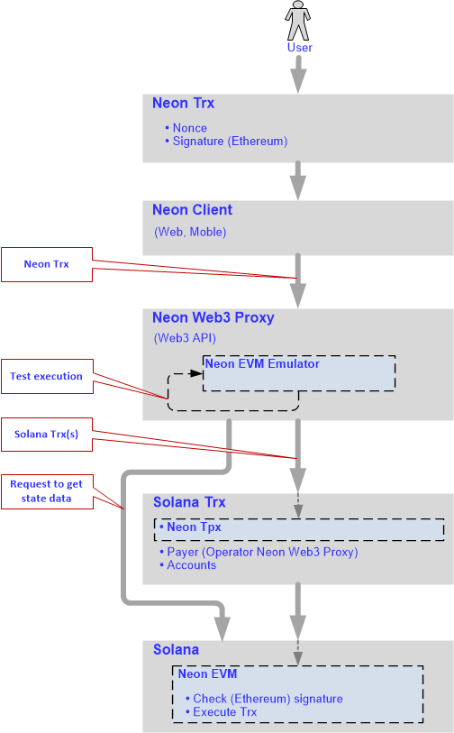

# The Ethereum and Solana capabilities in a single solution

> *This section describes a unique solution that allows Ethereum users to use the key features of Solana and vice versa - Solana users to use the key features of Ethereum.*

### Terminology used
Term | Meaning  
:----- |:-----  
*BPF* | the Berkley Packed Filter virtual machine  
*Contract* | a smart contract  
*dApp(s)* | decentralized application(s)  
*E-trx* | a transaction formed according to the Ethereum network rules  
*EVM* | the Ethereum Virtual Machine  
*Proxy* | the Neon Web3 Proxy  
*S-trx* | a transaction formed according to the Solana network rules  

## The key Ethereum capabilities

Ethereum’s core innovation, EVM is a Turing complete software that runs on the Ethereum network. EVM makes the process of creating blockchain applications much easier and efficient and enables developers to build and deploy dApps. Contracts are treated as autonomous scripts or stateful dApps that are stored in the Ethereum blockchain for later execution by the EVM.  

Ethereum has a large number of developer tools (such as *Metamask*, *Remix*, *Truffle*, and others) available in its ecosystem. The toolkit allows users to write dApps in Solidity that is most convenient for the development of contracts.  

Ethereum is the flagship of the crypto world. It runs a lot of distributed applications that have proven themselves in a market and are in demand all over the world.

## The key Solana capabilities

Solana is an exceptionally fast, secure, and inexpensive blockchain network.  
The Solana blockchain provides:
  * high performance, including:
    * short block processing time,
    * processing a large number of transactions per second (transactions can be executed in parallel),
  * low transaction fees;
  * increasing the number of nodes in the network without reducing the performance of the network as a whole;
  * building-in your language a code in *C*, *C++*, *Rust*, and *Move*.

## Goal

To find a solution that combines the best properties of both Ethereum and Solana and provides:
  * Solana users with the ability to use the unique Ethereum toolkits to write dApps in Solidity.
  * The ability for Ethereum dApps to be deployed on Solana to attract a huge audience of Ethereum users to the Solana blockchain.
  * Ethereum users with the ability to use the unique Solana properties. This allows users to significantly increase the speed of transactions and reduce the fee charged for their execution.

## Solution implemented

To achieve the goal, the following solution was proposed and implemented by the NeonLabs development team:
  * EVM was moved to Solana and named Neon EVM. This was an emulator implemented using Rust. The Neon EVM operated inside Solana providing parallel transaction processing and a low transaction fee.
  * The Neon Web3 Proxy component was created to mediate interactions between the Ethereum user (account) and the Neon EVM. The main function of Proxy was to provide an API for external clients.

## Solution in detail

The block diagram of the solution is shown in Fig. 1.  

  
  

 Fig. 1 
  

**Berkley Packed Filter**  
The BPF virtual machine is installed in Solana. The BPF allows developers to embed other virtual machines inside Solana.  

Using BPF capabilities, the EVM virtual machine was loaded inside Solana. That is, a contract called Neon EVM was created in Solana, inside of which the EVM was loaded.  

Because Solana has a contract update mechanism, the Neon EVM contract can also be updated independently of the update of the Solana node itself. This allows developers to update EVM versions for their various needs without updating all the blockchain nodes.  

**Neon Web3 Proxy**  
A user is allowed to form transactions under an Ethereum account and sign them with a public key generated in Ethereum. Formed transactions according to Ethereum rules are sent to the input of the Proxy component. This component converts *E-trxs* into transactions under the Solana rules.  

An *E-trx* size can exceed the maximum *S-trx* size. Also, the amount of resources that a *S-trx* can spend is limited. Converting a transaction in a one-to-one format is difficult due to the possible lack of resources. Therefore, it was decided to generate multiple *S-trxs* for one *E-trx*.
Each generated transaction is signed with a Proxy key. Proxy sends the generated batch of transactions to Solana.  

**Web3 API**  
Proxy provides the full Web3 API to interact with external clients. In Ethereum, some contracts work at the blockchain level, and there is also an API that is supported by an Ethereum node. Clients that are created for Ethereum contracts support standard interfaces. For a client (i.e. Metamask, Remix) to work in a web browser, it must work via the Web3 API. That is, the written client parts do not need to be rewritten again. Clients will work on a different blockchain if they are provided with the same interface. To do this, you just need to change the address where these clients need to go. Ethereum contracts and clients do not need to be rewritten to work in Solana, you just need to register the Proxy address. Any client can run a Proxy to deploy a contract inside Solana. Clients will work as they did before.

**Neon EVM**  
Solana runs BPF, inside of which Neon EVM also runs. Neon EVM is a Solana contract, so it recognizes the transaction format from the received batch. Neon EVM extracts data from each transaction and thus can retrieve all the original user information placed in the transaction.  

Neon EWM also validates a signature that is in the transaction. If the signature is authentic, Neon EVM takes the contract code to which this transaction is addressed and starts to execute it. As soon as the contract code has been executed successfully, Neon EVM fixes a new state.  
For example, if it is a token transfer, the contract code sends tokens from one account to another. Neon EVM simply fixes this new state.  

The user can also form a transaction to load a contract inside Neon EVM. In this case, the contract code will be written for Ethereum. A bytecode of this contract code will be loaded inside Neon EVM. That is, the contract itself and its data will be stored inside Solana.

**Account Data Storage**  
Solana contains storage of accounts. Neon EVM has access to this storage and uses the account data. After registering an account in Solana, its data is placed in this storage. Ethereum accounts are also stored here but in the Solana representation.  For each Ethereum address, there is a corresponding account in the Solan representation. A contract code is placed in a corresponding account of this storage. 

Neon EVM interacts with a set of data that is stored on Solana's accounts. Neon EVM can take from there a contract code using the corresponding account address to validate a transaction. Neon EVM contains a virtual machine inside it that runs according to Ethereum rules.

## How Neon works

A user calls a client that generates a transaction and sends it to the Proxy, inside which the Neon EVM emulator runs (Fig. 2). The transaction formed in accordance with the Ethereum rules contain mandatory fields, including:
  * **Nonce** - the number of transactions sent from the current address;
  * **Signature** – this is generated in accordance with the Ethereum rules;
  * **Gas price** - the fee the sender pays per unit of gas;
  * **Gas limit** - the maximum amount of gas units that can be consumed by the transaction;
  * **Value** - amount of coins to transfer from sender to a recipient;
  * **Recipient** - an address of a recipient.

  
  

 Fig. 2 
  

To perform this transaction, the Neon EVM emulator makes a request to Solana to get state data.
Proxy requests a blockchain state from Solana and makes a test launch of *E-trx* using the Solana state. On the basis of the data received, Proxy forms the new transaction according to Solana's rules. The transaction generated for Solana will contain the packaged *E-trx*, as well as the account data required to complete the transaction, including: 
  * payer - the account that pays for the transaction;
  * other accounts involved in the execution of this transaction.  

Next, the transaction is forwarded inside Solana, where participants of the transaction are determined according to the account data. The data added includes details about persons who initiate and take part in processing the transaction. The operator of Proxy is specified as a *payer*. The *payer* will be rewarded for completing the transaction.  

Next, the transaction is transferred to Neon EVM, where its signature is checked according to Ethereum rules. If the signature is valid, the transaction will be transferred to the Solana blockchain for execution. Since testing of *E-trx* is made, it is possible to provide Solana with all the necessary information to parallelize the execution of the *E-trx*.

## Conclusion

The developed solution gives users the following features:
  * No changes or additional resources are required to implement dApps on Solana.
  * No need to rewrite clients for all existing dApps, since the Ethereum node interface remains unchanged, and therefore clients can run on the Solana node also without changes.
  * No need to rewrite contracts for existing dApps.
  * Solana developers are given the opportunity to:
     * use a unique toolkit created for Ethereum;
     * create and deploy their contracts on the Solana network.
