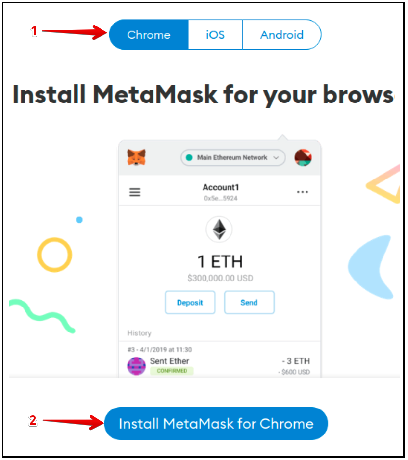
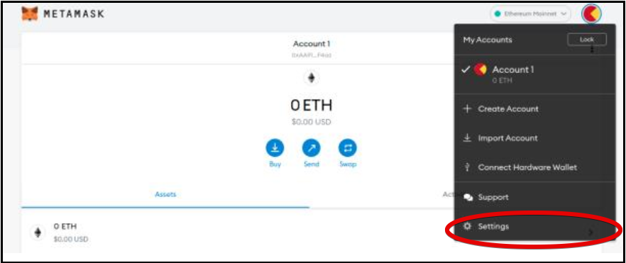
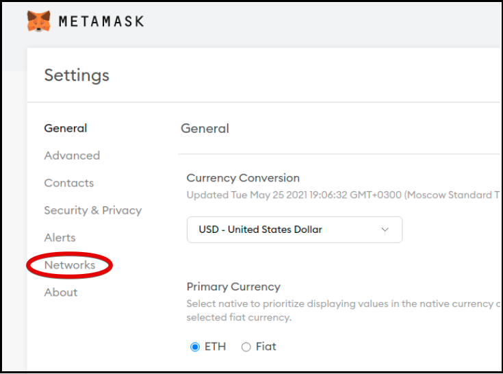

# Installing and Setting up MetaMask

MetaMask wallet is a convenient and fairly easy-to-use application for storing Ethereum addresses and private keys.

## Goal

Install the MetaMask on your device to connect the wallet to Solana Testnet environment.  

## Requirements to your device

A browser supported the MetaMask must be loaded on your device. You can use *Chrome*, *Opera*, *Firefox*, or on *iOS*, *Android* if you’re a mobile user.  

> Although this tutorial uses the *Ubuntu* platform, the instructions provided can be applied to other platforms.  

## Installing the MetaMask wallet

**Step 1.** Go to the MetaMask [Download page](https://metamask.io/download.html). From there, select any platform you use and follow the instructions to load and install the MetaMask on a browser of your device. (Fig. 1 shows an example of installing the MetaMask on the Chrome browser).  

  
  

 Fig. 1 - Loading up the MetaMask 

**Step 2.** The MetaMask is essentially a plugin in the form of an extension to a browser. Therefore, the browser supported MetaMask can get additional features. In the window appeared, click `Add extension` (Fig. 2).  

  
  

 Fig. 2 
  

When the MetaMask extension is installed, a fox's face will appear in the upper left corner of the web browser window - this is the company logo. This means that you have successfully installed MetaMask on your device and can start to use it.

**Step 3.** Create a wallet if you don't already have one. The MetaMask will offer a choice of two options for creating an account:  
* Import an existing wallet using a 12-word passphrase.
* Create a new wallet.

Go ahead and click `Create a Wallet`. On the support page `Help Us Improve MetaMask` appeared click the `I agree` button.  
The password generation form should open on the display. Enter a secret code that must contain at least 8 symbols.  
A secret phrase will be generated automatically. Write down a secret phrase for backup (preferably not on a device connected to the Internet). Without this phrase, your funds cannot be refunded if your device is damaged or lost. Confirm that you have written them down on the next page.  

After that, you should see your wallet linked to your account.

## Setting up the MetaMask wallet

You can use your wallet to interact with the Solana cluster via a proxy server. To do this, you need to configure your wallet to the desired proxy server.  
Depending on the tasks to be solved, as well as on a location of the proxy and Solana, there are 3 options for setting up the MetaMask wallet:  

  * *Option 1:* Both the proxy and Solana are hosted on the remote servers.
  * *Option 2:* The proxy is hosted locally, Solana - on a remote server.
  * *Option 3 (debug mode):* Both the proxy and Solana are hosted locally.

**Step 4.** In the upper-right corner, click the red apple view element. Select settings from the dropdown menu required to connect to the proxy server (Fig. 3).  

  
  

 Fig. 3 - Select Settings from the dropdown menu 
  

The dropdown menu elements:
* `My Accounts` - list of accounts created by your wallet.
* `Account 1` - account of your wallet that was created during the MetaMask installation. This account provides management of your wallet.
* `Create Account` - allows you to create one more account to interact with new proxy server. You can configure this wallet to interact with multiple proxy servers.
* `Import Account` - allows you to import your private key generated and saved previously into this wallet and use it in the future.
* `Connect Hardware Wallet` - allows you to save the private key to an external device (i.e. flash memory) located outside the network, increases the security of your private key. 
* `Settings` - to change the default values. By default, the wallet is configured for Ethereum addresses, including those that you can’t actually use.

**Step 5.** Click `Settings` in the dropdown menu. The window with settings menu for selecting a network should open (Fig. 4).  

  
  

 Fig. 4 - Choosing a Network 
  

**Step 6.** Add the Network choosed (Fig. 5).  

  
  

 Fig. 5 - The Networks menu 
  

The window opened contains the settings for the 6 default subnets. You need to use these settings to connect to the desired proxy. Click `Add Network` in the top-right corner.  

**Step 7.** Confirm that you fill in the fields on the next page (Fig. 6):  
* `Network Name` - defined network name.
* `New RPC URL` - path to interface
* `Chain ID` - blockchain id.
* `Currency Symbol` - coin ticker (e.g. ETH, BNB).
* `Block Explorer URL (optional)` - URL of the block browser.

The wallet settings depend on the selected option mentioned above. `New RPC URL ' - set for one of them.  

  
  

 Fig. 6 - Fill the Fields 
  

**Step 8.** Click `Save` to keep settings.  
Your MetaMask wallet has been successfully installed and ready to use!

