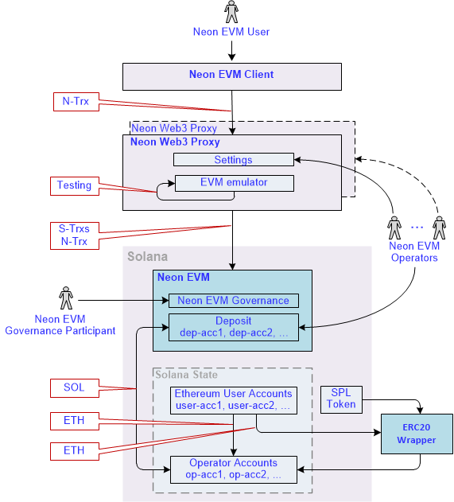
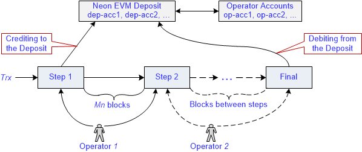

# Overview of the Neon EVM Architecture

> *This section describes the architectural solutions built into the Neon EVM that enable fast transaction processing for an Ethereum user. It also describes the ways of passing tokens from the user to the final consumer.*

## General about the problem being solved

For a user's transaction to be executed quickly, it must be finalized quickly. Therefore, the main task for the Neon EVM developers is to ensure the prompt finalization of a transaction. Also, solutions should be developed to ensure the creation of liquid tokens by Neon EVM users and their circulation within Solana.

## Solution

The architectural solution based on Neon EVM is presented in Fig. 1.

  
  

 Fig. 1 
  

Below are component descriptions of the architectural solution.

**Neon EVM User (or User)**  
This is any user who has an account in Neon EVM with a balance in ETH, ERC20, and ERC721 tokens.  

**Solana transaction (or S-trx)**  
This is a transaction formed according to the Solana network rules with a signature produced by Solana rules.  

**Neon transaction (or N-trx)**  
This is a transaction formed according to Ethereum rules with a signature produced by Ethereum rules.  

**Neon EVM Client (or Client)**  
This is an application that has an EVM (Solidity/Vyper/etc.) bytecode contract loaded into Neon EVM. The application generates a transaction *N-trx* according to Ethereum rules and sends it to a Proxy. Before sending *N-trx*, the client transfers funds to the Solana deposit required to cover the costs of an operator.  

**Neon EVM Operator (or Operator)**  
This is a role performed by a Solana account using a software tool. Within Neon EVM, an operator is provided with software in the form of a Proxy to fulfill certain functions. The operator can deploy either one Proxy or several. He can also configure one Proxy for multiple operators, as well as run several Proxy with different settings.  

**Neon Web3 Proxy (or Proxy)**  
This is software using which an operator does his job. Although Proxy is not a mandatory component in the Neon EVM architecture (for example, the Proxy logic can be implemented inside a client's browser), implementing it as a separate component can speed up transaction processing. In the Neon EVM Mainnet, Proxy must provide multithreading to work in parallel.  

The Proxy contains an EVM emulator that pre-tests the execution of the transaction. This testing determines the number of coins required on the operator's balance, as well as the current rate of SOL and ETH. This is so that there is economic motivation. Taking this into account that each operator configures a Proxy assigned to it at his discretion.  

Proxy converts *N-trx* into transactions under the Solana rules. *N-trx* is signed by a user, while *S-trxs* are signed by an operator. A separate account is created in Solana, to which the Neon transaction text is loaded from the received *S-trxs*. Neon EVM receives a command to execute the transaction located at this account address.  

Below is a list of the main Neon Web3 Proxy features that are implemented in the Neon EVM Testnet:
  * Receiving requests over Web3 API protocol.
  * Shaping responses using Web3 API protocol.
  * Packaging a Neon transaction into a Solana transaction. The Solana transaction contains the following information:
    * The Neon EVM operator account from which the amount in SOL tokens should be withdrawn for execution.
    * The Neon EVM operator account where a payment is sent for the job done in tokens specified by the user.
    * The Neon EVM account to deposit funds to be spent for iterative execution of a transaction.
    * List of accounts participating in the execution of Neon transactions (formed according to Solana rules).
    * The number of steps per iteration of a Neon transaction (see the section on iterative execution of Neon transactions).
  * Executing read-only Solidity methods of contracts.
  * Providing a method for linking accounts from SPL-token contracts to ERC20. SPL-wrapper to access SPL-token contracts via Neon transactions.
  * Providing a user with a method to switch a token to be used for gas payment.
  * Providing a user with a method to execute an Neon transaction without a test run.

**Neon EVM**  
This is an Ethereum Virtual Machine compiled into Berkeley Packet Filter bytecode of a virtual machine running on Solana. Neon EVM is configured using a multisig EVM account that looks like a decentralized Neon EVM governance. Participants of the multisig EVM account (actors) can change the Neon EVM code and set up Neon EVM parameters.  

**Neon EVM Governance Participant**  
The fuctions performed by the Governance participants:
  * updating contracts;
  * adding functionality;
  * elimination of shortcomings of the program code;
  * changing parameters in the settings (the fee value, opening new balance, the *Mn* value, the max number of iterations, etc.).  

**ERC20 TKN**  
This is a contract based on the ERC20 standard token. ERC20 Token shows user balances for a certain ticker. After an account (user-acc) selects a type of token, this contract becomes blocked.  

**SPL Token**  
SPL Token (Solana Program Library Token) is a contract containing a system register of tokens that are in the system along with the Solana balances of their users. The contract implements the ERC20 interface - this is a description of the basic set of functions that the contract must support. An operation of transferring funds is possible only with a contract that supports this interface.  

**Solana**  
This is a blockchain containing a stream of blocks. It stores a block-log of completed operations. It also contains the current Solana state, where the results of transactions, accounts, and public keys are stored. There are also 2 balances: the first one with the ETH token and the second one with the token with which a transaction will be paid.  

**ERC20 Wrapper**  
This is a separate contract developed based on the ERC20 standard. It contains maps with user balances. Although this contract is hosted inside Neon EVM, it is independent.  

A user can create a contract supporting the ERC20 standard for a specific token and generate the required number of tokens (coins). These tokens will only be liquid within Neon EVM. For these coins to be liquid in Solana, the SPL Token and ERC20 TKN contracts must be interoperable. This function is performed by the ERC20 Wrapper contract.

## Economic Game as a means of stimulating operators

The processing of a transaction is conventionally divided into several steps (iterations). Depending on the number of operations required to complete the transaction, the number of steps may vary. The next step starts only after the previous step is successfully completed (Fig. 2).

  
  

 Fig. 2 
  

A transaction will be considered successfully completed if the Final step finishes. The execution of the transaction should not go beyond the allotted number of *Mn* blocks. This means that the operations performed at all steps must be completed within the *Mn* period, otherwise, the transaction is considered uncompleted.  

A user who forms a transaction indicates in it an operator (Proxy) that will be responsible for its execution. Each operator has a deposit account in Neon EVM. These accounts belong to Neon EVM, so no one can withdraw funds from the deposit until the finalization step is completed. Before processing a transaction, Neon EVM debits the amount of funds from the operator account (op-acc) and transfers them to the operator's deposit (dep-acc).  

If for any reason (for example, due to a lack of funds on a deposit), an operation is not performed at a step, the next operator starts processing this transaction from the current step. This operator does not deposit any funds for the remaining steps. If he also does not complete all of the remaining steps, this process is passed to the next operator. At the Final step, a transaction is created to withdraw funds from the deposit in full, including a remainder, and credit them to the operator who completed this step. This implementation obliges not only the client, but also any operator involved in processing the transaction, to be interested in its successful completion.  

**Example**  
*Step 1* - transferring funds to a deposit.  
*Step 2* - blocking an account.  
*Steps* - other actions.  
*Final* - the deposit is returned to the operator's account (op acc). Results of the transaction have already been reflected in Solana State.  

In the Neon EVM settings, there is a limit on the number of blocks (*Mn*) during which a transaction must be completed. By default, the *Mn* value is 1 (that is, a transaction must be completed during the processing of one block). There is also a limit on the number of steps (the maximum number of iterations) to complete a transaction.
The values *Mn* and number of iterations are set by a Multisig account. The number of steps is also limited by funds on a user's balance.  

At every step, the Continue operation checks if this is the last step in the transaction execution or not.

### How does an operator know about the appearance of a transaction that can be continued?
Solana's entire history is stored in Solana State. Using this history, the operator can obtain the necessary information about all transactions related to Neon EVM. The Proxy can track incomplete transactions in this history, that can be continued by another operator. The operator who can continue to execute the unfinished transaction must first re-sign it with his key. If the number of blocks does not exceed *Mn* since the start of transaction processing by the previous operator, the signature of that operator is kept. If the number of blocks exceeds *Mn*, the transaction can be re-signed by any operator.

### Special cases
*Case 1*. One of the initial and mandatory operations is blocking an account, that is, the execution of other transactions is blocked for this time.  
For example, to go from step *1* to step *2* (see Fig.2), operator *1* must process *Mn* blocks. During this time, the Continue operation will not be available to other operators. If operator *1* is unable to complete a transaction during the processing of *Mn* blocks, this transaction remains incomplete. The funds on the balance are burned out.  
Therefore, every operator is interested in using high-speed resources.  

*Case 2*. A transaction cannot be completed if an error occurs.  
If step *1* is completed, and Cancel occurred in step *2*, the funds are not returned to an operator. He cannot withdraw funds from a client for partial execution of a transaction. The funds are also not returned to the client. In this case, the funds on the deposit will be burned. To don't lose funds, the operator is interested in completing the transaction in full, and not in part.  

*Case 3*. Before executing a transaction, funds are checked on the user's balance, including the exceeding Gas Limit. If a shortage of funds happens on some step, the transaction is fixed as a Fail. Funds are debited from the user's account and transferred to the operator's account.  

## Transferring tokens inside Solana
A special dApp (this is a contract) with its token balances was created in ERC20 Wrapper. Application users know the address of this dApp. To transfer funds, they need to contact this dApp address specifying an account and the number of funds to transfer. The transfer will be done within this contract.  

The interaction between SPL Token and ERC20 TKN is shown in Fig.3.  

  
  

 Fig. 3 
  

There are 2 user balances: User SPL Balance, whose tokens are traded within Solana, and User ERC20 Balance, whose tokens are traded within the Neon EVM. The ERC20 Wrapper allows a user to transfer his SPL tokens on the ERC20 Balance, exchange them for tokens he needs and withdraw them back. Thus, a user can create a token inside Neon EVM and transfer any number of coins from User SPL Balance to User ERC20 Balance. Then, using EVM contracts, he can handle these coins.

### Possible formation of a queue of payments and solution to this issue

**Issue description**  
Let the ERC20 TKN contract contain only one map for all users with their balances. Then the following conflict situation is possible: if the majority of users pay with ETH tokens, then the same contract will appear inside each *N-trx*, within which the value will need to be changed. This will cause all *N-trxs* to line up in one queue and they cannot be executed in parallel.  

The reason would be that: at the final step, funds would be transferred from the user's balance to the operator's balance within one contract.  

**The solution**  
The default token type field along with the balance is added to the Neon account. This field will allow a user to select a type of token for payment using the special option. To transfer SPL tokens from outside to an operator's account, the ERC20 wrapper is used.  

The Neon client does not have an option to select a type of token for payment and can only operate with ETH. Therefore, the storage of funds is implemented in the user's Solana State. The Neon account (user-acc) has a separate field that specifies the type of token. After a user specifies a type of token, this type will be indicated in the account field of this user. Having this information, Solana can turn to ERC20 wrapper to convert tokens.  

An operator will create a deposit account for the transaction. It is possible to create a pool of such deposit accounts, so that the ERC20 Wrapper logic will select the desired transaction from this pool, and thereby not create a queue for the payment of funds to the operator.  

## Transferring tokens between the Solana and Ethereum blockchains

ERC20 Wrapper allows a user to manipulate balances inside SPL Token. The user runs his application inside Neon EVM with logic that releases new coins. To transfer these coins to the outside world, he needs to use the ERC20 Bridge implementation. Inside Neon EVM, these coins will be blocked and transferred inside SPL Token to different addresses. They will become liquid inside Solana, but under a different token name, which is registered inside Solana.  

A user also can transfer part of the funds to his balance inside Neon EVM and convert them into a new token using a token exchange algorithm chosen by him.  

Fig. 4 shows the scheme for transferring tokens between Solana and Ethereum.  

  
  

 Fig. 4 
  

Ethereum tokens are generated in accordance with the ERC20 standard. Therefore, to transfer tokens between the Solana and Ethereum blockchains, a separate ERC20 Wrapper must be deployed for each Solana token. The task of the ERC20 Wrapper is to ensure the interaction of the Solana applications with EVM (Solidity/Vyper/etc.) bytecode contracts, as well as to transfer funds in Solana tokens using Ethereum wallets such as Metamask.  

The main interacting component in the toking transfer is the ERC20 Bridge, which is a separate contract. When it’s called, it generates a Solana token which represents the corresponding ERC20 token in the SPL Token contract. The Solana tokens registered in the SPL Token contract can be transferred to Solana contracts.  

Bridge operators are responsible for the ERC20 Bridge operation. They get fees from the conversion of tokens.

