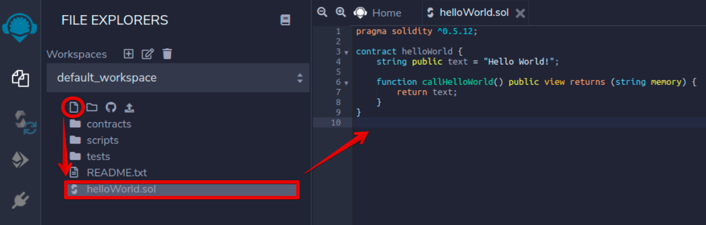
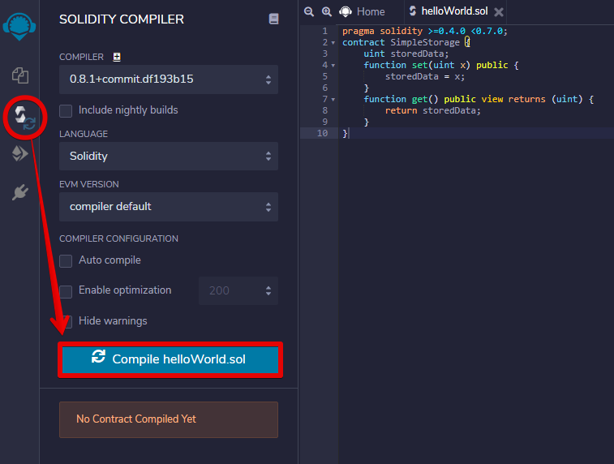
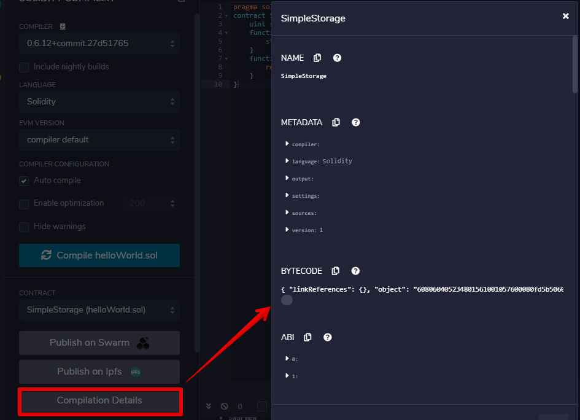
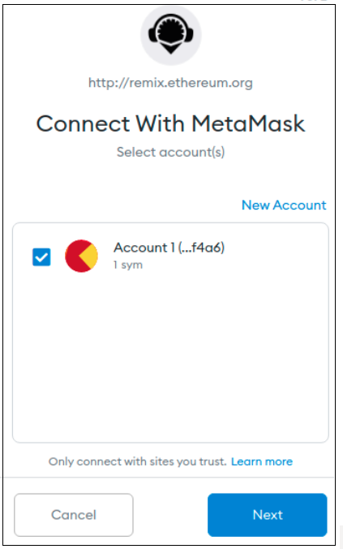
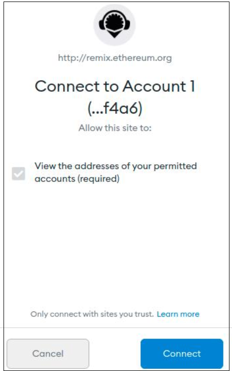
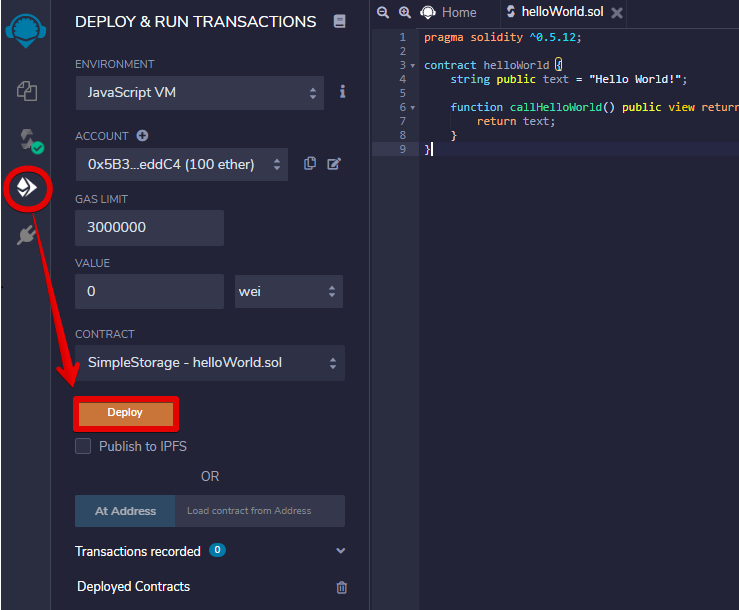
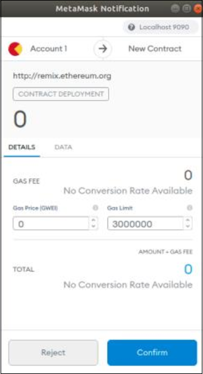
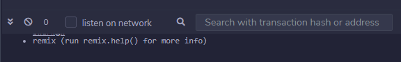
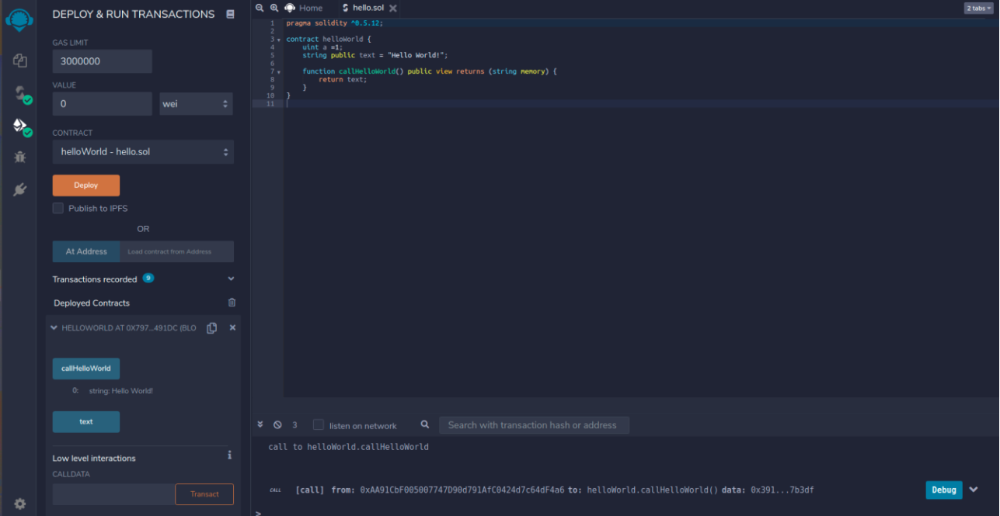
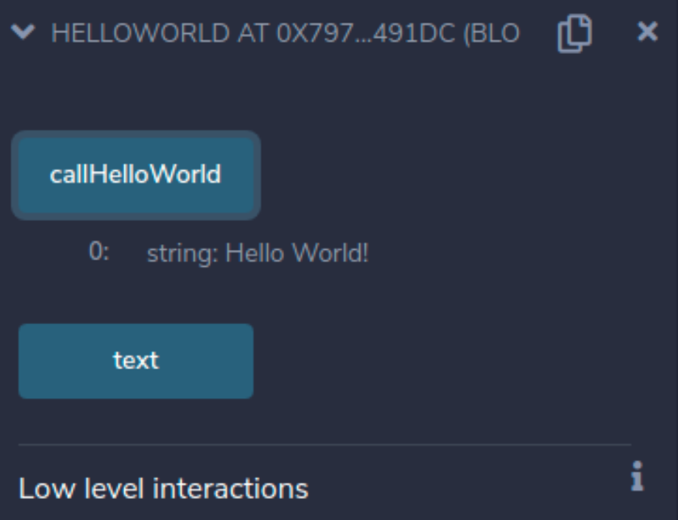

# Deploying Smart Contracts on Solana Testnet via Remix

This tutorial will show you step by step how to use Remix and Metamask to create and deploy a simple smart contract on Solana's Testnet.

## Requirements
Before you start, make sure that the following requirements are met:
  * The MetaMask wallet must be installed on your device.  
  * You must provide online access to remix.ethereum.org to use the `Remix - Ethereum IDE` open source web application.
  * MetaMask wallet must be configured for both Proxy and EVM-loader (regardless of how Proxy and EVM-loader are started, MetaMask wallet must always be configured for them).

**The network configuration:**
  * Solana cluster is accessed via a proxy.
  * Solana works in test mode and the proxy interacts with it through the EVM-loader.

## Steps to complete

### Set the Remix environment

**Step 1.** For Remix to be used to load a smart contract into the EVM-loader, Remix must be connected to your MetaMask wallet and run in `Injected Web3` environment.  
Go to http://remix.ethereum.org/ and open the `Remix - Ethereum IDE` web application. In the left side menu select the `File explorers`, it is the second button. The `FILE EXPLOPERS` menu will be active.  
At Environment field, choose `Injected Web3`to connect to localhost. (Fig. 1).  

  
  

 Fig. 1 - Connecting to localhost 
  

### Create a simple smart contract at Remix

**Step 2.** Click on the icon `Create New File` and type the file name in the field that appears below it. Let it be the smart contract named helloWorld.sol  
For now, it is an empty file. To fill it with content, click on the created file name and type the text on the right side of the explorer (or copy your pre-prepared text there)(Fig. 2).  

  
  

 Fig. 2 - Loading the helloWorld smart contract 
  

### Compile a smart contract

**Step 3.** In the left side menu select the `Solidity compiler`, it is the third button. The `SOLIDITY COMPILER` menu will be active.  
Click on the `Compile helloWorld.sol` button to compile the loaded smart contract helloWorld (Fig. 3).  

  
  

 Fig. 3 - Compiling helloWorld smart contract 
  

If the compilation is successful, a green icon will appear near the third button.  
You can also get detailed information about the compilation process by clicking the `Compilation Details` button (Fig. 4).  

  
  

 Fig. 4 - Compilation Details 
  

### Connect Remix to MetaMask

**Step 4.** Interaction with the EVM-loader is carried out through MetaMask. Choose the `Injected Web3` environment to connect Remix with an active account in Metamask (Fig. 5).  

  
  

 Fig. 5 -Injected Web3 connects Remix with an active account in Metamask 
  

The MetaMask window should appear. It should display a list of available accounts (in our case, only one account will be displayed). Choose this account and click `Next` (Fig. 6).  

  
  

 Fig. 6 - Selecting an account to interact with Remix 
  
 
Click `Connect` button to connect to this account (Fig. 7).  

  
  

 Fig. 7 
  

### Deploy a smart contract in Solana Testnet

**Step 5.** In the left side menu select the `Deploy & run transactions`, it is the fourth button. The `DEPLOY & RUN TRANSACTIONS` menu will be active.  
In our case there is only one smart contract to deploy. Therefore, it is automatically selected from dropdown and Remix will automatically generate a transaction.  
The `Account` field will display the amount of the wallet account. This data is taken from MetaMask.  
Click the `Deploy` button (Fig. 8).  

  
  

 Fig. 8 - Deploying the smart contract 
  

**Step 6.** MetaMask will send a notification in the form of a pop-up window to confirm the transaction. Click the `Confirm` button (Fig. 9).  

  
  

 Fig. 9 - MetaMask notification 
  

**Step 7.** Once the transaction is confirmed, you can check it by the appeared messages at the bottom right (Fig. 10).  

  
  

 Fig. 10 
  

After successfully deploying the smart contract, you will see a message containing the name and address of the smart contract where it was uploaded (Fig. 11).  

  
  

 Fig. 11 - Deployed the smart contract data
  

If all steps are completed successfully, a green icon will appear near the fourth button (Fig. 12).

  
  

 Fig. 12 - The final view of the Remix panel 
  

Our congratulations! Now you can call methods of the helloWorld smart contract deployed on the Solana Testnet (Fig. 13 shows the result of your smart contract - the text string "Hello World!").  

  
  

 Fig. 13 - Calling the smart contract methods 
  

----  

> **Usefull links**  
> https://ethereum.org/en/developers/tutorials/deploying-your-first-smart-contract/