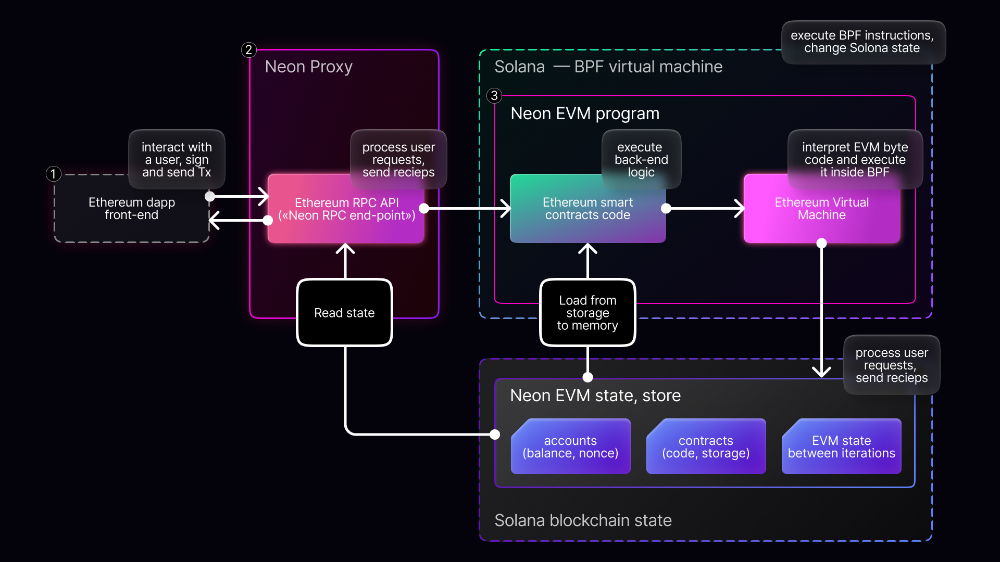

1. User send signed Ethereum-like Tx (using Ethereum-compatible wallet) to Neon RPC end-point ([How to Connect to Neon RPC](/docs/wallet/metamask_setup))
2. Neon Proxy
   * estimate gas usage for execute transaction
   * wraps Ethereum-like Tx into Solana tx
   * send it to Solana RPC, calling Neon EVM program
   * extract NeonEVM receipt from Solana receipt and pass it to the client
3. Neon EVM program
   * unwraps Ethereum-like Tx and **check user signature**
   * load EVM state, including account data and smart contracts code, from Solana storage
   * execute Ethereum-like Tx inside Solana BPF
   * save new EVM state back into Solana state
