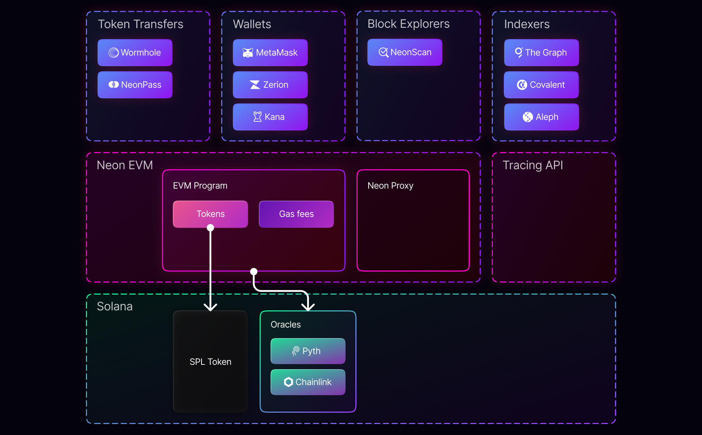

**Neon EVM** is *the* solution that makes Solana's throughput, swift block speeds, and low gas prices available to Ethereum contracts. Neon EVM interacts directly with Solana nodes to carry out txs on Solana. The service is made up of three main components:

- Neon DAO
- Neon EVM
- Neon Proxy

This page presents a high-level overview of each, and the native tools and integrations available within the Neon ecosystem.

## Neon DAO

The DAO essentially owns the Neon EVM and is also a grant-issuing authority able to direct future research and development. The Neon DAO exists as a series of contracts deployed on Solana to provide a Layer 0 (L0: a social/governance layer) to control the functionality of Neon EVM. The DAO provides a web interface to allow the community, i.e. NEON holders, to raise and vote on proposals that impact the functioning of the Neon EVM.

## Neon EVM program

The **Neon EVM program** is a smart contract on the Solana blockchain. The Neon EVM program accepts Ethereum-like transactions and processes them on Solana according to Ethereum rules. Ethereum transactions directed to the Neon EVM are called Neon Transactions. 

> **Neon Transactions**: a [subset of Ethereum's JSON-RPC Specification](/docs/evm_compatibility/json_rpc_api_methods) may be directed to the Neon EVM to be used as inputs for the targeted Neon clients.

## Neon Proxy

Neon Proxy is the "translator', an essential tool for packaging a Neon transaction into a Solana transaction. The proxy provides a containerized solution that's intuitive for [Operators](/docs/operating/overview/introduction) in the Neon ecosystem. It's the Neon Proxy that allows Ethereum dApps to be ported to Neon with virtually no code or configuration changes.

### The NEON Token

The NEON token is a utility token with 2 functions:

#### 1. Payment of gas fees

The Neon Proxy Operator accepts payment from the user in [NEON tokens](/docs/tokens/neon_token) to pay the [gas fees](/docs/tokens/gas_fees) required for transaction execution.

#### 2. Governance

Owners of the Neon token may engage in the Neon DAO activities.

### Neon Operators

**Neon Operators** run Neon Proxy servers to facilitate the seamless execution of Ethereum-like transactions on Solana. It is this proxy service that allows Ethereum dApps to be ported to Neon with no code changes. Operators accept payment in NEON and make payments within the Solana ecosystem in SOL.

## Neon Tools

### Explorers

Two explorers are available:

#### 1. NeonScan

[NeonScan](https://neonscan.org/) provides a block explorer and analytics platform to examine Neon transactions within Solana.

#### 2. NeonAnalytics

[NeonAnalytics](https://neon.aleph.cloud/) provides a block explorer providing a high-level overview of various metrics. It allows users to analyze deployed contracts.

### Tracing API

More sophisticated than NeonScan, Neon's Tracing API is an extension for Neon Proxy. It assists developers to test, debug, and understand the behavior of their smart contracts on Neon EVM. The API provides a full externality trace on any Neon transactions executed on the Solana blockchain. 

The Tracing API supports a rerun of historical transactions, runs transactions on historical states, and analyzes the state of the Solana blockchain after the execution of each instruction. 

> More details are available in [our blog](https://medium.com/neon-labs/neon-proxy-tracing-api-fdb3842a80fa).

### NeonPass

[NeonPass](https://devnet.neonpass.live/), currently available for devnet, transfers ERC-20 tokens between Solana and Neon EVM. The [ERC-20 SPL wrapper](/docs/developing/deploy_facilities/interacting_with_spl_tokens) makes such transfers possible via (non-custodial) wallets.

> See the [NeonPass guide](/docs/token_transferring/neonpass_usage).

### NeonFaucet

[NeonFaucet](https://neonfaucet.org/) provides NEON test tokens and other ERC-20 test tokens to be used for testing applications on devnet.

## Integrations

Neon EVM integrates with several essential services:

### Oracles

Oracles enable the decentralized Web3 ecosystem to access price feeds and other external (off-chain) data sources. Neon EVM supports querying data from Solana deployed Oracles:  
* [Chainlink](/docs/developing/integrate/oracles/integrating_chainlink)
* [Pyth](/docs/developing/integrate/oracles/integrating_pyth)

### Wallets

Neon EVM is supported by the MetaMask non-custodial wallet.

