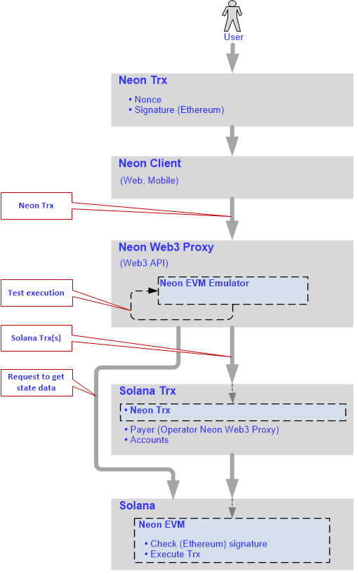

*This section describes a unique solution that allows Ethereum users to use the key features of Solana and vice versa.*

### Terminology

  * **BPF** - the Berkeley Packet Filter virtual machine
  * **Contract** - smart contract
  * **dApp** - a decentralized application (plural: dApps)
  * **N-tx** - a Neon transaction formed according to the Ethereum network and executed inside Neon EVM
  * **EVM** - the Ethereum Virtual Machine
  * **Proxy** - Neon Web3 Proxy
  * **S-tx** - a transaction formed according to the rules of the Solana network

## Key capabilities of Ethereum

Ethereum’s core innovation, the EVM, is a Turing-complete software that runs on the Ethereum network. The EVM allows developers to build and deploy dApps, which makes the process of creating blockchain applications much easier and more efficient. Contracts are treated as autonomous scripts or stateful dApps that are stored in the Ethereum blockchain for execution by the EVM at a later stage.

Ethereum has a large number of developer tools available in its Ecosystem, including *MetaMask*, *Remix*, and *Truffle*. The toolkit allows users to write dApps in Solidity, which is the standard language for developing contracts.

Ethereum is the flagship of the crypto world. It runs numerous dApps that have proven themselves in the market and are in demand all over the world.

## Key capabilities of Solana

Solana is an exceptionally fast, secure, and relatively inexpensive blockchain network.  
The Solana blockchain provides:
  * High performance, including:
    * Short block processing time
    * Processing many transactions per second due to the ability to execute transactions in parallel
  * Low transaction fees
  * The ability to increase the number of nodes in the network without reducing the performance of the network as a whole
  * The capability to build in coding languages *C*, *C++*, and *Rust*

## The goal

The goal was to find a solution that combined the best of both Ethereum and Solana. This solution allows:
  * Solana users to use Ethereum toolkits to write dApps in Solidity
  * Ethereum dApps to deploy on Solana, thereby attracting the huge audience of Ethereum users to the Solana blockchain
  * Ethereum users to significantly increase the speed of transactions and reduce the fee charged for their execution by using Solana

## The solution

Neon EVM provides:
  * An EVM integrated with Solana (an emulator implemented using Rust)
  * Solana's parallel transaction processing and a low transaction fee
  * Neon Proxy: to mediate interactions between the Ethereum user (account) and Neon EVM
  > The main function of the Proxy is to provide an API for external clients

## The solution in detail

The block diagram of the solution is shown in Fig. 1.

Fig. 1

### Berkeley Packet Filter (BPF)

The BPF virtual machine is installed in Solana, allowing developers to embed other virtual machines inside Solana.  

Using BPF capabilities, a contract called Neon EVM was created in Solana with the EVM loaded inside it.  

Because Solana has a contract update mechanism, the Neon EVM contract can also be updated independently from updates to the Solana node itself. This allows developers to update EVM versions without updating all the blockchain nodes.  

### Neon Proxy

A user can form transactions under an Ethereum account and sign them with a public key generated in Ethereum. Transactions formed according to Ethereum rules are sent to the input of the Proxy component. This component converts N-txs into transactions under Solana rules.  

Converting a transaction in a one-to-one format is difficult due to two Solana constraints:
- The size of N-tx can exceed that of S-tx
- The amount of resources that an S-tx can spend is limited

To overcome these, Neon Proxy generates multiple S-txs for one N-tx. Each transaction generated is signed with a Neon Proxy key. Neon Proxy then sends the batch of transactions to Solana.  

### Web3 API

Neon Proxy provides the full Web3 API to interact with external clients. In Ethereum, some contracts work at the blockchain level, and there is also an API that is supported by an Ethereum node. Clients that are created for Ethereum contracts support standard interfaces. For a client (such as MetaMask or Remix) to work in a web browser, it must work via the Web3 API. With Neon EVM, Ethereum dApps can be deployed on Solana with minimal reconfiguration of the source code: dApps look and function exactly the same.  

Clients work on a different blockchain via the same interface by changing the address to which the clients are directed. This allows Ethereum contracts and clients to work in Solana by updating the registered proxy address and minimal reconfiguration. Any client can run a proxy to deploy a contract inside Solana. The interface that the clients interact with will be the same as for dApps running on Ethereum.

<!-- not yet true that any client can run a proxy to deploy a contract inside Solana is it todo -->

### Neon EVM

The Neon EVM runs inside BPF, which is run by Solana. The Neon EVM is a Solana contract, so it recognizes the transaction format from the received batch. Neon EVM extracts data from each transaction, and therefore it can retrieve all the original user information that was placed in the transaction.  

(<!-- I can't unpack the preceeding p todo -->)

The Neon EVM also validates the N-tx signature. If the signature is authentic, the Neon EVM takes the contract code that the transaction is addressed to and starts to execute it. As soon as the contract code has been executed successfully, Neon EVM records a new state.  

For example, if the transaction is a token transfer, the contract code sends tokens from one account to another. The Neon EVM records this new state.  

The user can also form a transaction to load a contract inside Neon EVM. In this case, the contract code will be written for Ethereum. A bytecode of this contract code will be loaded inside the Neon EVM. The contract itself and its data will be stored inside Solana.  

### Account data storage

Solana stores account data in temporary storage. The Neon EVM has access to this storage, and uses the account data. After an account is registered in Solana, the account data is placed in this storage. Each Ethereum address corresponds to a Solana account, and contract code is placed into the corresponding account's storage.  

Neon EVM interacts with a set of data that is stored on Solana's accounts. The Neon EVM can take a contract code from there using the corresponding account address to validate a transaction. The Neon EVM contains a virtual machine inside it that runs according to Ethereum rules.  

<!-- final line of the above p does not belong here todo -->

## How Neon works

A user calls a client that generates a transaction and sends it to the proxy, which is running the Neon EVM emulator inside it. (Fig. 2). The transaction is formed in accordance with the Ethereum rules, and contains mandatory fields, including:
  * **Nonce** - the number of transactions sent from the current address
  * **Signature** - generated in accordance with the Ethereum rules
  * **Gas price** - the fee the sender pays per unit of gas
  * **Gas limit** - maximum amount of gas units that can be consumed by the transaction
  * **Value** - amount of coins to transfer from sender to a recipient
  * **Recipient** - address of the recipient

Fig. 2

To perform this transaction, the Neon EVM emulator makes a request to Solana to get state data. The proxy requests a blockchain state from Solana and makes a test launch of N-tx using the Solana state. On the basis of the data received, Neon Proxy forms the new transaction according to Solana's rules. The transaction generated for Solana will contain the packaged N-tx, as well as the account data required to complete the transaction, including:
  * The payer: the account that pays for the transaction
  * Other accounts involved in the execution of this transaction

Next, the transaction is forwarded inside Solana, where participants of the transaction are determined according to the account data. The data added includes details about people who initiate and take part in processing the transaction. The operator of the proxy is specified as the payer. The payer will be rewarded for completing the transaction.  

Next, the transaction is transferred to Neon EVM, where its signature is checked according to Ethereum rules. If the signature is valid, the transaction will be transferred to the Solana blockchain for execution. Since testing of N-tx is carried out, it is possible to provide Solana with all the necessary information to run the execution of the N-tx in parallel.  

## Benefits of the Neon solution

Neon's solution offers the following benefits:
  * No changes or additional resources are required to implement dApps on Solana.
  * No need to rewrite clients for all existing dApps since the Ethereum node interface remains unchanged, and therefore clients can also run on the Solana node without changes.
  * No need to rewrite contracts for existing dApps.
  * Solana developers are given the opportunity to:
     * Use a unique toolkit created for Ethereum.
     * Create and deploy their contracts on the Solana network.
  * Unlike Ethereum, Neon EVM can be updated at any time, which means that new functionality can be added at any time and code updates can take place simply by uploading them as a new smart contract.
