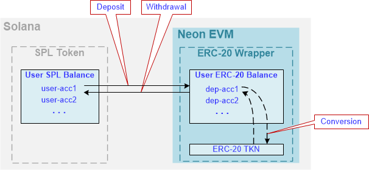

*This section describes the architectural solutions built into Neon EVM that enable fast transaction processing for Ethereum users. It also describes how tokens pass from users to final consumers.*

## General

For a user's transaction to be executed quickly, it must be finalized quickly. Therefore, the main task for Neon EVM developers is to ensure the prompt finalization of a transaction. Also, solutions should be developed to ensure the creation of liquid tokens by Neon EVM users, and their circulation within Solana.

## Solution

The architectural solution based on Neon EVM is presented in Fig. 1.

 

Fig. 1

The components of the architecture are:

### Neon EVM User (user)
Any user who has an account in Neon EVM with a balance in ETH, ERC-20, or ERC-721 tokens.  

### Solana Transaction (S-tx)
A transaction formed according to Solana network rules with a signature produced by Solana rules.  

### Neon Transaction (N-tx)
A transaction formed according to Ethereum rules with a signature produced by Ethereum rules.  

### Neon EVM Client (client)
An application that has an EVM (Solidity, Vyper, etc.) bytecode contract loaded into Neon EVM. The application generates a transaction N-tx according to Ethereum rules and sends it to a proxy. Before sending N-tx, the client transfers the required funds to the Solana deposit to cover the costs of an operator.  

### Neon EVM Operator (operator)
A role performed by a Solana account using a software tool. Within Neon EVM, an operator is provided with software in the form of a proxy in order to fulfill certain functions. The operator can deploy one or more proxies. The operator can also configure one proxy for multiple operators, as well as run several proxies with different settings.  

### Neon Web3 Proxy (proxy)
The software that an operator uses to do their job. Although the proxy is not a mandatory component in the Neon EVM architecture (for example, proxy logic can be implemented inside a client's browser), implementing it as a separate component can speed up transaction processing. In the Neon EVM Mainnet, the proxy must provide multithreading to work in parallel.  

The proxy contains an EVM emulator that pre-tests the execution of the transaction. This testing determines the number of coins required on the operator's balance, as well as the current exchange rate of SOL to ETH. Each operator configures their proxy server with this course in mind. This relates to economic motivation.  

A proxy converts N-tx into transactions under Solana rules. N-tx is signed by a user, while S-txs are signed by an operator. The Neon transaction text is loaded from the received S-txs into a separate account that is created in Solana. Neon EVM receives a command to execute the transaction located at the address of this account.  

More details on how the proxy converts a N-tx to multiple S-txs can be found [here](https://neonlabsorg.medium.com/neon-web3-proxy-facilitating-seamless-transactions-on-neon-evm-b33c2041aa08).

Below is a list of the main Neon Web3 Proxy features that are implemented in the Neon EVM:
  * Receiving requests over Web3 API protocol
  * Shaping responses using Web3 API protocol
  * Packaging a Neon transaction into a Solana transaction. The Solana transaction contains the following information:
    * The Neon EVM operator account from which the given amount in SOL tokens should be withdrawn for the execution of the transaction
    * The Neon EVM operator account where a payment is sent for the job done in tokens specified by the user
    * The Neon EVM account to deposit funds to be spent for iterative execution of a transaction
    * A list of accounts that are participating in the execution of Neon transactions (formed according to Solana rules)
    * The number of steps per iteration of a Neon transaction
  * Executing read-only Solidity methods of contracts
  * Providing a method for linking accounts from SPL token contracts to ERC-20: an SPL wrapper to access SPL token contracts via Neon transactions
  * Giving users a method to switch a token to be used for gas payment
  * Giving users a method to execute a Neon transaction without a test run.

### Neon EVM
An Ethereum Virtual Machine compiled into the Berkeley Packet Filter bytecode of a virtual machine running on Solana. Neon EVM is configured using a multisig EVM account that resembles a decentralized Neon EVM governance. Participants of the multisig EVM account (actors) can change the Neon EVM code and set up Neon EVM parameters.  

### Neon EVM Governance Participant
Governance participants perform the following functions:
  * Updating contracts
  * Adding functionality
  * Eliminating shortcomings in the program code
  * Changing settings parameters such as the fee value, opening a new balance, the Mn value and the maximum number of iterations.  

### ERC-20 token
This is a contract based on the ERC-20 standard token. An ERC-20 token shows user balances for a certain ticker. After an account (user-acc) selects a type of token, this contract becomes blocked.  

### SPL Token
Solana Program library (SPL) token is a contract that contains a system register of tokens that are in the system, along with the Solana balances of their users. The contract implements the ERC-20 interface; this is a description of the basic set of functions that the contract must support. Transferring funds is possible only with a contract that supports this operation.  

### Solana
This is a blockchain containing a stream of blocks. It stores a block-log of completed operations. It also contains the current Solana state, where the results of transactions, accounts, and public keys are stored. There are also two balances: one for ETH tokens, and another for the token that the transaction will be paid in.  

### ERC-20 Wrapper
This is a separate contract developed using the ERC-20 standard. It contains maps with user balances. Although this contract is hosted inside Neon EVM, it is completely standalone and independent.  

A user can create a contract supporting the ERC-20 standard for a specific token and generate the required number of tokens (coins). These tokens will only be liquid within Neon EVM. For these coins to be liquid in Solana, the SPL Token and ERC-20 TKN contracts must be interoperable. This function is performed by the ERC-20 Wrapper contract.

## Using Economics to Motivate Operators

Conventionally, the processing of a transaction is divided into several steps (iterations). The number of steps may vary depending on the number of operations required to complete the transaction. The next step starts only after the previous step has been successfully completed (Fig. 2).

 

Fig. 2

A transaction is considered to be successfully completed if the "Final" step finishes. The execution of the transaction should not go beyond the allotted number of Mn blocks. In other words, the operations performed at all steps must be completed within the Mn period or the transaction is considered incomplete.  

A user who forms a transaction will indicate an operator (proxy) within it. That operator will be responsible for the execution of the transaction. Each operator has a deposit account in Neon EVM. These accounts belong to Neon EVM, so no one can withdraw funds from the deposit account until the finalization step has been completed. Before processing a transaction, Neon EVM debits the funds from the operator account (op-acc) and transfers them to the operator's deposit account (dep-acc).  

If for any reason an operation is not performed at a given step (such as lack of funds), the next operator starts processing the transaction from the current step. This operator does not deposit any funds for the remaining steps. If they also do not complete all of the remaining steps, this process is passed to the next operator. At the "Final" step, a transaction is created that withdraws funds from the deposit in full and credits them to the operator who completed this last step. This method of implementation motivates not only the client, but also any operator involved in processing the transaction to have a vested interest in making sure that the transaction is successfully completed.  

**Example:**  
*Step 1*: Transferring funds to a deposit.  
*Step 2*: Blocking an account.  
*Additional Steps*: Other actions.  
*Final Step*: The deposit is returned to the operator's account (op acc). The results of the transaction have already been reflected in the Solana state.  

In the Neon EVM settings, there is a limit on the number of blocks (Mn) that can be processed during a transaction. By default, the Mn value is 1. That is, a transaction must be completed during the processing of one block. There is also a limit on the number of steps (iterations) that can be taken to complete a transaction. The Mn value and the number of iterations are set by a multisig account. The number of steps is also limited by a user’s fund balance.  

At every step, the "Continue" operation checks whether or not this is the last step in the transaction execution.

### How can operators find out about the transactions that are ready to be continued?
Solana's entire history is stored in the Solana state. Using this history, the operator can obtain the necessary information about all transactions related to Neon EVM. The proxy can track incomplete transactions in this history: transactions that can be continued by another operator. The operator who wishes to continue executing the unfinished transaction must first re-sign it with their key. If the number of blocks does not exceed Mn since processing was initiated by the previous operator, the signature of the initial operator is kept. If the number of blocks exceeds Mn, the transaction can be re-signed by any operator.

### Special Cases
*Case 1*: One of the initial and mandatory operations is blocking an account. That is, the execution of other transactions is blocked for an amount of time.

If an operator is interested in reducing this amount of time, they must complete a transaction in Mn blocks, otherwise another operator will perform this transaction.

For example (see Fig. 2), to go from Step 1 to Step 2, Operator 1 must process Mn blocks. During this time, the "Continue" operation will not be available to other operators. If Operator 1 is unable to complete a transaction during the processing of Mn blocks, this transaction remains incomplete. The funds on the balance are burned out.  

Therefore, it is in every operator’s best interest to use high-speed resources.  

*Case 2*: A transaction cannot be completed if an error occurs.  
If Step 1 is completed and "Cancel" occurred in Step 2, the funds are not returned to the operator. Funds cannot be withdrawn from a client for the partial execution of a transaction. The funds are also not returned to the client. In this case, the funds on the deposit will be burned. To avoid losing funds, the operator is compelled to complete the transaction in full, not in part.  

*Case 3*: Insufficient funds. Before executing a transaction, two things are checked: the user’s account balance, and whether the gas limit will be exceeded. If there is a shortage of funds during any of the steps, the transaction is labelled as "Fail" and funds are debited from the user's account and transferred to the operator's account.  

## Transferring Tokens Inside Solana
The ERC-20 wrapper, a special dApp (contract) with token balances, has been created. Application users know the address of this dApp. To transfer funds, they need to contact this dApp address and specify an account and the amount of funds to transfer. The transfer will take place within this contract.  

The interaction between the SPL token and ERC-20 TKN is shown in Fig.3.  

 

Fig. 3

There are two user balances:  
  * User SPL Balance, whose tokens are traded within Solana.
  * User ERC-20 Balance, whose tokens are traded within Neon EVM.  

The ERC-20 wrapper allows users to transfer their SPL tokens on the ERC-20 Balance, exchange them for tokens they need, and withdraw them back. Thus, a user can create a token inside Neon EVM and transfer any number of coins from User SPL Balance to User ERC-20 Balance. Then, using EVM contracts, they can use these coins.

### Payment Queues

**The Issue**  
If the ERC-20 TKN contract contains only one map for all users and their balances, it can result in an issue: if the majority of users pay with ETH tokens, then the same contract will appear inside each N-tx, where the value will need to be changed.  

This will cause all N-txs to line up “single file”, and they cannot be executed in parallel. This is because at the final step, the funds would be transferred from the user's balance to the operator's balance within one contract.  

**The Solution**  
The default token type field is added to the Neon account along with the balance. This field provides a special option that will allow a user to select a type of token for payment. The ERC-20 wrapper can be used to transfer SPL tokens from outside to an operator's account.  

The Neon client does not have an option to select a type of token for payment, and can only operate with ETH. Therefore, the storage of funds is implemented in the user's Solana state. The Neon account (user-acc) has a separate field that specifies the type of token. After a user specifies a type of token, this type will be indicated in the account field of this user. With this information, Solana can use the ERC-20 wrapper to convert tokens.  

An operator creates a deposit account for the transaction. It is possible to create a pool of such deposit accounts so that the ERC-20 wrapper logic will select the desired transaction from this pool rather than creating a queue for the payment of funds to the operator.

## Transferring Tokens Between Solana and Ethereum

The ERC-20 wrapper allows users to manipulate balances inside SPL tokens. The user runs an application inside Neon EVM with logic that releases new coins. To transfer these coins to the outside world, they need to use the ERC-20 bridge implementation. Inside Neon EVM, these coins will be blocked and transferred inside the SPL token to different addresses. They will become liquid inside Solana, but under a different token name, which is registered inside Solana.  

A user can also transfer part of the funds to their balance inside Neon EVM and convert it into a new token using a token exchange algorithm of their choice.  

Fig. 4 shows the process for transferring tokens between Solana and Ethereum.

 

Fig. 4

Ethereum tokens are generated in accordance with the ERC-20 standard. Therefore, to transfer tokens between the Solana and Ethereum blockchains, a separate ERC-20 wrapper must be deployed for each Solana token. The ERC-20 wrapper’s job is to ensure that the Solana applications interact with EVM (Solidity, Vyper, etc.) bytecode contracts, as well as to transfer funds in Solana tokens using Ethereum wallets such as MetaMask.  

The main interacting component in the token transfer is the ERC-20 bridge, which is a separate contract. When it’s called, it generates a Solana token, which represents the corresponding ERC-20 token in the SPL token contract. The Solana tokens registered in the SPL token contract can be transferred to Solana contracts.  

Bridge operators are responsible for the ERC-20 bridge operation. They get fees from the conversion of tokens.
