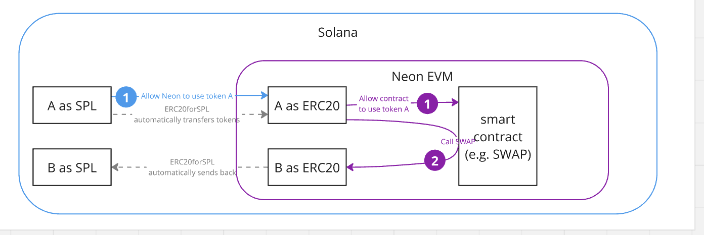

## Automatic SPL ↔ ERC-20 token handling with ERC20forSPL

This document describes, in production-ready detail, how the **ERC20forSPL** system program transparently wraps any SPL token as a canonical ERC-20 inside **Neon EVM**, how that wrapped asset is consumed by arbitrary Solidity code, and how the resulting balance is un-wrapped back to the originating Solana wallet – all inside a single outer Solana transaction.

### Components

| Layer | Element | Role in the flow |
| --- | --- | --- |
| Solana | User’s SPL token accounts (token A, token B, …) | Hold the real liquidity. |
| Solana | ERC20forSPL program + vault PDA | Custodies the SPL liquidity and mints/burns the mirrored ERC-20 supply. |
| **Neon EVM** | **Wrapped ERC-20 contracts** (token A, token B, …) | One-to-one representations of the SPL mints; standard IERC20 ABI. |
| **Neon EVM** | **Application contract** | Any Solidity logic that spends A and produces B (DEX, lending pool, etc.). |

### End-to-end sequence

| Step | Signed by | Action | Internals |
| --- | --- | --- | --- |
| 1. Grant Neon access to token A (SPL) | User (Solana) | `spl-token approve <vault> x` | ERC20forSPL transfers *x* token A into its vault and mints *x* token A (ERC-20) to the user’s Neon address. |
| 2. Allow the application contract to spend token A (ERC-20) | User (Neon) | `IERC20(A).approve(contract, x)` | Standard ERC-20 allowance inside Neon. |
| 3. Call the application contract | User (Neon) | `contract.swap(x A)` (example) | Contract pulls *x* token A (ERC-20), executes its logic, and sends *y* token B (ERC-20) to the caller. |
| 4. Convert the result back to SPL | ERC20forSPL | — | On receipt of *y* token B (ERC-20), the program burns those units and transfers *y* token B (SPL) from its vault back to the user’s SPL account. |
| 5. Final state | — | — | User’s Neon balances are zero; wallet now holds *y* token B as an ordinary SPL asset. |

All of the above instructions are bundled into one Solana transaction. The conversion logic (mint → burn) runs inside the Solana compute budget; the only EVM gas paid is for the application contract itself.
