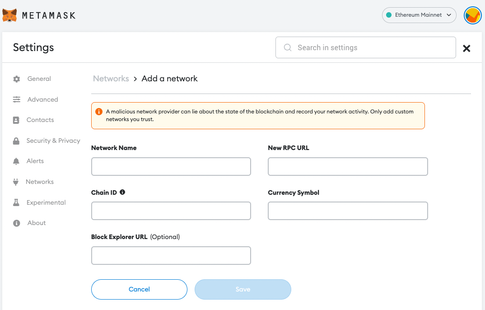
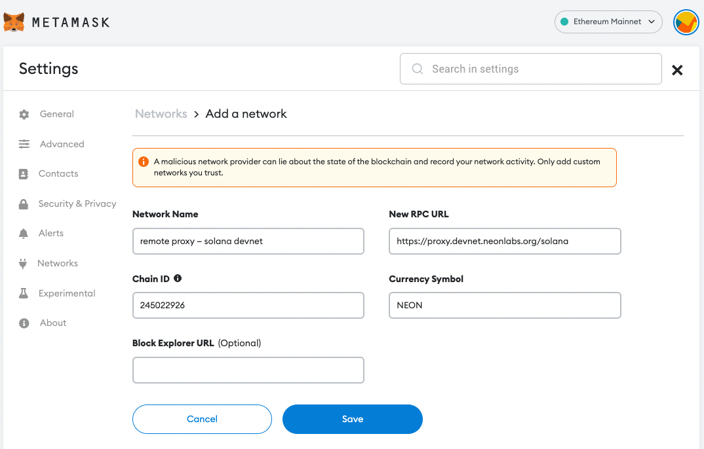

## Device Requirements

The MetaMask wallet must be already installed on your device.  

> Although this tutorial uses the *Ubuntu* operating system, these instructions can be applied to other Linux distros as well.

### Network Configuration
  * The [Solana cluster](https://docs.solana.com/cluster/overview) is accessed via a proxy hosted on a remote virtual server.
  * Solana works in test mode (recommended) and the proxy interacts with it through the Neon EVM.

## Steps

### Step 1: Install MetaMask
Install MetaMask by clicking the "Download now" on [MetaMask's homepage](https://metamask.io/).

### Step 2: Create a New MetaMask Account
Open your MetaMask wallet, and in the upper-right corner, click on the account icon.  
Click `Create Account` in the dropdown menu and create a new account by giving it a descriptive name.

### Step 3: Connect MetaMask to Neon EVM Devnet
In this step, you will connect to the Solana [Devnet](https://docs.solana.com/clusters#devnet) cluster. There are two ways to do so: using Chainlist.org or manually.

#### Option A: Connect with Chainlist.org
Go to [Chainlist](https://chainlist.org/) and type `Neon` in the search bar. You should see `Neon EVM Devnet` and `Neon EVM MainNet`.  

Select `Neon EVM Devnet` and click `Connect Wallet`. A MetaMask pop-up window will show. Click `Next` and then `Connect`. You can now access the [Solana cluster](https://docs.solana.com/clusters) and carry out transactions.

#### Option B: Connect Manually with MataMask
Alternatively, you can connect to Neon EVM Devnet manually via MetaMask. Open your MetaMask wallet under the new account, click `Ethereum Mainnet`, and then click `Add Network` in the dropdown menu. The settings menu window for adding a new network should open in a new page, as follows.  

fill in the fields in the open window as follows:
  * `Network Name`: "remote proxy — solana devnet"
  * `New RPC URL`: `https://proxy.devnet.neonlabs.org/solana`
  * `Chain ID`: 245022926
  * `Currency Symbol`: NEON

After filling in the fields, click `Save`. You can now access the [Solana cluster](https://docs.solana.com/clusters) and carry out transactions.