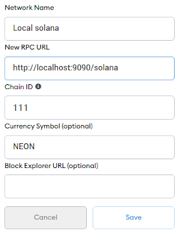
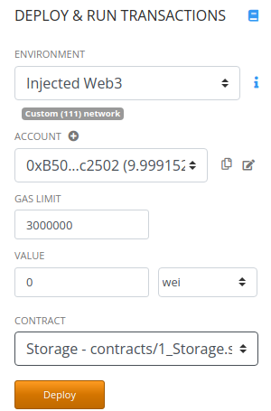

# Local Neon EVM infrastructure

*This guide describes how to install, configure and test the local Solana cluster with Neon EVM on-board. It helps new developers to create their own environment and run Ethereum programs, wrapped into Neon EVM. All you need is to follow this guide step by step.*

The [Neon EVM](https://neon-labs.org/) is a solution that performs transaction execution outside layer 1. The development process can be run on any modern Linux or Mac system, though this document is based on Ubuntu 20.04 experience.

## Prerequisites

* [Docker](https://docs.docker.com/engine/install/ubuntu/)
* [Docker-compose](https://docs.docker.com/compose/install/)
* A Chromium-based browser for [Metamask](https://metamask.io/) and [Remix](https://remix.ethereum.org/)
* [Node.js/npm](https://www.w3schools.com/nodejs/nodejs_npm.asp)

## Setting up the Solana Cluster

All you need to have the Solana Cluster with Neon EVM on board is to deploy multi-container environment with [the following compose file](docker-compose-local.yml) and of course you should have `docker` and `docker-container` apps installed.

```sh
$ docker-compose -f docker-compose-local.yml up -d
Creating solana   ... done
Creating postgres ... done
Creating evm_loader ... done
Creating proxy      ... done
$ ls ./solana_state
ledger  run
```

Once you deploy the environment you'll have the Solana RPC endpoint working from the docker container at the 9090 port. 
The folder named "solana_state" will be created as well, it contains the solana's ledger to keep the state over restarts. If you need to reset the ledger just remove this folder and it'll be recreated after next-time running docker-compose.

## Logs

To look for events or errors that you can be interested in just run the `docker logs` for either `solana` or `proxy` container:

```sh 
$ docker logs -f solana 2>&1 | grep -v "Program Vote111111111111111111111111111111111111111"
$ docker logs -f proxy
```

## Remix and Metamask with Neon EVM

Setup the "Metamask" Chromium extension to connect to the proxy via Custom RPC at `http://localhost:9090/solana`. The following image describes how to set up the local Solana connection:  

<div class='neon-img-box-300' style={{textAlign: 'center'}}>  



</div>

Worth remarking is that once you create or import new account in metamask there some NEONs will be airdropped onto it.

Open Remix (also in Chromium) and select `Injected Web3` environment. You can deploy EVM-wrapped smart contracts on Solana and invoke instructions:  

<div class='neon-img-box-300' style={{textAlign: 'center'}}>  



</div>


## Truffle suite with Neon EVM

Truffle is a popular platform to deploy and test solidity programs. This section is to check Neon EVM and truffle suite compatibility.

In the new terminal, create a truffle project and deploy contracts into EVM:

```sh
$ sudo npm install -g truffle
$ mkdir myproject && cd myproject
$ truffle init
$ npm install web3 @truffle/hdwallet-provider
```

### Common truffle settings

Put your `truffle-config.js` into the truffle root:

```sh
$ echo 'const Web3 = require("web3");

const Web3eth = require("web3-eth");
const HDWalletProvider = require("@truffle/hdwallet-provider");

const web3eth = new Web3eth();
const accs = Array.from(Array(10), (_, x) => web3eth.accounts.create());
const privateKeys = accs.map((account) => account.privateKey);

module.exports = {
  networks: {
    solana: {
      provider: new HDWalletProvider(privateKeys, "http://127.0.0.1:9090/solana"),
      from: accs[0].publicKey,
      network_id: "111",
      gas: 3000000,
      gasPrice: 1000000000,
    }
  },

  compilers: {
    solc: {
      version: "0.8.9"
    }
  }
};' > truffle-config.js
```

### Contract creating

Create a trivial contract at `contracts/Storage.sol`:

```sh
$ echo '// SPDX-License-Identifier: GPL-3.0

pragma solidity >=0.7.0 <0.9.0;

contract Storage {
    uint256 number;

    function put(uint256 num) public {
        number = num;
    }

    function get() public view returns (uint256) {
        return number;
    }
}' > contracts/Storage.sol
```

### Testing

You can now start testing `Storage` invocations with truffle facility:

```sh
$ echo 'const Storage = artifacts.require("Storage");

contract("Storage", (accounts) => {
    let storage;

    beforeEach(async () => {
        storage = await Storage.new();
    });

    it("should store a value", async () => {
        const setResult = await storage.put(248);
        assert.equal(setResult.receipt.status, true);
        const value = await storage.get();
        assert.equal(value, 248);
    })
})' > test/Storage.test.js

$ truffle test test/Storage.test.js --network solana
```

### Possible problems

If for some reasons you remove the Solana container and run it again then all related accounts, stored in foreign systems, get invalid from that moment. That's why you need to re-run proxy container and reset the state of Metamask and truffle as well, to make all relations consistent.

To reset the metamask state, follow the steps `Settings`, `Advanced`, `Reset Account`, .

The truffle state can be reset by redeploying in the following way:

```sh
$ truffle compile --network solana --reset
```

---

*Welcome to deploy your solidity programs on [Solana](https://solana.com) driven [Neon EVM](https://neon-labs.org/)*.
