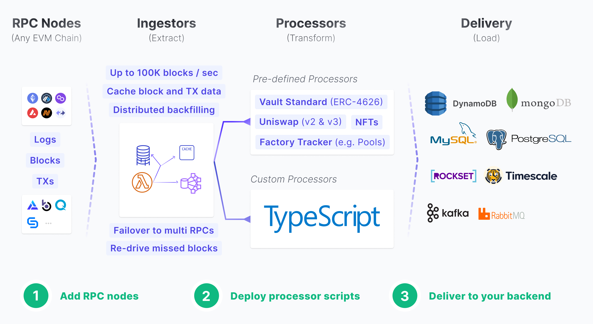

*This page provides a tutorial covering how to leverage Flair for data collection from Neon EVM*.


# Introduction

[Flair](https://flair.dev) supports real-time and historical custom data indexing for any EVM chain via an RPC URL.

Flair offers reusable indexing primitives (such as fault-tolerant RPC ingestors, custom processors, re-org aware database integrations) to simplify how you receive, transform, store, and access on-chain data.
[](https://docs.flair.dev/)

Learn more about [Flair's features](#flair-features)

## How to integrate with Flair

### Step 1: clone the repo

Clone the [starter boilerplate](https://github.com/flair-sdk/starter-boilerplate) template and follow the instructions in the README.md:


```bash
git clone https://github.com/flair-sdk/starter-boilerplate.git
```
:::info

The boilerplate creates a **new cluster**, generates **an API Key**, and sets up a manifest.yml to index your **first contract** with **sample custom processor** scripts.

Learn more about the [structure of manifest.yml](https://docs.flair.dev/reference/manifest.yml).

:::

### Step 2: configure Neon RPC nodes

Set a **unique** namespace, Neon `chainId` and RPC endpoint in your configuration file. Remember that you can add up to 10 RPC endpoints for resiliency.

```yaml
{
  "cluster": "dev",
  "namespace": "my-awesome-neon-indexing-dev",
  "indexers": [
    {
      "chainId": 245022934,
      "enabled": true,
      "ingestionFilterGroup": "default",
      "processingFilterGroup": "default",
      "sources": [
        # Highly-recommended to have at least 1 websocket endpoint
        "wss://XXX",
        # You can put multiple endpoints for failover
        "https://neon-mainnet.everstake.one"
      ]
    }
  ]
}
```

:::info 

Ensure that you apply a **unique** namespace value. A single namespace cannot be used for more than one Flair integration.

::: 

### Step 3: Sync

3. Sync some historical data using the [backfill command](https://docs.flair.dev/reference/backfilling). Remember that the `enabled: true` flag in your `config` enables your indexer to capture data in real-time.

```bash
# backfill certain contracts or block ranges
pnpm flair backfill --chain 245022934 --address 0x6c2908088920d01adf4e17112d013e48f333164c -d backward --max-blocks 10000

# backfill for a specific block number, if you have certain events you wanna test with
pnpm flair backfill --chain 245022934 -b 219068525

# backfill for the recent data in the last X minute
pnpm flair backfill --chain 245022934 --min-timestamp="30 mins ago" -d backward
```

### Step 4: work with your data

4.1 [Query](https://docs.flair.dev/#getting-started) your custom-indexed data.

4.2 Stream the data to your [own database](https://docs.flair.dev/reference/database#your-own-database).

## Examples

Explore real-world usage of Flair indexing primitives for various use-cases.

### DeFi

* [Aggregate protocol fees in USD across multiple chains](https://github.com/flair-sdk/examples/tree/main/aggregate-protocol-fees-in-usd)
* [Calculate "Health Factor" of positions with contract factory tracking](https://github.com/flair-sdk/examples/tree/main/health-factor-with-factory-tracking)
* [Index Uniswap v2 swaps with USD price for all addresses](https://github.com/flair-sdk/examples/tree/main/uniswap-v2-events-from-all-contracts-with-usd-price)

### NFT

* [Index ERC-721 and ERC-1155 NFTs on any EVM chain with an RPC URL](https://github.com/flair-sdk/examples/tree/main/erc721-and-erc1155-nft-indexing)

## Flair features

Flair offers:

* A **parallel and distributed processing** paradigm means high scalability and resiliency for your indexing stack. Instead of constrained sequential processing (e.g Subgraph).
* A focus on **primitives**, which means on the left, you plug-in an RPC, and on the right, you output the data to any destination database.
* Native **real-time stream processing** for certain data workload (such as aggregations or rollups) for properties such as total volume per pool, or total portfolio per user wallet.
* **Managed** cloud services avoid DevOps and irrelevant engineering costs for dApp developers.
* Avoids decentralization **overhead** (consensus, network hops, etc.): simplifying data access.
* Free managed RPC URLs for 8+ chains.
* Works with both websocket and https-only RPCs.
* Tracks and ingests **any contract** for **any event topic.**
* Auto-tracks new contracts deployed from factory contracts.
* **Custom processor scripts** with Javascript runtime (with **Typescript** support)
* Makes external API or Webhook calls to third-party or your backend.
* Gets current or historical USD value of any ERC20 token amount of any contract address on any chain.
* Uses any external NPM library.
* **Streams** stored data to your destination database (Postgres, MongoDB, MySQL, Kafka, Elasticsearch, Timescale, etc.).

## Need help?

[Flair engineers](https://docs.flair.dev/talk-to-an-engineer) provide product support.
