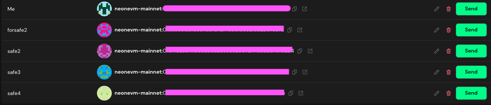
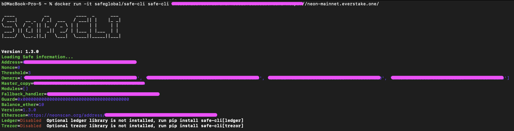
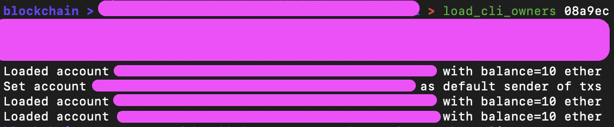
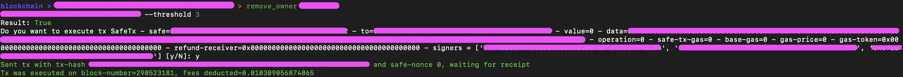

import Tabs from '@theme/Tabs';
import TabItem from '@theme/TabItem';

## Introduction

Get the Safe CLI
Prerequisite: Install Docker Desktop (https://www.docker.com/products/docker-desktop/)

Once Docker is installed on your system, create Safe account using the Safe guide

Purpose:

The primary purpose of the Neon CLI (Command Line Interface) for Neon EVM is to allow developers to manage, deploy, and operate Ethereum-compatible dApps on the Solana blockchain directly from the command line. This interface simplifies development tasks by enabling users to handle various functions, such as deploying smart contracts, configuring projects, managing databases, and setting up multi-signature accounts.


## Interact with a Safe wallet using CLI

### Step 1: Create 2 or more wallets

1.1 Go to the [login](https://safe.neonevm.org/welcome) page and connect your wallet and create two or more wallets

<div className='neon-img-width-600' style={{textAlign: 'center'}}>



</div>

### Step 2: Installation

Run
```
docker run -it safeglobal/safe-cli safe-cli 0x0000000000000000000000000000000000000000 https://neon-mainnet.everstake.one/
```

<div className='neon-img-width-600' style={{textAlign: 'center'}}>



</div>

### Step 3: How to remove an owner

3.1 Run
For 2 wallets:
```
load_cli_owners <private-key1> <private-key2>
```

If you have more wallets then add more private keys

<div className='neon-img-width-600' style={{textAlign: 'center'}}>



</div>

3.2 Run
```
show_cli_owners
```

<div className='neon-img-width-600' style={{textAlign: 'center'}}>


</div>

3.3 Run
```
remove_owner <address> --threshold 3
```

Example for 2 wallets:
```
remove_owner 0x0x0000000000000000000000000000000000000000 --threshold 2
```

If you have more than two wallets then change the number of --threshold

<div className='neon-img-width-600' style={{textAlign: 'center'}}>



</div>
