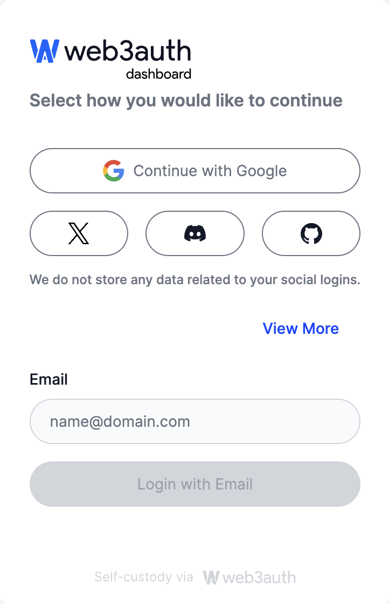
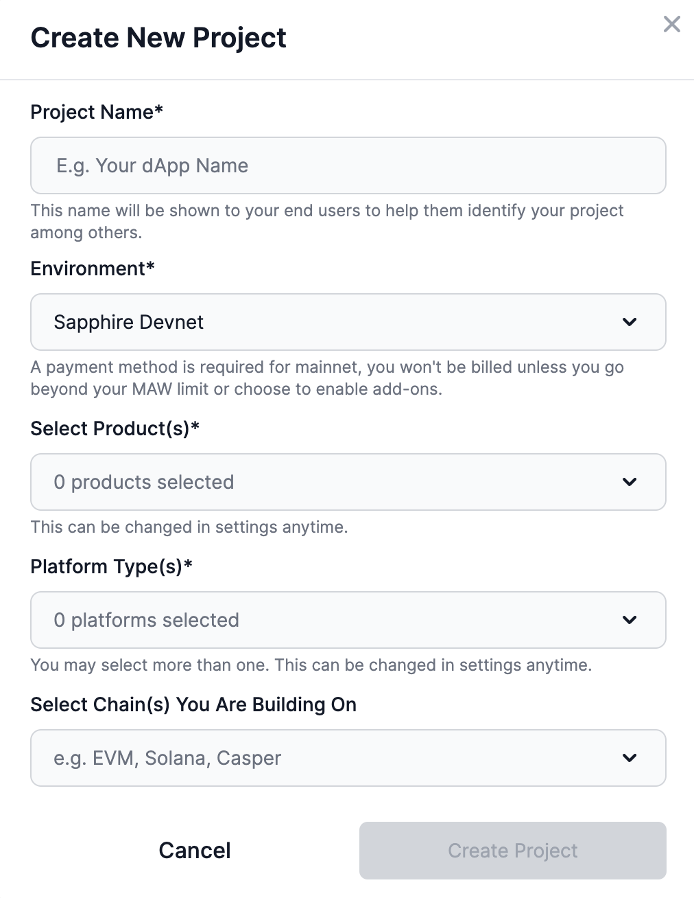
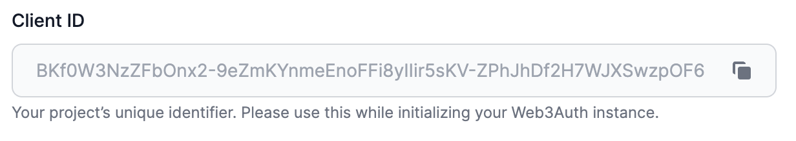
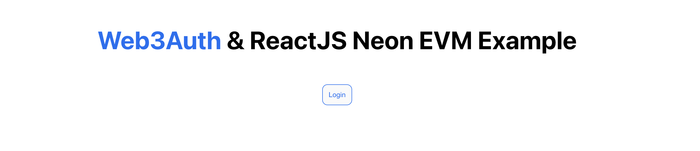
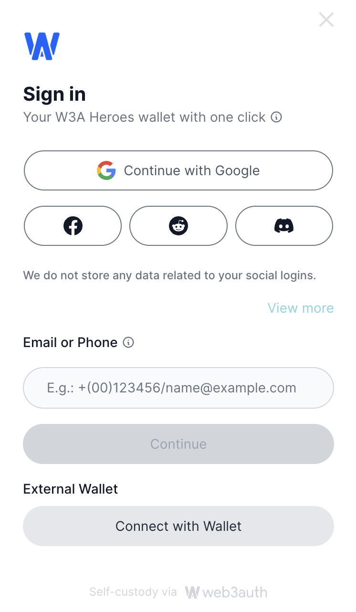
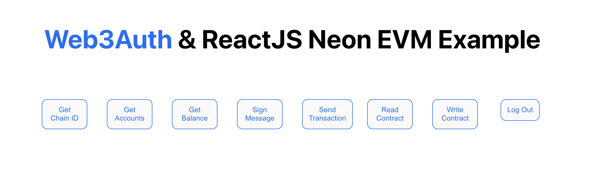

import Tabs from '@theme/Tabs';
import TabItem from '@theme/TabItem';

## Introduction

This guide will walk you through the steps of a working example for integrating Web3Auth pluggable wallet infrastructure for Web3 wallets and applications using Web3Auth SDK and ReactJS.

Integrating Web3Auth into your decentralized application (dApp) or blockchain wallet offers a means to greatly streamline the user onboarding process, ensuring a smooth and uncomplicated experience for your users. Concurrently, Web3Auth enables the preservation of your wallet management system's non-custodial nature. This ensures that users continue to possess complete control and ownership of their cryptographic wallets, thereby strengthening the foundational principles of privacy and security inherent in blockchain technology. To learn more, please follow the [Web3Auth documentation](https://web3auth.io/docs/what-is-web3auth).

## Prerequisites

- NodeJS 16.x or newer

## How to integrate Web3Auth SDK

This tutorial is based on the example located in [this repository](https://github.com/neonlabsorg/neon-tutorials/tree/main/web3auth).

### Step 1: Create a Web3Auth project and get the Client ID from Web3Auth Dashboard

1.1 Go to the [login](https://dashboard.web3auth.io/login) page and login with any of your social login credentials.

<div className='neon-img-width-600' style={{textAlign: 'center'}}>



</div>

1.2 Create a new project to get the Client ID for the project.

<div className='neon-img-width-600' style={{textAlign: 'center'}}>



</div>

1.3 Copy the Client ID.

<div className='neon-img-width-600' style={{textAlign: 'center'}}>



</div>

### Step 2: Installation

> **Note:** This page is just a quickstart based on a specific example program.

2.1 Using Git, clone the example project from the remote repository and navigate to it:

```sh
git clone https://github.com/neonlabsorg/neon-tutorials
cd neon-tutorials/web3auth
```

2.2 Then, run the following command:

```sh
npm install
```

This will install all the necessary packages to continue with the example.

### Step 3: Configure the project

3.1 In the `src/App.tsx` file, replace this line with your own Client ID.

```sh
const clientId =
  "BPi5PB_UiIZ-cPz1GtV5i1I2iOSOHuimiXBI0e-Oe_u6X3oVAbCiAZOTEBtTXw4tsluTITPqA8zMsfxIKMjiqNQ";
```

3.2 Add the chain configuration

<Tabs>
<TabItem value="Devnet" label="Devnet" default>
```sh
// Neon EVM Devnet
const chainConfig = {
  chainId: "0xe9ac0ce",
  rpcTarget: "https://devnet.neonevm.org",
  chainNamespace: CHAIN_NAMESPACES.EIP155,
  displayName: "Neon EVM Devnet",
  blockExplorerUrl: "https://devnet.neonscan.org",
  ticker: "NEON",
  tickerName: "Neon",
  logo: "",
};
```
</TabItem>
<TabItem value="Mainnet" label="Mainnet">
```sh
// Neon EVM Mainnet
const chainConfig = {
  chainId: "0xe9ac0d6",
  rpcTarget: "https://neon-proxy-mainnet.solana.p2p.org",
  chainNamespace: CHAIN_NAMESPACES.EIP155,
  displayName: "Neon EVM Mainnet",
  blockExplorerUrl: "https://neonscan.org",
  ticker: "NEON",
  tickerName: "Neon",
  logo: ""
};
```
</TabItem>
</Tabs>

### Step 4: Run and interact with the application

4.1 To start the application in your local machine, run -

```sh
npm run start
```

This will redirect to http://localhost:3000/ where you can interact with the application.

<div className='neon-img-width-600' style={{textAlign: 'center'}}>



</div>

4.2 Click on the login button to open the login modal.

<div className='neon-img-width-600' style={{textAlign: 'center'}}>



</div>

This Web3Auth example allows you to login via the following ways -

    - Social logins like Google, Facebook, Reddit, Discord, Apple, Github, X, Linkedin and many more.
    - Email or Phone number.
    - Metamask wallet.

4.3 After successfully signing in with any of the above mentioned ways of signing in, the following methods can be checked on Neon EVM -

<div className='neon-img-width-600' style={{textAlign: 'center'}}>



</div>

:::important
By default, this example is configured to connect with **Neon EVM Devnet**. `readContract()` and `writeContract()` functions in the `src/web3RPC.ts` file includes a simple storage contract address `0x093451875d5A8D61bB90faA7A8645eB17c86b297` and its ABI deployed on Neon EVM Devnet.

If you change the chain configuration to **Neon EVM Mainnet**, then please deploy the smart contract on Neon EVM Mainnet and replace the deployed address and the contract ABI in `readContract()` and `writeContract()` functions in the `src/web3RPC.ts` file.
:::

    - **Get Chain ID:** Displays the network chain ID to which the dApp is connected. This value is `245022926`, when the chain configuration is **Neon EVM Devnet** and `245022934` when the chain configuration is **Neon EVM Mainnet**.

    - **Get Accounts:** Displays the wallet account on Neon EVM Devnet connected to the dApp.

    - **Get Balance:** Displays the balance of NEONs for the wallet account that is connected to the dApp.

    - **Sign Message:** Signs a message with the connected wallet account and returns the signed message.

    - **Send Transaction:** Does a simple NEON transfer from account to another and returns the transaction receipt.

    - **Read Contract:** Calls a read-only contract method and returns the result. In this example, it returns a message stored in the simple storage contract `0x093451875d5A8D61bB90faA7A8645eB17c86b297` deployed on Neon EVM Devnet.

    - **Write Contract:** Sends a transaction to the smart contract method and returns the transaction receipt. In this example, the message is updated in the simple storage contract `0x093451875d5A8D61bB90faA7A8645eB17c86b297` deployed on Neon EVM Devnet.

    - **Log Out:** Logs out of the account connected.
