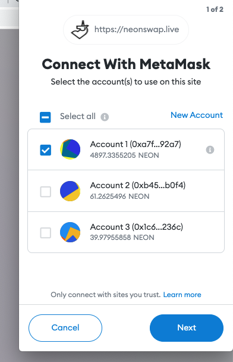
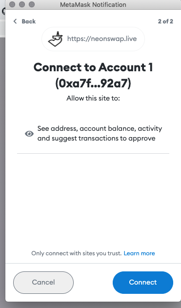

# Neon Faucet

The Neon Faucet is a service that distributes small amounts of tokens.

# Neon Swap

A utility that allows you to access the token distribution service through the user interface.

## Getting tokens

### Step 1
Go to the page for obtaining tokens using the following [link](https://neonswap.live/#/get-tokens).

### Step 2
Connect your wallet to get tokens:
- Click button `CONNECT WALET` after installing the dependency using the following article [Installing MetaMask](../../wallet/metamask_setup#installing-metamask)

<div class='neon-img-box-300' style={{textAlign: 'center'}}>


</div>

- Click button `CONNECT METAMASK`

<div class='neon-img-box-300' style={{textAlign: 'center'}}>


</div>

- In the MetaMask window, select one or more accounts and click `Next`.

<div class='neon-img-box-300' style={{textAlign: 'center'}}>



</div>

- Сlick the `Connect` button to confirm.

<div class='neon-img-box-300' style={{textAlign: 'center'}}>



</div>

- In the form that appears, enter the number of requested tokens and click the button `GET TOKENS`.

<div class='neon-img-box-300' style={{textAlign: 'center'}}>


</div>


# HTTP API Endpoints

A client uses POST requests to send data to the server.
Several endpoints are supported.

```
|------------------------------------------------------------------------------------------
| Endpoint               | Workload    | Description
|------------------------------------------------------------------------------------------
| request_ping           | text        | Requests ping to check availability of the service
| request_version        |             | Requests version of the service
| request_neon_in_galans | JSON        | Requests NEON tokens, amount in galans (fractions)
| request_neon           | JSON        | Requests NEON tokens
| request_erc20          | JSON        | Requests ERC20 tokens
|------------------------------------------------------------------------------------------
```

Example of JSON workload:
```
{ "wallet": "0x4570e07200b6332989Dc04fA2a671b839D26eF0E", "amount": 1 }
```

Example of ping request with **curl** utility:
```
curl -i -X POST -d 'Hello' 'http://localhost:3333/request_ping'
```

Example of version request with **curl** utility:
```
curl -i -X POST 'http://localhost:3333/request_version'
```

Example of NEON drop request with **curl** utility:
```
curl -i -X POST \
    -d '{"wallet": "0x4570e07200b6332989Dc04fA2a671b839D26eF0E", "amount": 1}' \
    'http://localhost:3333/request_neon'
```


# Configuration

The configuration file should be in TOML format.

```
|----------------------------------------------------------------------------------------------
| Option                  | Description
|----------------------------------------------------------------------------------------------
| rpc.bind                | Local interface TCP address
| rpc.port                | TCP port to listen
| rpc.allowed_origins     | List of client URLs that can send requests
| web3.enable             | Flag to on/off the entire web3 section
| web3.rpc_url            | Ethereum network endpoint
| web3.private_key        | Ethereum private key to support operations
| web3.tokens             | List of available ERC20 token addresses
| web3.max_amount         | Largest amount of ERC20 tokens to distribute with a single request
| solana.enable           | Flag to on/off the entire solana section
| solana.url              | Solana network endpoint
| solana.commitment       | Solana client commitment level
| solana.operator_keyfile | Solana keyfile to support operations
| solana.evm_loader       | Address of the EVM Loader program
| solana.max_amount       | Largest amount of NEONs to distribute with a single request
|----------------------------------------------------------------------------------------------
```

Example of the configuration file contents:
```
[rpc]
bind = "0.0.0.0"
port = 3333
allowed_origins = ["http://localhost"]

[web3]
enable = true
rpc_url = "http://localhost:9090/solana"
private_key = "0x0000000000000000000000000000000000000000000000000000000000000Ace"
tokens = ["0x00000000000000000000000000000000CafeBabe",
          "0x00000000000000000000000000000000DeadBeef"]
max_amount = 1000

[solana]
enable = true
url = "http://localhost:8899"
commitment = "processed"
evm_loader = "EvmLoaderId11111111111111111111111111111111"
operator_keyfile = "operator_id.json"
max_amount = 10
```

The configuration file is optional and, if present, can be incomplete
(default values or environment variables will be used in such cases).


# Environment Variables

Environment variables, if present, override portions of the configuration.

```
|----------------------------------------------------------------------------------------------
| Name                       | Overrides               | Value Example
|----------------------------------------------------------------------------------------------
| FAUCET_RPC_BIND            | rpc.bind                | `0.0.0.0`
| FAUCET_RPC_PORT            | rpc.port                | `3333`
| FAUCET_RPC_ALLOWED_ORIGINS | rpc.allowed_origins     | `["http://localhost"]`
| FAUCET_WEB3_ENABLE         | web3.enable             | `true`
| WEB3_RPC_URL               | web3.rpc_url            | `http://localhost:9090/solana`
| WEB3_PRIVATE_KEY           | web3.private_key        | `0x00...0A`
| NEON_ERC20_TOKENS          | web3.tokens             | `["0x00B", "0x00C"]`
| NEON_ERC20_MAX_AMOUNT      | web3.max_amount         | `1000`
| FAUCET_SOLANA_ENABLE       | solana.enable           | `true`
| SOLANA_URL                 | solana.url              | `http://localhost:8899`
| SOLANA_COMMITMENT          | solana.commitment       | `processed`
| EVM_LOADER                 | solana.evm_loader       | `EvmLoaderId11111111111111111111111111111111`
| NEON_OPERATOR_KEYFILE      | solana.operator_keyfile | `operator_id.json`
| NEON_ETH_MAX_AMOUNT        | solana.max_amount       | `10`
| NEON_LOG                   |                         | `json`
| RUST_LOG                   |                         | `info`
|----------------------------------------------------------------------------------------------
```
