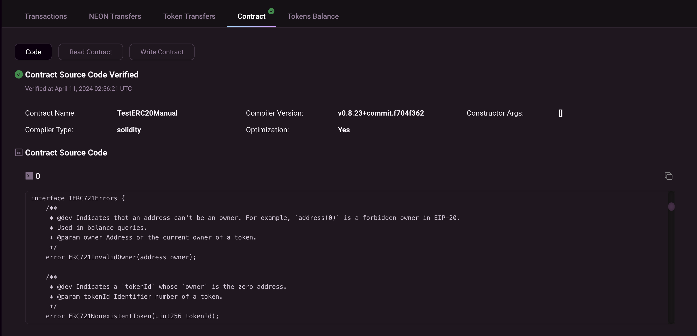

import Tabs from '@theme/Tabs';
import TabItem from '@theme/TabItem';

_This page outlines the steps for verifying contracts on Neon EVM manually on NeonScan and Blockscout._

Before beginning the tutorial below, please follow this page which describes [how to deploy a smart contract on Neon EVM using Remix IDE](https://docs.neonevm.org/docs/developing/deploy_facilities/using_remix).

If you are not using Hardhat or Foundry tools for deployment and using Remix for the smart contract development, then you can verify your smart contracts on NeonScan or Blockscout.

## Step 1: Deploy the contract

For this example, let us take a simple smart contract `TestERC20.sol` -

```sh
// SPDX-License-Identifier: MIT
pragma solidity 0.8.24;

import "@openzeppelin/contracts/token/ERC20/ERC20.sol";

contract TestERC20Manual is ERC20 {
    constructor() ERC20("TestERC20", "TST") {
        _mint(msg.sender, 1000 * 10 ** decimals());
    }
}
```

## Step 2: Verify the deployed contract

If your smart contract references different solidity files in its imports, you can upload a flattened version of the smart contract or upload each solidity file your smart contract references.

To flatten your contract, right-click the filename on your Remix.IDE file explorer, and choose flatten. Remix.IDE will generate a flattened version of your smart contract e.g., TestERC20_flattened.sol in this case, that you can paste into NeonScan or Blockscout.

<Tabs>
<TabItem value="NeonScan" label="NeonScan">

To verify the deployed contract from the above step, let's take an example of a deployed contract with address `0x628C8F52De7C661AA703523eDD75539Dce8D7EBB` on Neon EVM Devnet.

The deployed contract can be found here https://devnet.neonscan.org/address/0x628C8F52De7C661AA703523eDD75539Dce8D7EBB#contract.

1. Click on the `Verify Contract Code` link to go the verification page.

<div className='neon-img-width-600' style={{textAlign: 'center'}}>


</div>

2. On the `Verify and Publish` page, the `Contract Address` field is auto-filled with the deployed contract address.

<div className='neon-img-width-600' style={{textAlign: 'center'}}>


</div>

3. Enter the name of the deployed contract in the `Contract Name` field. In this example, the name of the deployed contract is **TestERC20Manual**.

<div className='neon-img-width-600' style={{textAlign: 'center'}}>


</div>

4. Select the `Compiler Type` from the dropdown. In this example, this should be **Solidity**.

<div className='neon-img-width-600' style={{textAlign: 'center'}}>


</div>

5. Select the `Compiler Version` from the dropdown. In this example, the compiler version used is **v0.8.23+commit.f704f362**.

<div className='neon-img-width-600' style={{textAlign: 'center'}}>


</div>

6. Select `Optimization` from the dropdown and the `Run` value. In this example, optimization is **Yes** and the value is **200**.

<div className='neon-img-width-600' style={{textAlign: 'center'}}>


</div>

7. Enter the name of the flattened smart contract in the `File name` field and the flattened solidity source code in the `Code` field. The file name in this example is **TestERC2_flattened.sol**.

<div className='neon-img-width-600' style={{textAlign: 'center'}}>


</div>

8. After clicking on the `Submit` button, the verified contract source code can be seen on the contract page https://devnet.neonscan.org/address/0x628C8F52De7C661AA703523eDD75539Dce8D7EBB#contract.

<div className='neon-img-width-600' style={{textAlign: 'center'}}>



</div>

</TabItem>

<TabItem value="Blockscout" label="Blockscout">

To verify the deployed contract from the above step, let's take an example of a deployed contract with address `0x00407307F5eb91dFCC406E88618dB8aAE7d715B8` on Neon EVM Devnet.

The deployed contract can be found here https://neon-devnet.blockscout.com/address/0x00407307F5eb91dFCC406E88618dB8aAE7d715B8?tab=contract.

1. Click on `Verify & publish`.

<div className='neon-img-width-600' style={{textAlign: 'center'}}>


</div>

2. On the `Verify & publish` page, choose Contract license from the dropdown. In this example, the license mentioned in the smart contract is MIT.

<div className='neon-img-width-600' style={{textAlign: 'center'}}>


</div>

3. Choose verification method or compiler type from the dropdown. In this example, we are using Solidity (Flattened source code).

<div className='neon-img-width-600' style={{textAlign: 'center'}}>


</div>

4. Choose compiler and the EVM version from the dropdowns. These fields should be entered as per the configuration in Remix IDE. In this example, we are using compiler **0.8.24+commit.e11b9ed9** and EVM version **default**.

<div className='neon-img-width-600' style={{textAlign: 'center'}}>


</div>

5. Click on the Optimization enabled if it is enabled in Remix IDE. Enter the flattened solidity code in the Contract code box.

<div className='neon-img-width-600' style={{textAlign: 'center'}}>


</div>

6. After clicking on the `Verify & publish` button, the verified contract source code can be seen on the contract page https://neon-devnet.blockscout.com/address/0x00407307F5eb91dFCC406E88618dB8aAE7d715B8?tab=contract.

<div className='neon-img-width-600' style={{textAlign: 'center'}}>


</div>

</TabItem>
</Tabs>
