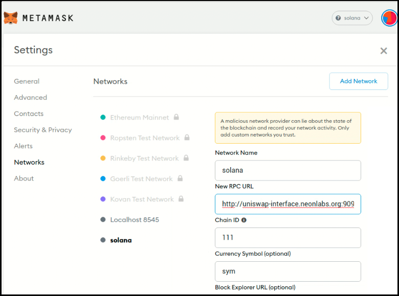
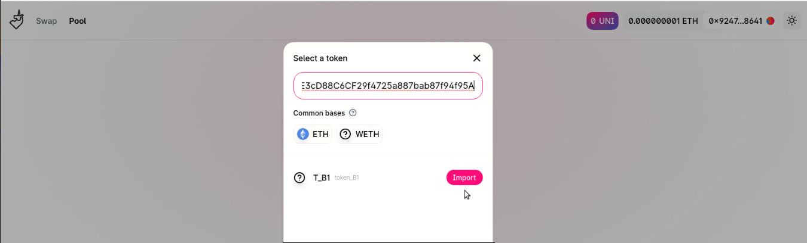
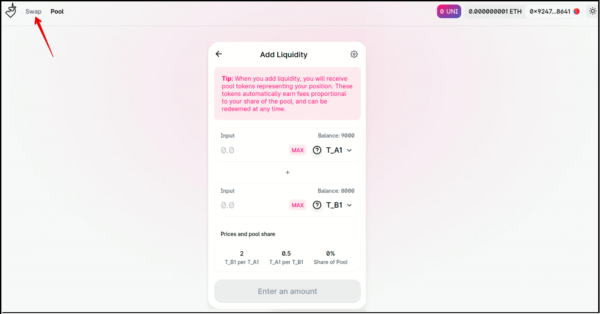

# Porting the uniswap service to Neon EVM

*The purpose of this document is to share the experience with Ethereum users how easily their applications can be ported to Neon EVM.*

> Uniswap is an open-source dApp used on Ethereum. In Ethereum, exchanging some tokens for others requires deploying contracts. We want to demonstrate that our Neon EVM product allows you to port the Uniswap service from Ethereum to Solana. To do this, we deploy the complete Uniswap infrastructure, including contracts in our Neon EVM, as well as the uniswap-interface on a separate server. Using the uniswap service deployed on Neon EVM, users can make transactions in their usual form and make sure that Neon EVM is functioning successfully.  

Any dApp using the Uniswap service consists of 2 parts: contracts and software serving these contracts. Contracts are loaded into a chain, and the software is deployed on a separate server for providing users interaction with these contracts.

Porting applications from Ethereum to Solana is done in 3 stages:  
**Stage 1.** Deploying contracts in a Neon EVM environment.  
**Stage 2.** Checking the functioning of deployed contracts.  
**Stage 3.** Deploying Uniswap-interface.

## Stage 1. Deploying contracts in a Neon EVM environment
No changes to the Uniswap product are required to port applications using the Uniswap service. The product version used is Uniswap-v2. Changes are made only to those components that are necessary for its operation on Neon EVM.  

The contracts are built by a typical Solidity compiler used in Ethereum. After compilation, all the necessary contracts are deployed on Neon EVM using a Web 3 proxy. This proxy provides a standard interface that Ethereum utilities and tools can use.  

Here is a list of contracts to be deployed:
  * Governance.
  * Uniswap-v2-periphery.
  * Multicall.

**Changes for deploying contracts**  
The following changes were made for deploying contracts in Neon EVM:
  * The timeout value was increased.
  * The number of repeated requests for transaction recipes was increased:  
```js
// The call  
    wait factoryV1.createExchange(WETHPartner.address, overrides)
// was replaced with  
    let id = await factoryV1.createExchange(WETHPartner.address, overrides) let receipt = await provider.waitForTransaction(id.hash, 3)
```
  * Added the `deploy contracts()` method.

As a result, we get the addresses of the following uploaded contracts:
  * UNI_ADDRESS
  * TIMELOCK_ADDRESS
  * GOVERNANCE_ADDRESS
  * MULTICALL_ADDRESS
  * MIGRATOR_ADDRESS
  * FACTORY_ADDRESS
  * ROUTER1_ADDRESS
  * ROUTER_ADDRESS
  * V1_FACTORY_ADDRESS
  * WETH_ADDRESS

## Stage 2. Checking the functioning of deployed contracts

Contracts health checking is performed in a real chain, not in a test environment, which is fully managed.  

Unlike the test environment, in a really working chain, the range of test operations cannot be performed in full (for example, operations such as generating a block with a specified number of transactions, etc., are excluded). In a chain, all operations rely on real-time and a user checking the contracts cannot influence the block generation.  

To test Uniswap, we use the entire set of tests available in Ethereum. The method of running these tests has been changed. Before running the tests, it is indicated that the deployment of contracts, calls to their methods, as well as testing takes place not in the test framework, but in the real blockchain.  

> For testing, we use an unmanaged environment. However, in uniswap tests (in contracts), there are sections of program code that contain environment management. In these pieces, we were able to successfully replace the environment management to expectation for a reaction from a chain. That is, where the block is to be generated, a delay is set. Then an action is performed and the reaction of the contract is evaluated, namely, whether it meets the expectation or not. At the same time, we believe that the number of blocks produced may be different.  

The need to adapt tests is due to the fact that tests must issue correct results regardless of the run conditions.  

**Changes for running the uniswap-v2-core test suite**  
 The following changes were made to run the uniswap-v2-core test suite in Neon EVM:
  * Increased timeouts when expanding contracts.
  * Changed ChainId.
  * Replaced the rcp-request libraries, including the following: `Web3Provider` and `MockProvider` replaced with `JsonRpcProvider`.
  * Changed the test using the `mineBlock()` method.
  * Increased the number of re-requests in the `ethereum-waffle` library for receiving transaction receipts, including the following:
```js
// In the file  
uniswap-v2-core/node_modules/@ethereum-waffle/chai/dist/cjs/matchers/emit.js  
// the line  
const derivedPromise = promise.then((tx) => contract.provider.getTransactionReceipt(tx.hash) ).then((receipt) => {  
// was replaced with  
const derivedPromise = promise.then((tx) => contract.provider.waitForTransaction(tx.hash, 3) ).then((receipt) => {  
```
  * Increased the value of `gasLimit` in the `ethereum-waffle` library.

## Stage 3. Deploying Uniswap-interface
After we have managed to get the addresses of the contracts loaded into the Neon EVM, we can start deploying the uniswap-interface. It is necessary to specify that we use a real blockchain and our contracts are located in this blockchain.  

**Changes for the uniswap-interface**  
For the uniswap-interface to function successfully in Neon EVM, we were made the following changes:
  * Added a new testnet to the adapted uniswap-interface code. The name of the new network with the new chain-ID is registered in all places where it was used, including:
    * Added `ChainId LOCAL` to dependent libraries and sources.
    * ChainID, url was specified in the .env file.
  * For the new network, a set of the loaded contracts was registered. In the directory `node_modules`, the addresses of contracts in the sources and dependent libraries were replaced.

****  
> The next section contains an example of step-by-step actions for deploying and exchanging a pair of tokens via Neon EVM using Uniswap.

## Example. Exchanging tokens using Uniswap

**Initial data**  
We have 2 types of tokens *T_A1* and *T_B1*. There are 10,000 tokens on the balance of each of them. The current rate of *T_A1* and *T_B1* tokens is 1:2, respectively.  

**Goal**  
We need to exchange 1000 *T_A1* for *T_B1* tokens.

#### Step 1
Connect Metamask to your proxy server (the proxy server should already be deployed in Neon EVM by this time).
To do this, open Metamask and in the settings for `Networks` in the `Neon RPC URL` field, write the domain address https://uniswap-interface.neonlabs.org:9090/solana. This address is required to connect to the proxy server.

<p align="center">

  
</p>  

#### Step 2
Create and deploy an ER20 standard contract containing the *T_A1* token. 
To do this, open the Remix web application and load the ERC20 contract into it. Write the data of the *T_A1* token to this contract.

<p align="center">

  
</p>  

After editing the text, compile the contract.

#### Step 3
Сlick `Deploy` in the Remix web application.  
Metamask will activate to determine the required signature and add it to the transaction. The transaction will be sent to the proxy server and then to Solana. After the transaction is successfully completed, the contract containing the *T_A1* token will be deployed.

#### Step 4
Repeat actions of 2 and 3 steps to create and deploy a contract for the *T_B1* token.  
If the operations for deploying contracts for *T_A1* and *T_B1* tokens are completed successfully, 2 addresses of these contracts will appear in the lower-left corner of the Metamask window. To the right of the address is an icon for copying this address.

<p align="center">

  
</p>

#### Step 5
*For an exchange operation, it is necessary to create a liquidity pool for a pair of tokens that will be exchanged. Certain amounts should be debited from the balances of these tokens. The exchange operation must be carried out within these amounts.*  

Open the main page of the [Uniswap interface](https://swap-interface.neondemo.org) (registration is required to enter this page). The address of Metamask is indicated in the upper right corner. There are 2 operations in the upper left menu:
  * `Swap` - token exchange operation.
  * `Pool` - creates a pair of tokens between which an exchange operation will be performed.

In the menu, click `Pool` and In the pop-up window, click `Create a pair`.

<p align="center">

  
</p>

#### Step 6
In the Remix window, you need to copy the *T_A1* token address. Then open the Uniswap window and write this address into the `Select a token` field. Click `Import`.

<p align="center">

  
</p>

Repeat this step to copy the *T_B1* token address.  
> When creating a liquidity pair, a warning about the risk of selling a token back may appear.

#### Step 7
After setting a pair of tokens, a pop-up window should appear with the balances of these tokens.  
Specify the amount for which the liquidity pool is created. For example, let's assume that there are 10,000 tokens on the balances of both tokens. Also, let's create a pair of tokens with values 1000 and 2000 for *T_A1* and *T_B1* respectively. This means the exchange operation can be performed for amounts not exceeding 1000 and 2000 tokens for *T_A1* and *T_B1*, respectively. These amounts will be reserved for exchange. The exchange rate is 1:2.

<p align="center">

  
</p>

Creating a liquidity pair requires an approval operation for both tokens. The need for the operation is due to the ERC20 contract requirement.  

Click `Approve_TA1` and then confirm the operation in the Metamask pop-up window. Repeat this operation for another token.  

After receiving a notification about the successful completion of both transactions, click `Supply`.  

#### Step 8
In the window that appears, click `Create Pool & Supply`. Confirm this operation in the Metamask window.

<p align="center">

  
</p>

After receiving a notification about the successful completion of the transaction, click `Close`

<p align="center">

  
</p>

#### Step 9
Make sure the balances have been updated. The balances of the *T_A1* and *T_B1* tokens should be reduced by 1000 and 2000 tokens, respectively. Now the token exchange operation can be performed.  

In the upper left corner of the Uniswap window, select the `Swap` operation.

<p align="center">

  
</p>

#### Step 10
In the appearing Swap window, select the *T_A1* and *T_B1* tokens using `Select a token`. Specify the exchange amount in `From`. The amount for *T_B1* will automatically appear in `To`. This amount is calculated taking into account the exchange rate and fee. The exchange rate is calculated based on the amounts of tokens specified in the pair.  

For example, let's specify the exchange amount of 1 token.

<p align="center">

  
</p>

#### Step 11
Click `Swap` and then `Confirm swap`.  
After the transaction is completed successfully, click `Close` to end the session. The final Swap window should appear with updated token balances. The *T_A1* balance will decrease by 1 token, and the *T_B1* balance will increase by almost 2 tokens.

<p align="center">

  
</p>

****  
> **More details**  
> All changes we made for Porting the uniswap service to Neon EVM can be found in the [uniswap-v2-core repository](https://github.com/neonlabsorg/uniswap-v2-core).
