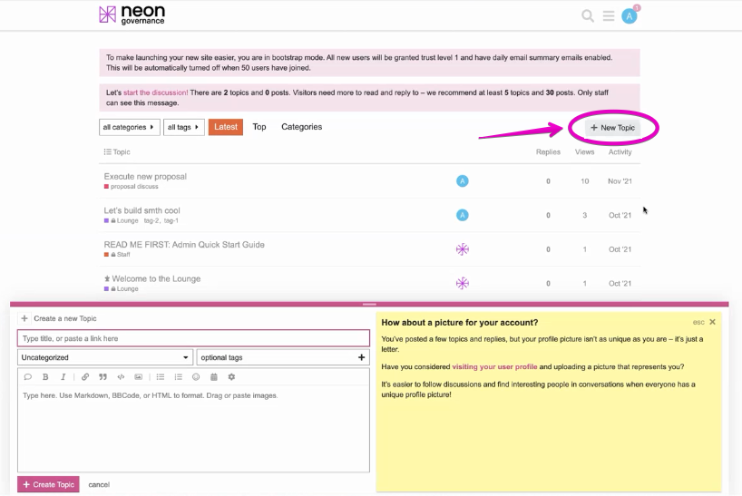
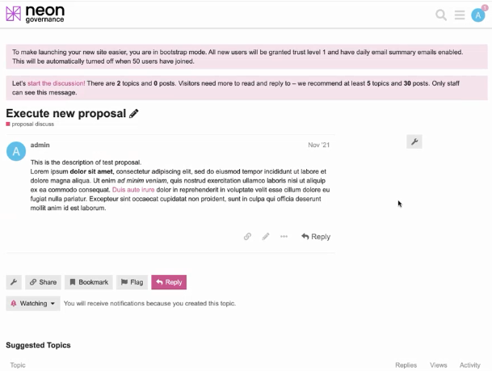
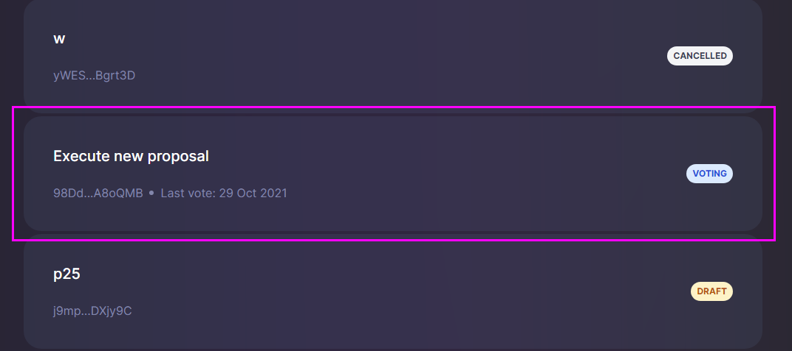
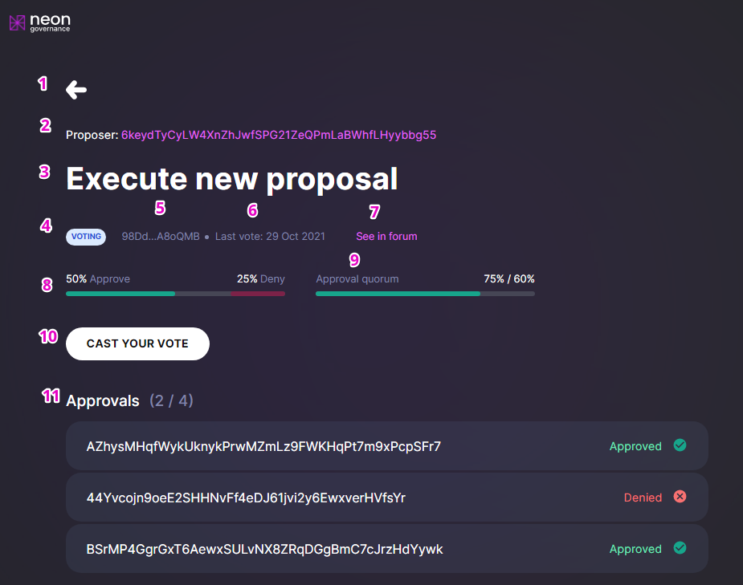
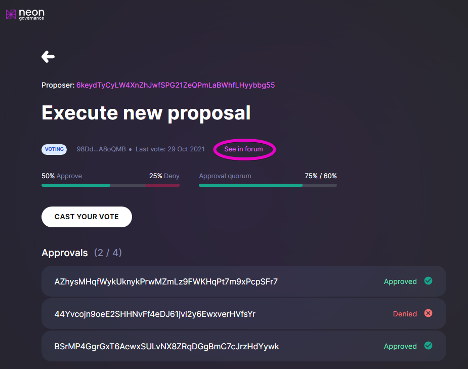
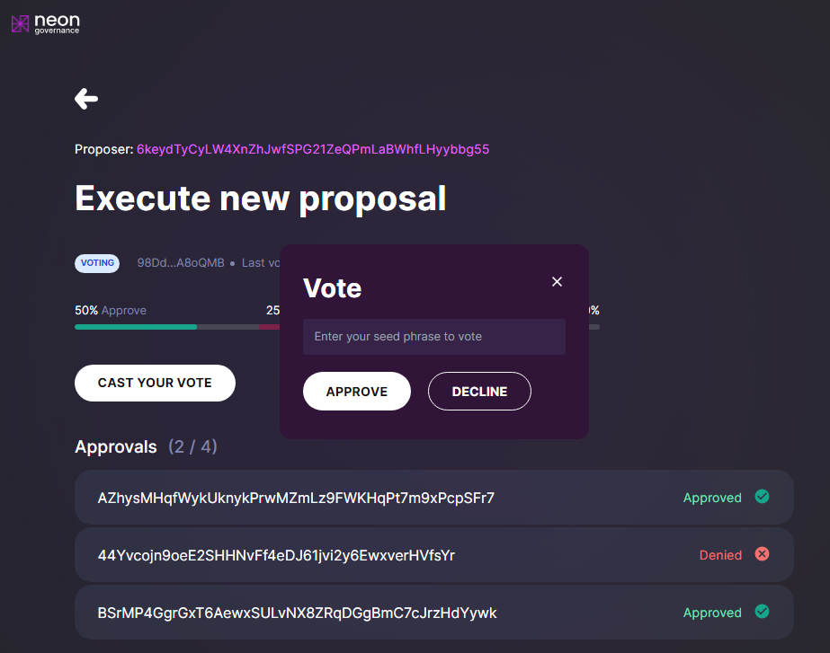

# Governance User Interface

The Neon Governance application is an open source service designed to provide a convenient form for submitting proposals to improve Neon EVM and for voting on acceptance of these proposals.

Any Neon user can submit a proposal to improve the Neon EVM governance, but only stakeholders can make the final decision on whether to implement this proposal or not. Submission of proposals and voting for them are carried out using the Neon Governance application.

## Proposal submission procedure

> Currently, the procedure for submitting and considering proposals is being finalized and therefore some actions may differ from these described. If you have a problem, feel free to contact *community* for help.

### Posting an article on the Neon forum
The first thing to do is to go to the [Neon forum](https://forum.neon-labs.org) and post an article describing your proposal. If you are not yet registered you must do so. Then click `New Topic` and put your content in the pop-up window.

Topic of your proposal should concern the Neon EVM governance. Proposal content may contain a textual description of your idea, illustrations, and links to your prepared and tested program code. If you have the code, you must provide brief instructions for installing it and checking the features that it performs.

Here is an example of the article "Execute new proposal" published on the forum:

### Submitting a proposal to Neon Governance

If an article after its discussions on the forum receives positive reviews, it can be submitted for consideration to stakeholders. (Currently, only the Neon EVM network administrator can register a submission in Governance UI. The author of the article should notify the administrator of the intention to create a proposal).

Proposal should match the recommended template and contain the following fields:
  * `Summary` — brief description.
  * `Instructions` — sequence of actions for installing and running program code, if it is in proposal.
  * `Discussion` — feedback and comments from stakeholders.

Once the proposal is registered in Governance UI, new line with data about it will appear in the list of [Governance Proposals](https://governance.neon-labs.org).

### Monitoring the status of the submitted proposal
The page [Governance Proposals](https://governance.neon-labs.org) contains the list of all proposals with their brief information, including their names, identifiers, and current states. Authors have the opportunity to track the status of their proposals to monitor the voting processes. To get up-to-date information about the proposal, click on its status field.

As an example, the following figure shows the page containing detailed information about the "Execute new proposal" with the status `Voting`.

Page fields and their functional meanings:

  1. Reverse arrow icon. By clicking on it you go to the `Governance Proposals` page.
  1. `Proposer` — public key of the proposer.
  1. Name of the proposal.
  1. Current status of the proposal.
  1. Proposal ID in Neon Governance.
  1. The date of the last vote, after which no votes are accepted.
  1. `See in forum` — link to forum post for further discussion.
  1. Voting scale, visually displaying the voting process. It also displays the percentage of `Approve` and `Deny` votes scored.
  1. `Approval quorum` — displays the percentage of votes required to approve a proposal. The minimum number of approve votes required. Once approval quorum is greater than or equal to specified value, the proposal is eligible to pass.
  1. `Cast your vote` — button to call pop-up voting window. Only stakeholders are allowed to vote.
  1. `Approvals` — list of voters with their votes given. The first numeric value means the number of stakeholders who voted as `Approve`. The second numeric value means the total number of stakeholders who have the right to vote.

Here is the list of possible states of proposals and their functional meaning:
  * `Draft` — Stage of preparation of the proposal.
  * `Voting` — Stakeholders are voting to accept the proposal.
  * `Cancelled` — Proposal was not approved on a forum.
  * `Execution errors` — Attempting to execute the program code attached to the proposal, ends with an error.
  * `Defeated` — The number of `Deny` votes was at least 50% of the total number of stakeholders allowed to vote.
  * `Approved` — The number of `Approve` votes has reached the `Approval quorum` threshold.
  * `Succeeded` — Proposal was approved but not yet implemented.
  * `Completed` — Proposal was approved and already implemented.
  * `Voting ended` — The time allotted for voting has expired.

### Stakeholder voting
If you are a stakeholder and you are allowed to vote, you should be here, others can skip this section.

You should first open the list of proposals with their current status and select the proposal with `Voting` you wish to vote on or view. The voting progress page will open.

Then you should click `See in forum` to view the content of the proposal. To vote on the proposal, you must click `Cast your vote`. A pop-up box will appear.

 Click `Approve` or `Decline` to vote on the proposal. Next, you will be asked to confirm and have the option to add a message to your vote.
