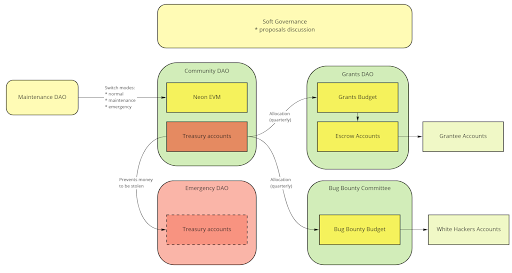
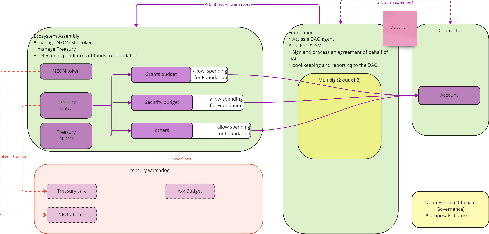

## Neon is Governed by the Community, For the Community

The goal of the Neon DAO is to allow the community of token holders to have a say in how the protocol evolves. The Neon DAO includes core developers, application developers, operators, users, and other contributors in order to come to a consensus on solving issues and developing rules for the functioning of governance. The rules can be changed by contractual amendments as decided by the stakeholders.

Since the results depend on Neon's stability, a high level of coordination must be ensured when making changes to the management and technical processes. This ensure that any changes to Neon are secure and approved by the community. It is also necessary to make the process of resolving issues related to Neon management transparent.

## The Neon DAO Model

The Neon DAO model is based on the interplay and synergy of several decentralized Assemblies, organized into three Focus Areas. In a nutshell, Assemblies are member-owned communities that serve as safe and effective venues for like-minded indivuals to constructively work together and engage in collective decision-making. While each Assembly has different criteria for submitting proposals, eligibility for voting, and the scope of influence its decisions can have, they all follow the same basic formula as described in the [Voting Process Overview](/docs/governance/overview/#voting-process-overview).

* An idea for potential implementation is brought to an Assembly within a Focus Area.
* Assembly participants discuss, review, and revise the proposed idea off-chain.
* If a prelimiary consensus has been reached, the idea is fleshed out and finalized into a proposal, which includes instructions to automatically implement the desired changes.
* The proposal is taken to a simple "Yes"/"No" vote, and eligible voters cast votes (in the form of NEON tokens) for their preferred option, with 1 NEON being equivalent to one vote.

## Focus Areas Overview

The Neon DAO consists of three (3) Focus Areas, each of which carries out functions in one area of focus:
- Ecosystem
- Development
- Security

The following is a diagram visualizing the relationships between the Neon DAO's Focus Areas and their constituent Assemblies:

The parameters pertaining to the Neon DAO governance framework may be adjusted and voted on by the community. These parameters can be found on the Governance UI.

## Ecosystem Focus Area

The Ecosystem Focus Area is charged with the promotion of sustainable, long-term growth of the Neon ecosystem. As the collective owner of the Neon Treasury, its duties and responsibilties consist of distribution of funds for grants, security audits, bug bounties, and other ecosystem initiatives.

Within the Ecosystem Focus Area, the Ecosystem Assembly and Foundation work in collaboration to provide a frictionless experience for Ecosystem developers. The Ecosystem Assembly provides custodial services to the Foundation: it holds tokens in the Treasury (including the NEON token itself) and distributes funds in accordance with the Assembly's decisions. This is done under the supervision of the Ecosystem Foundation, which assumes the role of an agent for the Ecosystem Assembly.

A typical scenario, funding an ecosystem initiative, would have the proponent proceed as follows:
1. During the off-chain stage, the Assembly discusses and evaluates the proper incentives to provide for the initiative in question.
2. Create a proposal to
   * Transfer the agreed-upon funds from the Neon Treasury to the Grants Budget
   * Delegate an allocation of the Grants Budget to be used by the Ecosystem Foundation
3. The proposal is voted on and, if approved, leads to the transfer of funds to the Grants Budget.
4. Once the applicant team has been vetted by the Ecosystem Foundation, the proponent would create a proposal to compensate the applicant for their work.
5. The proposal is voted on and, if approved, leads to the transfer of funds from the Grants Budget to the applicant's desired accounts, pursuant to the agreements signed between them and the Ecosystem Foundation.

### Ecosystem Assembly

The Ecosystem Assembly is the most active Assembly in the Neon DAO. Proposals submitted to this Assembly can distribute funds to and from Neon treasury accounts, user accounts, and escrow funds. It uses this power to incentivize Neon ecosystem projects.

#### Usage Scenarios
Most Ecosystem Assembly proposals deal with the matter of distributing tokens from one treasury account to another. The following are some examples:
* Filling the Neon Treasury
* Funding ecosystem initiatives via the Grants Budget
* Funding white-hat hackers via the Bug Bounty Budget
* Funding security audits via the Security Audit Budget

A typical scenario, funding an ecosystem initiative, would have the proponent proceed as follows:
1. Off-chain, discuss and evaluate the proper incentives to provide for the initiative.
2. Create a proposal to transfer the agreed-upon funds from the Neon Treasury to the Grants Budget.
3. The proposal is voted on and, if approved, leads to the transfer of funds to the Grants Budget.
4. Projects and teams do eligible work and negotiates with the Ecosystem Foundation for approval and funding.
5. Once the applicant team is vetted by the Ecosystem Foundation, the proponent would create a proposal to recompense the applicant for their work.
5. The proposal is voted on and, if approved, leads to the transfer of funds from the Grants Budget to the applicant's desired accounts, pursuant to the agreements signed between them and the Ecosystem Foundation.

Like all Neon DAO Assemblies, the Ecosystem Assembly also allows for changing the voting parameters and permits users to monitor existing proposals by opting to receive notifications for new proposals and voting results.

### Ecosystem Foundation
The Ecosystem Foundation is a organization that acts as the Ecosystem Assembly's agent. As the Assembly's agent, the Foundation is responsible for required to implement Ecosystem Assembly proposals that cannot be done automatically. These responsibilities include:
* Performing necessary Know-Your-Customer (KYC) and Anti-Money Laundering (AML) processes for contractors and grantees
* Signing agreements with contractors on behalf of the Ecosystem Assembly
* Process signed agreements with regards to acceptance and payments 
* Bookkeeping and reporting pertinent information to the Ecosystem Assembly

The Ecosystem Foundation also has the power to enact token transfers between different accounts, just like the Ecosystem Assembly. However, since it is not an Assembly and therefore is not subject to a formal proposal vetting and approval process, such a transfer may be made very quickly.

## Development Focus Area
As the owner of the Neon EVM program, the Development Assembly is the only component of the Development Focus Area. This Assembly is the group that deals with the technical aspects of the Neon EVM, and can stop the Neon EVM to prevent malicious transactions. In break-glass emergency scenarios, Emergency Engineers, appointed by the Development Assembly, may elect to stop the Neon EVM without the Assembly's approval.

### Development Assembly

The Development Assembly is responsible for overseeing upgrades to the Neon EVM, identifying and proritizing relevant feature upgrades, appointing Emergency Engineers, as well as for preventing funds from being maliciously withdrawn from dApps on Neon. 

When upgrading the Neon EVM, Development Assembly cannot change the source code. Instead, it loads an approved precompiled version of the EVM. It can also add and remove precompiled Neon EVM versions from its approved version list. The Development Assembly also appoints Emergency Engineers that have the power to upgrade the EVM to an approved version without the Assembly's approval. These Engineers can also stop and restart the Neon EVM in case of an emergency.

#### Usage Scenarios
The Development Assembly allows for proposals dealing with the following:
* Approval of new EVM versions. This allows the Assembly to later upgrade the EVM using these versions.
* Upgrading the EVM for approved EVM versions.
* Adding or removing Emergency Engineer multisig private keys, allowing them to upgrade the EVM (to already approved EVM versions) without the Assembly's approval, as well as to start or stop the EVM in an emergency.

A typical scenario, updating the EVM version, would have the proponent proceed as follows:
1. Load the new EVM version byte code to the Solana buffer.
2. Create a proposal to approve this version of the EVM and switch to it.
3. The proposal is voted on and, if approved, leads to 
   * Addition of the new EVM version to the list of approved versions
   * Upgrade of the EVM to the new version.

Like all Neon DAO Assemblies, the Development Assembly also allows for changing the voting parameters and permits users to monitor existing proposals by opting to receive notifications for new proposals and voting results.

## Security Focus Area

The Security Focus Area's primary focus, as its name implies, is to monitor and prevent attacks on Treasury accounts and the Neon EVM program.

Within the Security Focus Area, the Treasury Watchdog and EVM Emergency Assembly provide additional assurances that attacks and other malicious actions may be monitored, detected, and rectified.

### Treasury Watchdog

The Treasury Watchdog is meant as a check on the Ecosystem Assembly, to make sure no malicious actors attempt to withdraw funds from any treasury wallets/accounts by taking advantage of the Ecosystem Assembly's decentralized nature. The Treasury Watchdog's main function is to identify malicious proposals that have been approved in rare cases and may target treasury accounts normally controlled by the Ecosystem Assembly. A Treasury Watchdog proposal to prevent such a withdrawal must be undertaken before or during the hold up period of the malicious Ecosystem Assembly proposal.

### EVM Emergency Assembly
The EVM Emergency Assembly is meant as a check on the Development Assembly, to make sure no malicious actors attempt to submit a malicious upgrade to the Neon EVM by taking advantage of the Development Assembly's decentralized nature. The EVM Emergency Assembly's main function is to prevent the Neon EVM being upgraded with malicious code. An EVM Emergency Assembly proposal to prevent such an upgrade must be undertaken before or during the hold up period of the malicious Development Assembly proposal.
