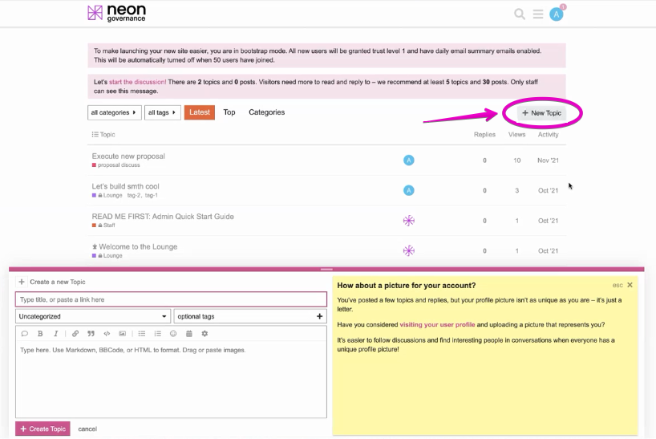
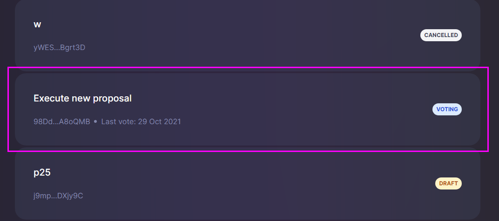
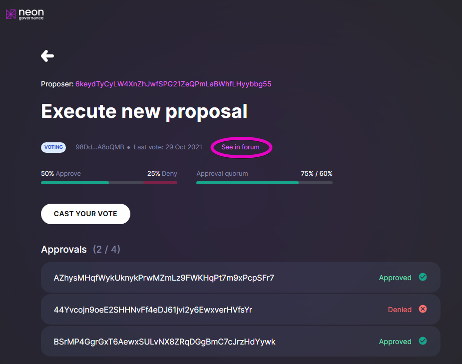
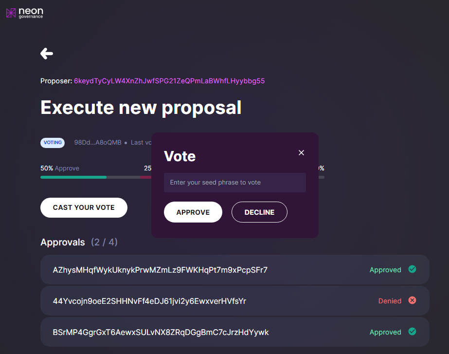

## Introduction

Any Neon user can submit an idea for potential implementation by the Neon DAO. Each idea is included in the list of promising solutions and discussed on the DAO forum. After an idea is proposed, it goes through a formal life cycle of technical reviews, research, and discussions. This discussion stage allows management to exclude the implementation of inefficient or risky solutions in Neon. After the discussion stage, finalized ideas are reworked into concrete on-chain **proposals** and are put to a vote by the Assembly. Proposals that are approved according to the rules of their Assembly are then automatically implemented by Neon.

## Discussing on the DAO Forum

The DAO Forum is a place where Neon developers and third-party teams can discuss and debate ideas and express and articulate their opinions in preparation for becoming proposals. This forum is a vital part of the Neon DAO, because it provides transparency and accountability, fosters constructive discourse, and helps ensure the decentralization of the project. 

Potential proposals can affect both the management and technical processes of Neon. If this is a proposal to change the logic of system contracts or to improve the technical capabilities of Neon, the proposal contract must be tested on either Devnet or Testnet. Proposals for the implementation of new features associated with risk or high labor costs go through the following formal process:

  * Substantiation of the need to implement this proposal, taking into account its labor intensity and relevance.
  * Development of technical specifications for the implementation of this proposal.
  * Appointment of a worker for the implementation of the proposal. The worker may be an individual, a group of individuals, or a third-party company.
  * Verification and decision on acceptance of the work done.

All these details are discussed, revised, and debated civilly on the DAO Forum.

## Creating a Proposal

Once an idea has reached its final form after discussions on the DAO Forum and the formal review process is complete, the proponent can create the actual proposal. The on-chain code to automatically implement the proposal that was tested and finalised on the DAO Forum is now ready to be included in a formal proposal on the Neon DAO website.

To create a proposal, follow the following steps:

1. On the Neon DAO website, select the Assembly for which the proposal is best suited.
2. Connct your Solana wallet, with NEON tokens available, to the DAO website.
3. Deposit the number of NEON tokens required by the Assembly for proposal submission.
4. Create the proposal, with a link to the discussion on the DAO Forum.

Current proposals are displayed on the main page of the *Neon DAO* section, under the "How to Participate" heading.

## Voting

After a proposal is created, it is ready to be put to a vote. The community of eligible voters in the relevant Assembly is then invited to cast their votes to either "Accept" or "Reject" this proposal. This is done by submitting NEON tokens to the desired option, with each NEON token being worth one vote.

To vote on a proposal, follow the following steps:

1. On the Neon DAO website, select the Assembly for which the proposal is best suited.
2. Connct your Solana wallet, with NEON tokens available, to the DAO website.
3. Deposit the number of NEON tokens equivalent to the desired number of votes for your preferred option, whether it is to "Accept" or "Reject" the proposal.
4. Click "Vote" to approve the transaction.

Once the voting period is concluded, the votes are automatically counted. If the proposal's "Accept" votes pass the Assembly's required vote threshold, the proposal is passed and is ready for implementation. Otherwise, the proposal fails.

<!-- ------------------------ -->
<!-- Below should be merged as soon as the Governance UI is ready -->

<!-- ## Using the Governance User Interface

The Neon Governance application is an open-source service designed to provide a convenient forum for submitting proposals to improve Neon EVM and for voting on the acceptance of these proposals.

Any Neon user can submit a proposal to improve the Neon EVM governance, but only stakeholders can make the final decision on whether to implement the proposal or not. Submitting proposals and voting on them are carried out using the Neon Governance application.

### Governance UI Features in the Neon Project Improvements

The purpose of Governance UI is to:
  * Store proposals and their related votes in the network's state.
  * Increase the decentralization of governance through decision-making by majority vote.
  * Avoid imposing ideas or their implementations.
  * Eliminate the adoption of ambitious decisions, the implementation of which is associated with high risk.

## General Statements for Stakeholders

  * Members must not threaten other members.
  * No member should improperly influence the vote of another.
  * Members agree to hold software developers harmless for unintentional mistakes made by them in the expression of contractual intent, whether or not said mistakes were due to actual or perceived negligence.

## Proposal Submission Procedure

> Currently, the procedure for submitting and considering proposals is being finalized and therefore some actions may differ from the ones described below. If you encounter an issue, feel free to contact *community* for help.

### Posting an Article on the Neon Forum
The first thing to do is to go to the [Neon forum](https://forum.neon-labs.org) and post an article describing your proposal. If you are not yet registered, you must do so. Then click `New Topic` and put your content in the pop-up window.

The topic of your proposal should concern Neon EVM governance. Proposal content may contain a textual description of your idea, illustrations, and links to your prepared and tested program code. If you have the code, you must provide brief instructions for installing it and checking the features that it performs.

Here is an example of the article "Execute new proposal" published on the forum:

### Submitting a Proposal to Neon Governance

If after being discussed on the forum, an article receives positive reviews, it can be submitted for consideration to stakeholders. Currently, only the Neon EVM network administrator can register a submission in Governance UI. The author of the article should notify the administrator of the intention to create a proposal.

The proposal should match the recommended template and contain the following fields:
  * `Summary` — a brief description
  * `Instructions` — the sequence of actions for installing and running program code, if it is in the proposal.
  * `Discussion` — feedback and comments from stakeholders

Once the proposal is registered in Governance UI, a new line with data about it will appear in the list of [Governance Proposals](https://governance.neon-labs.org).

### Monitoring the Status of the Submitted Proposal
The page [Governance Proposals](https://governance.neon-labs.org) contains the list of all proposals, including their names, identifiers, and current states. Authors have the ability to track the status of their proposals and monitor the voting processes. To get up-to-date information about the proposal, click on its status field.

As an example, the following figure shows the page containing detailed information about the "Execute new proposal" with the status `Voting`.

Page fields and their functional meanings:

  1. Reverse arrow icon — by clicking on it you go to the `Governance Proposals` page
  2. `Proposer` — public key of the proposer
  3. Name of the proposal
  4. Current status of the proposal
  5. Proposal ID in Neon Governance
  6. The date of the last vote, after which no votes are accepted
  7. `See in forum` — link to forum post for further discussion
  8. Voting scale, visually displaying the voting process. It also displays the percentage of `Approve` and `Deny` votes scored.
  9. `Approval quorum` — displays the percentage of votes required to approve a proposal and the minimum number of approve votes required. Once the approval quorum is greater than or equal to the specified value, the proposal is eligible to pass.
  10. `Cast your vote` — button to open the pop-up voting window. Only stakeholders are allowed to vote.
  11. `Approvals` — list of voters with their votes given. The first numeric value means the number of stakeholders who voted `Approve`. The second numeric value means the total number of stakeholders who have the right to vote.

Here is the list of possible states of proposals and their functional meaning:
  * `Draft` — The proposal is in the preparation stage.
  * `Voting` — Stakeholders are voting to accept the proposal.
  * `Cancelled` — The proposal was not approved on the forum.
  * `Execution errors` — Attempting to execute the program code attached to the proposal ended with an error.
  * `Defeated` — The number of `Deny` votes was at least 50% of the total number of stakeholders allowed to vote.
  * `Approved` — The number of `Approve` votes has reached the `Approval quorum` threshold.
  * `Succeeded` — The proposal was approved but not yet implemented.
  * `Completed` — The proposal was approved and has been implemented.
  * `Voting ended` — The time allotted for voting has expired.

### Stakeholder Voting
If you are a stakeholder and you are allowed to vote, you should be here. Others can skip this section.

You should first open the list of proposals to view their current status, and select the proposal with `Voting` that you wish to vote on or view. The voting progress page will open.

Then you should click `See in forum` to view the content of the proposal. To vote on the proposal, you must click `Cast your vote`. A pop-up box will appear.

 Click `Approve` or `Decline` to vote on the proposal. Next, you will be asked to confirm and you will have the option to add a message to your vote.

## General Definitions/Terminology
Understanding Neon's Governance structure requires one to know some niche terminology. The following are some of the more common terms used in reference to Neon Governance:

### Voting
**Voting**, in the context of Neon Governance, is the act of staking NEON tokens to either support or oppose a proposal. In general, the more tokens one stakes, the more power their vote has; however, the precise vote weight of each token varies, and can take into account factors such as the vesting period of the tokens as well as the percentage of the total token supply.

### Proposal
A **Proposal** is a request for a particular change to something in the Neon ecosystem. Each DAO authority over a certain area of this ecosystem, and a proposal in any given DAO cannot involve a change to anything that DAO does not have authority to change. For example, the Grants DAO will only publish proposals that are related to the creation and distribution of grants and rewards.

### Pass Threshold
The **Pass Threshold** is the minimum token proportion that must be submitted in support of the proposal, expressed as a percentage of the total NEON token supply. For example, proposals submitted to the Community DAO have a 1% pass threshold, so the votes in favour of the proposal must comprise more than 1% of the total supply of NEON tokens. In addition to meeting the pass threshold, a proposal must have the majority of the votes be in support in order to be accepted.

### Voting Period
The **Voting Period** is the amount of time eligible token holders have to cast their vote on a particular proposal. After this point, votes can no longer be submitted.

### Hold-up Period
The **Hold-up Period** is the minimum amount of time that must pass between the approval of a proposal and its implementation. This delay allows for voters to unstake their tokens if they change their mind regarding the proposal's implementation. If enough voters withdraw their votes in support of the proposal that the pass threshold is no longer met, the proposal will be rejected - even if it had been accepted previously.

### Proposal Creation Threshold
In order to submit a proposal to a DAO, a user must stake a minimum amount of NEON tokens - this is known as the **Proposal Creation Threshold**. For example, to submit a proposal to the Emergency DAO, the proponent must stake at least 2*103 NEON, which is 0.0003% of the total token supply. This threshold discourages frivolous proposals and ensures that proponents have invested in their proposal's success.

## Technical Implementation
The Governance UI is based on [SPL Governance](https://github.com/solana-labs/solana-program-library/tree/master/governance), a versatile DAO creation tool for the Solana blockchain.

This program allows for the customisation of the following parameters:

* Pass threshold
* Voting period
* Hold up period
* Vote weight calculation (e.g. percentage of total supply, based on vested tokens)
* Whether to allow voting using a portion of vested tokens

## Scenarios: Using the Governance UI

View locked tokens amount
Add tokens to Deposit
Withdraw tokens
Create proposal
Vote for proposal
Execute proposal
Sign up for notifications

## Quorum Criteria

This program allows for the customization of the following parameters:
* Pass threshold to accept a proposal
* Voting period
* Hold up period - the minimum time before executing an approved proposal
* Vote weight calculation (e.g. percentage of total supply, based on vested tokens)
* Whether to allow voting using a portion of vested tokens -->
