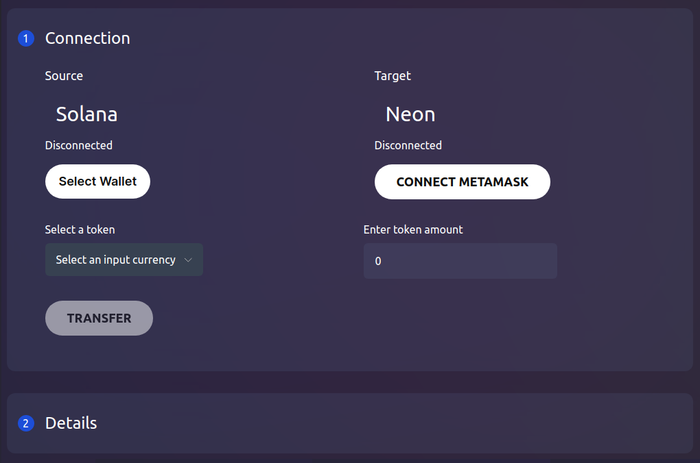
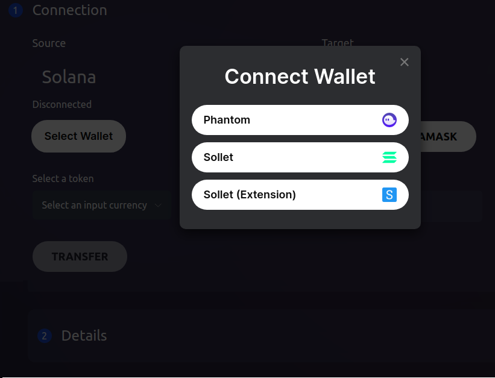
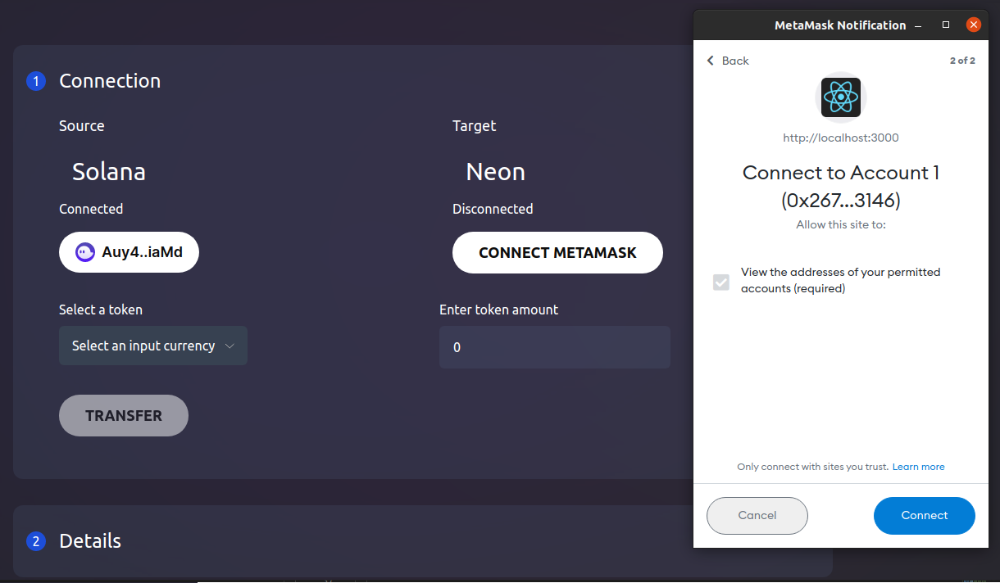
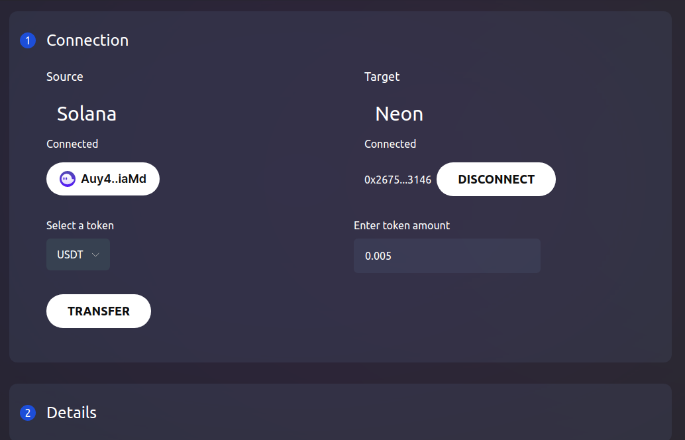
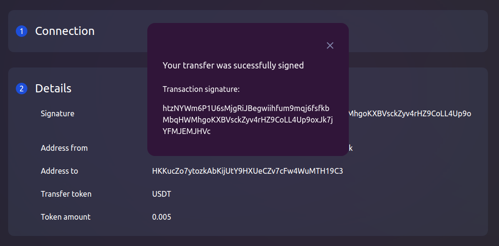

# Transferring SPL Tokens via Neon Pass

## Overview
This guide provides instructions on how to transfer tokens between Solana and Neon EVM using Neon Pass. It is assumed that you already have an account with SPL token balance in Solana, as well as an account with ERC-20 token balance in Neon EVM. Neon Pass uses [Metamask](https://docs.neon-labs.org/docs/glossary#metamask) and [Phantom](https://docs.neon-labs.org/docs/glossary#phantom) — two popular non-custodial browser based wallets. The SPL token can be any ERC-20 token deployed in Neon EVM, including SOL, ETH, USDT, or USDC. The Neon Pass application is deployed in the browser to which your wallets are attached.

## Procedure
Using Neon Pass, you can transfer tokens from Solana to the Neon EVM, or withdraw them back from Neon EVM. In our case, tokens are transferred from Colana to Neon EVM.

### Step 1. Open the Neon Pass application

Go to the main [Neon](https://neon-labs.org/) page and open the `NeonPass` tab to call the Neon Pass application. Open the Neon Bridge application in the browser to which the Phantom and Metamask wallets are attached. Switch `Reverse transfer` to set the transfer of funds from Neon EVM to Solana (this is default switch position).

### Step 2. Connect the Phantom wallet to Solana
Click `Select Wallet` on the left hand side of the screen. You will have an option to connect up wallets. You have to select the Phantom (recommended) wallet to connect it to the Solana network.

The `Select Wallet` field will be changed to the public key of the account in Solana. You will see `Connected` at the top of the field. This means that the user authorizes the application to use this key to sign transactions. Phantom stores sets of account keys, but does not store any balances. To obtain balances, Phantom will refer to the Solana blockchain.

### Step 3. Connect the Metamask wallet to Neon EVM
Click `Connect Metamask` on the right hand side of the screen. If you do not have an account created before on the Neon EVM network, you must do so now following the [instructions](https://docs.neon-labs.org/docs/software_manuals/how_to_guides/connect_metamask_to_solana). In the dropdown window `Metamask Notification` you will see the public key of the account in Neon EVM. 

Click `Connect` to complete the connection. The `Connect Metamask` field will be changed to the account's public key connected to the Neon EVM network. You will see `Connected` at the top of the field.

### Step 4. Select the ERC-20 token and sign the transaction

Now you need to select the token symbol from the list of ERC-20 tokens available to the application and specify the amount to be transferred.

Check the completed fields and click `Transfer` to sign and send the transaction.

### Step 5. Check the results of the completed transaction.

Open the `Details` tab located below. The application will display you the results of the completed transaction, including the sender and recipient addresses, as well as the symbol and amount of the transferred tokens.

> After crediting tokens to the account balance in Neon EVM, you can use them to pay for the gas required for each transaction to execute. You can also exchange these tokens for any other tokens used in Neon EVM. To do so you can use the Neon Swap application.
