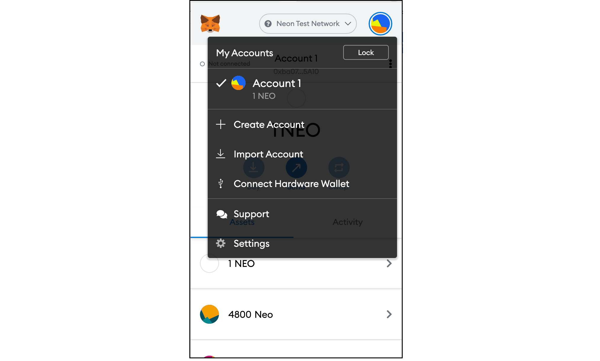
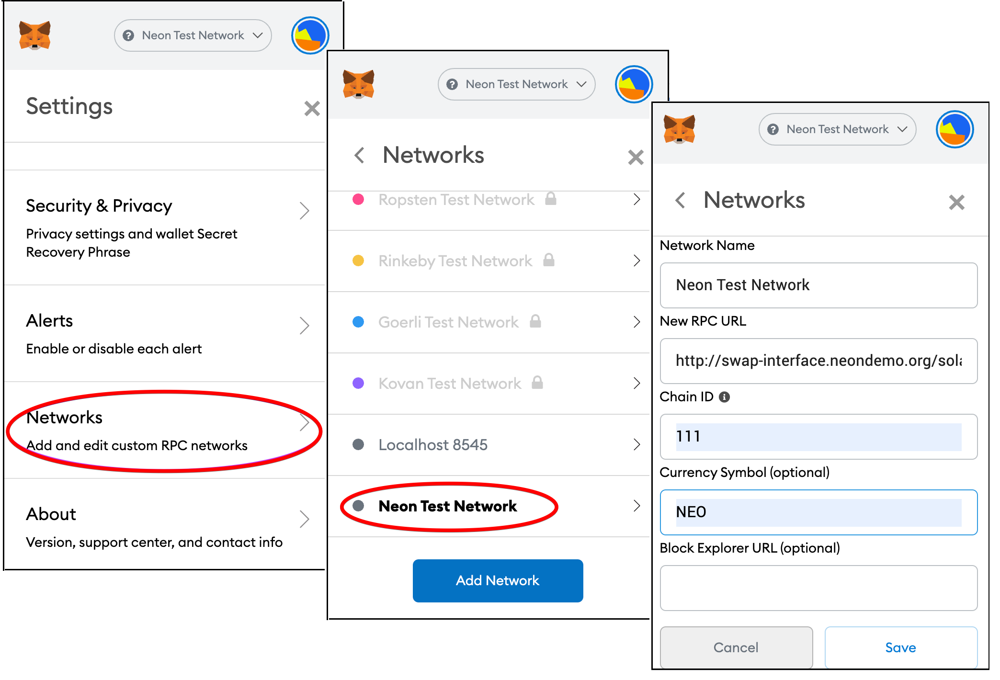
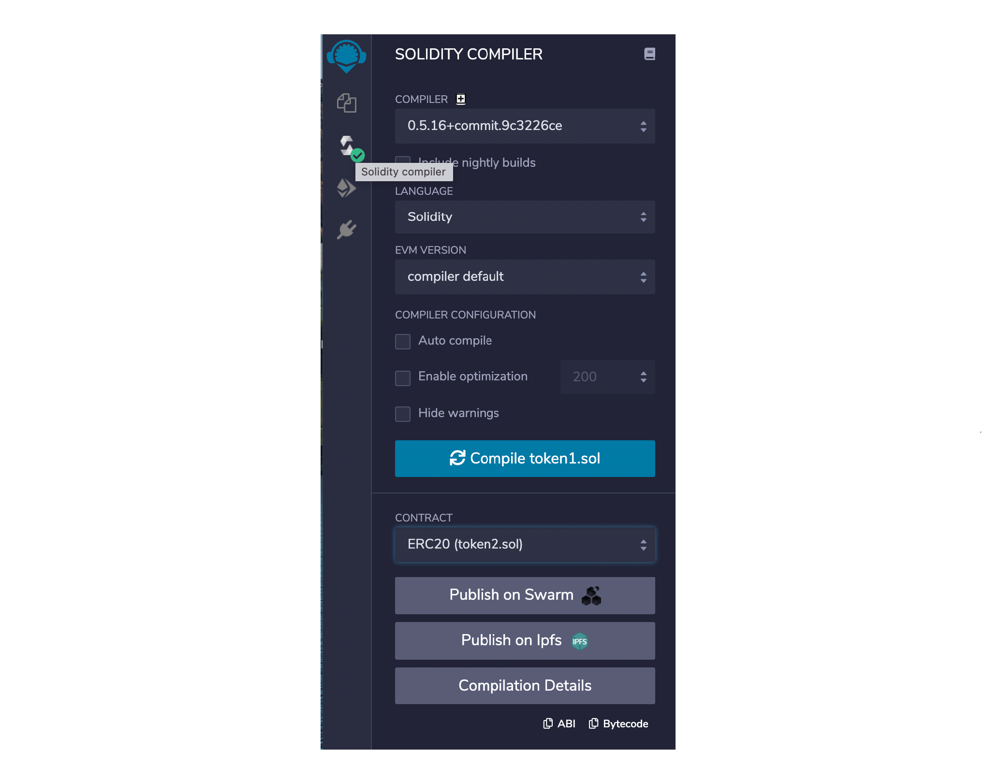
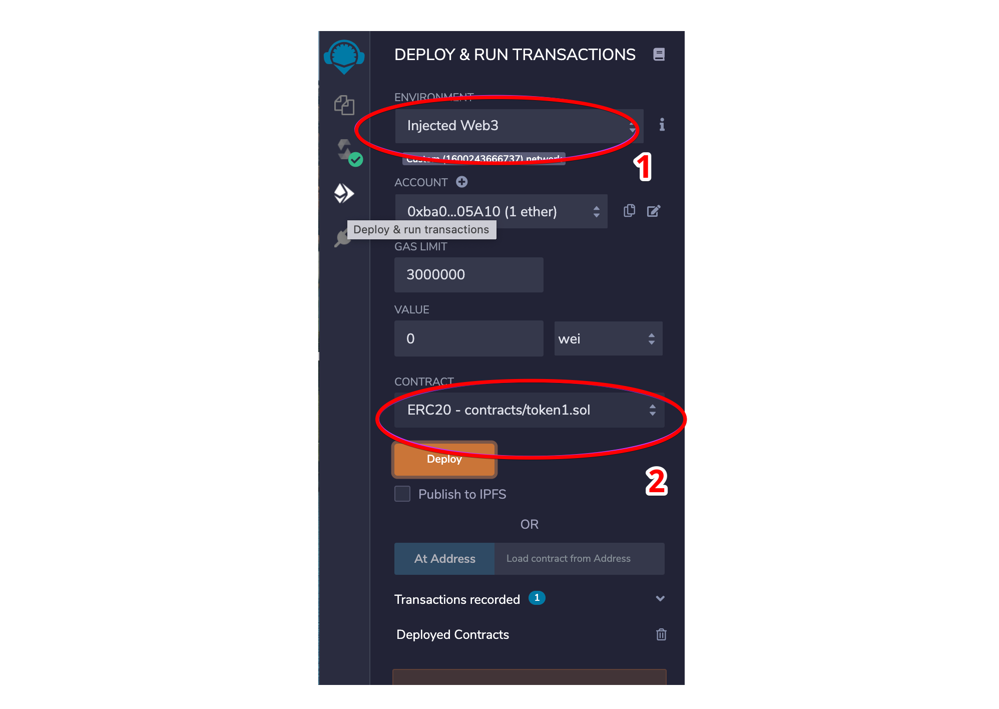
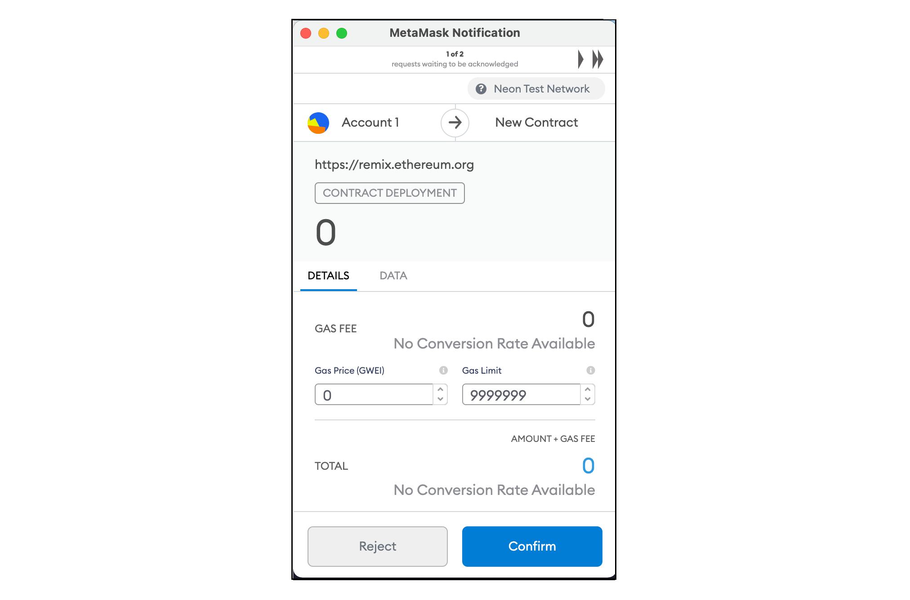
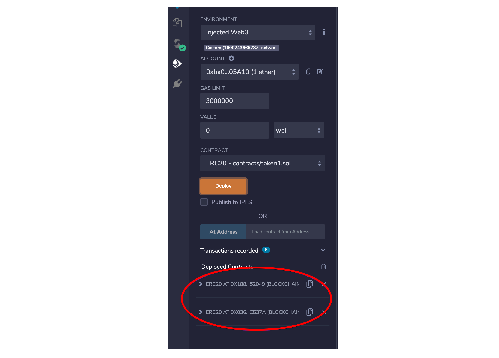
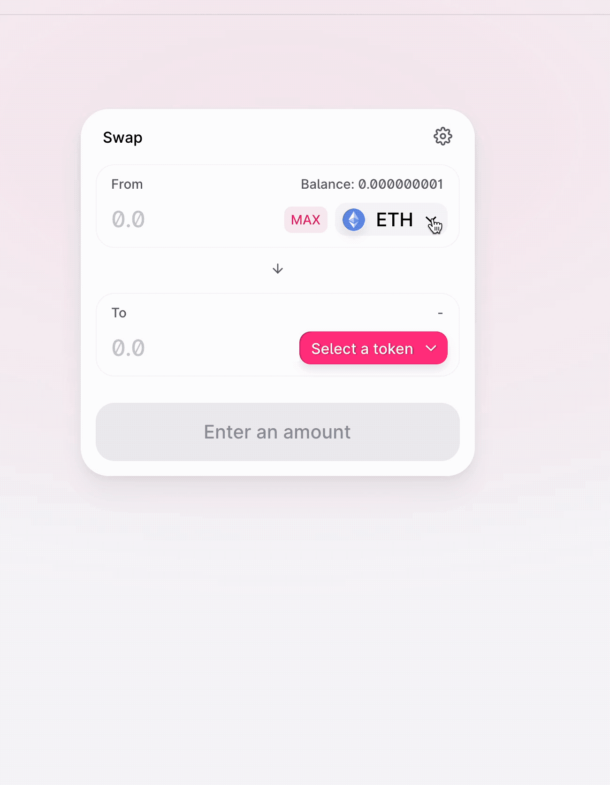

# NeonSwap demo guide

*This guide describes how to deploy an application on Neon EVM via [NeonSwap](https://doc.neonlabs.org/docs/glossary#neonswap) services using the example of tokens exchange. You can see how easily your applications can be run on [Solana](https://docs.solana.com/introduction) without any software code changes.*

Any ethereum dapp using a swap service consists of 2 parts: contracts and software processing these contracts. Contracts are loaded into a chain, and the software is deployed on a separate server for providing users interaction with these contracts. Below is a description of the steps that Ethereum users can follow to run their apps on Solana.

Running an ethereum dapp on [Solana](https://docs.solana.com/introduction) is done in 3 stages:  
  * Deploying contracts in a Neon EVM environment.  
  * Check if the deployed contracts work correctly.  
  * Deploying the NeonSwap interface.

### Requirements
Before you begin, make sure of the following:
  * Your proxy server should already be deployed in Neon EVM by this time.
  * You have provided online access to [Remix](https://remix.ethereum.org/) to use the `Remix - Ethereum IDE` open source web application.

No changes to software serving contracts are required to port dapps using NeonSwap. All you need is to follow the instructions step by step.

### Step 1. Navigate to [Neon demo](http://swap-interface.neondemo.org/)
Neon will provide credentials to access this page (if there are difficulties, do not hesitate to contact the Neon community to help you).

### Step 2. Import your demo account’s unique private key
  * Open MetaMask and click the identicon in the top right corner.
  * Click `Import Account` and paste the private key that was provided by Neon.
  * Click `Import`.



### Step 3. Add the Neon proxy network
Add a custom [RPC](https://doc.neonlabs.org/docs/glossary#rpc) network. To do so:
  * Click the identicon in the top right corner of MetaMask window and click `Settings`.
  * Select `Networks` in the bottom of the list, then click `Add Network`.
  * Choose any Currency Symbol you like. The required fields are:
```
Network Name = Neon Test Network
New RPC URL = http://swap-interface.neondemo.org/solana
Chain ID = 111
```
The results of the actions performed are shown in the following figure.



### Step 4. Add test assets
  * The accounts provided to you should have two tokens (*NEON_A* and *NEON_B*, for instance) already. If they do not appear, follow the steps below:
    * In MetaMask, click `Assets` and `Add Token`. There will be two assets.
    * Copy/paste the following Token Contract Addresses and click `Next`:

*0xB150f5Df93491A3b8B1742f0b5943Ac4287C7064*  
*0x5a379A80Ae648748baBcE274944Da26c6aa9bF9f*

### Step 5. Start swapping
  * Copy contract addresses from Step 4.
  * Navigate to the `Swap` tab, click the dropdown, and copy/paste the contract addresses.  
**You are now ready to swap!**
  * We have already created liquidity for you. Optionally, however, you can navigate to the `Pool` tab and add liquidity. To do this, click the token dropdown menus and paste the contract addresses for *NEON_A* and *NEON_B*. Then, approve each token and supply the liquidity.  
**You can supply liquidity in any quantity as long as you maintain some tokens to swap with.**  

> The following steps are optional!  
> *To make sure the deployed contracts can be run successfully on Neon, you can deploy your own tokens to Neon Test Network via Remix and control the process.*  

### Step 6. Deploy two [ERC-20](https://github.com/neonlabsorg/uniswap-v2-periphery/blob/master/contracts/test/ERC20.sol) contracts to Neon Test Network for use in the demo

With Neon, Ethereum developers can use the same tools to deploy contracts on Solana. Try it yourself with Remix:
  * Open [Remix](https://remix.ethereum.org/).
  * We have 3 Solidity contracts ready to upload, which can be found [here](https://www.dropbox.com/sh/jp7u17ril0zlasm/AADHo8EasRJzQ7SW1yJtGGcxa?dl=0). These are [SafeMath.sol](https://www.dropbox.com/sh/jp7u17ril0zlasm/AADHo8EasRJzQ7SW1yJtGGcxa?dl=0&preview=SafeMath.sol), [token1.sol](https://www.dropbox.com/sh/jp7u17ril0zlasm/AADHo8EasRJzQ7SW1yJtGGcxa?dl=0&preview=token1.sol), [token2.sol](https://www.dropbox.com/sh/jp7u17ril0zlasm/AADHo8EasRJzQ7SW1yJtGGcxa?dl=0&preview=token2.sol).
  * Upload contracts to Remix (red circle in the screenshot):
> Important to upload to the Contracts folder.

  

  * Now go to the `Contracts` folder and follow steps below for **each** token contract:
    * Select the `Solidity compiler` tab, select your contract, and click `Compile`. 
    * Next, deploy contracts via the `Deploy & run transactions` tab. Note that you will need to select `Injected Web3` as your environment and ensure you’ve specified the correct contract under the `Contract` dropdown menu. Click `Deploy`. 
    * When MetaMask opens and shows the following, click `Confirm`. 
    * You should have two the ERC-20 contracts deployed now. 

### Step 7. Import contract addresses to Uniswap on Neon Test Network, provide liquidity, and execute swaps

  * Copy *contract addresses* from Remix and navigate back to Uniswap demo.
  * Navigate to the `Pool` tab and click `Create a pair` to add new liquidity:
    * Click the token dropdown menus and paste the contract addresses for token1 and token2.
    * Approve **each** token and supply the liquidity.
  * Return to the `Swap` tab and toggle tokens 1 and 2 again in their respective dropdown menus.
> *You are now ready to swap!*  


 | | 
:-:|:-:|:-:
|  | 


> If you have any questions/issues with the demo, please reach out to *@Ikeguchi* or *@mgureva* on Telegram.  
>  
> Thank you!

-----  

**Useful links**  
[Deploying contracts on Solana via Remix](http://docs.neonlabs.org/docs/devportal/testnet/deploy_contract_via_remix)  
[Installing and setting up MetaMask](https://docs.neonlabs.org/docs/devportal/metamask_setup)