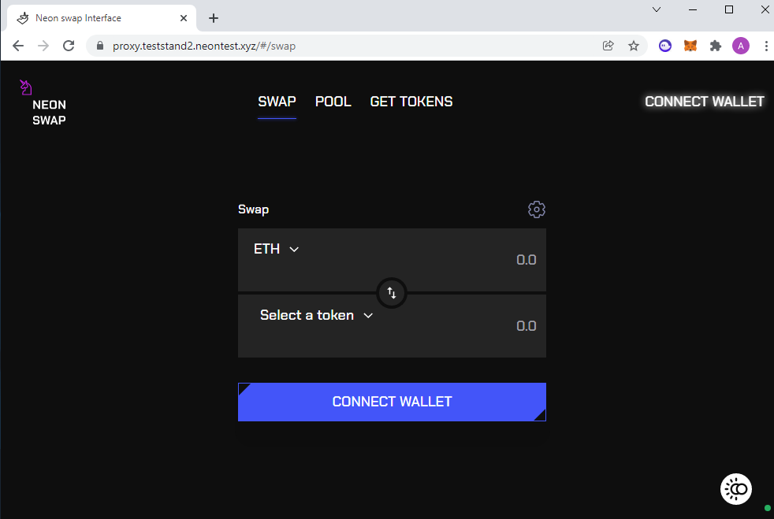
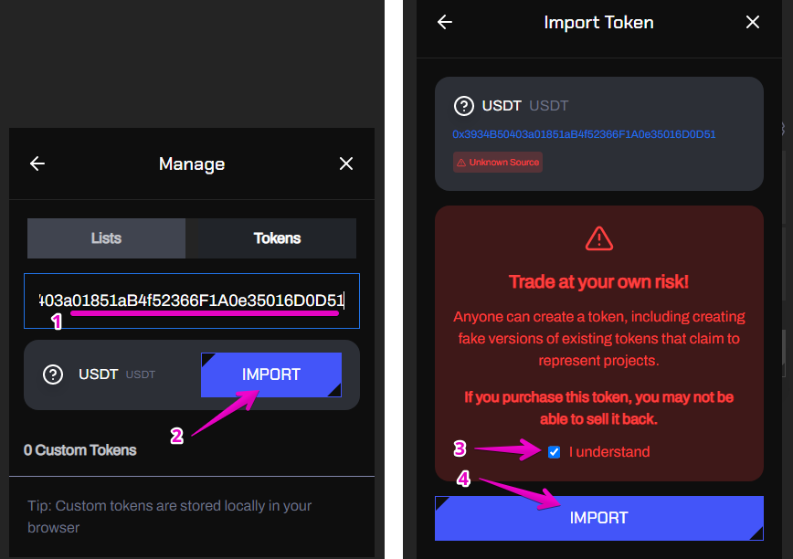
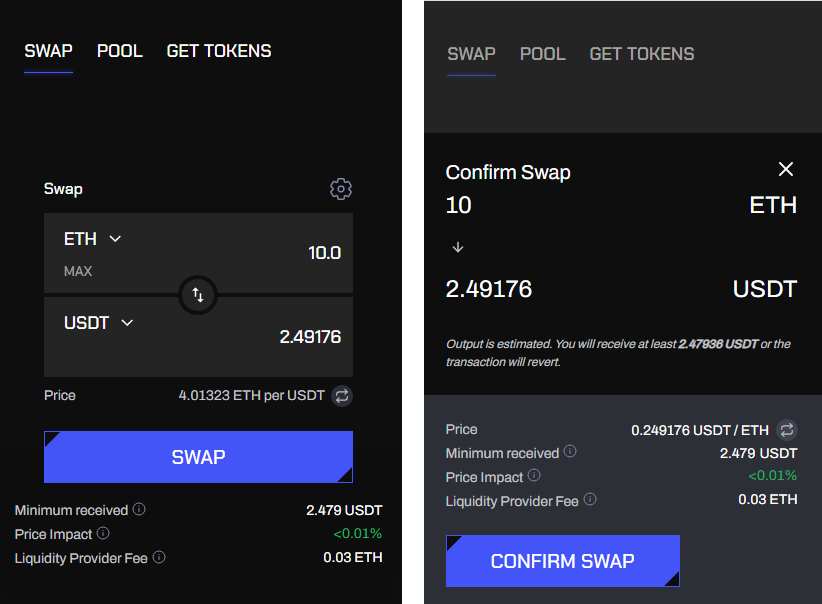
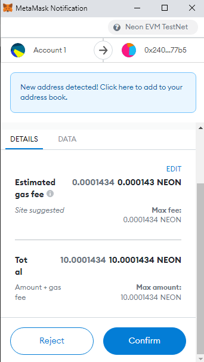
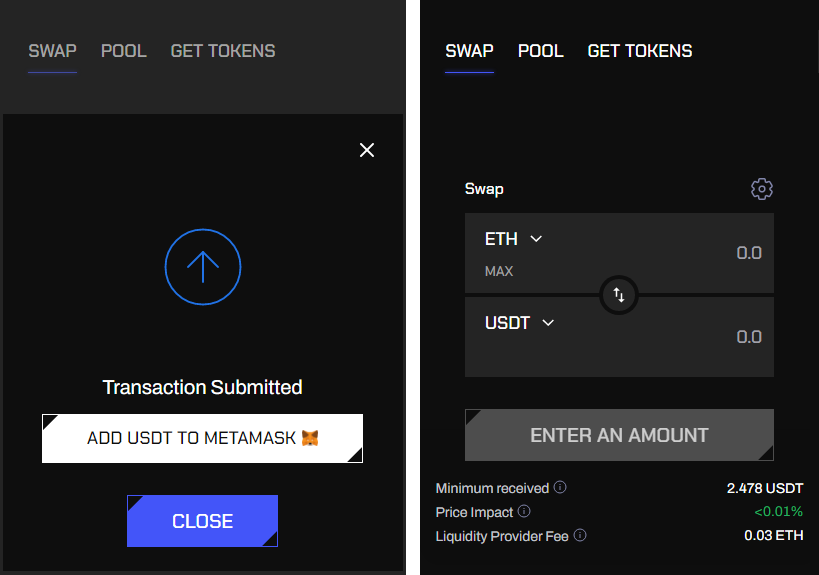
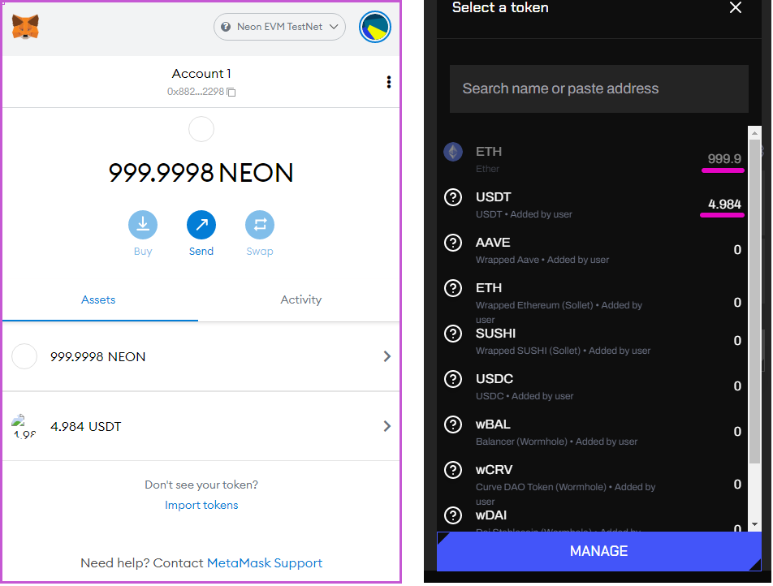
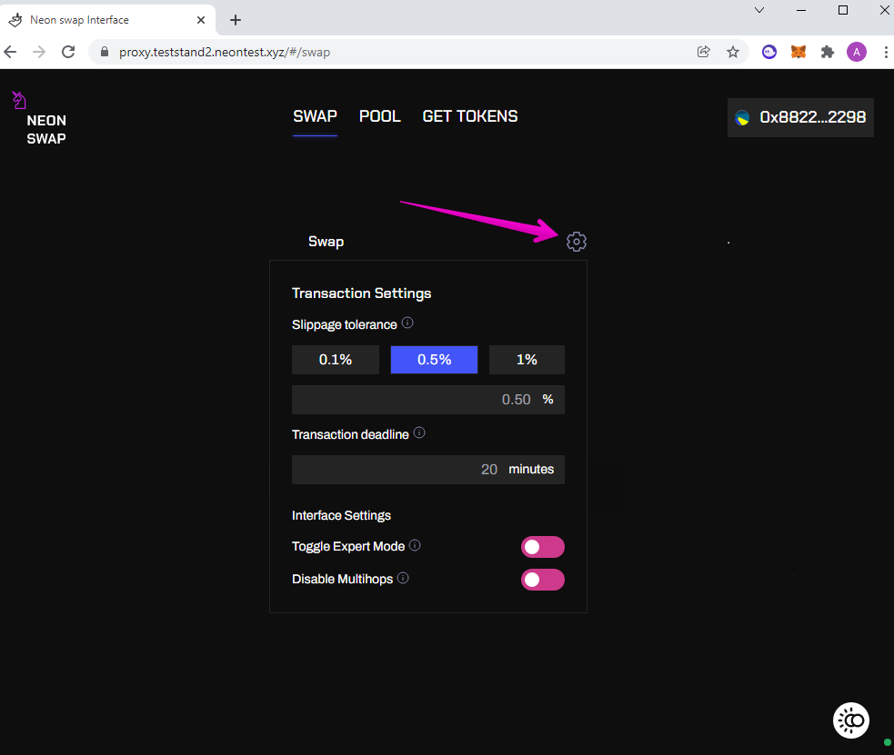

# How to Swap ERC-20 Tokens

## Goal
To swap an ERC-20 token with another token of the same standard using the Neon Swap application.

*Condition:* The ERC-20 token can be any [SPL token](https://doc.neonlabs.org/docs/glossary#spl-token) whose contract complies with the [ERC-20 standard](https://docs.neon-labs.org/docs/glossary#erc-20) and is deployed in Neon EVM.

## Before you begin
  * Understand the following:
    * What is the [Solana network](https://docs.solana.com/clusters).
    * What is the [Metamask](https://docs.neon-labs.org/docs/glossary#metamask).
  * The [Metamask](https://docs.neon-labs.org/docs/glossary#metamask) wallet must be installed on your device and can be accessed from the browser you are using.
  * Learn the guide [How to Connect Metamask to Solana's Network](https://docs.neon-labs.org/docs/software_manuals/how_to_guides/connect_metamask_to_solana).

## Steps
The Neon Swap application allows any user to swap one token for another. You just need to connect your wallet to the application following the step-by-step instructions. Swapping tokens will be carried out automatically without sending funds to the exchange. There are some gas transaction fees to pay with the application.

This tutorial outlines the exchange of ETH->USDT tokens.

### Step 1. Open the Neon Swap application and connect your wallet
Go to the main [Neon](https://neon-labs.org/) page and open the `Neon Swap` tab (the link will be added later) to call the Neon Swap application. Before you can make a swap you need to connect your wallet. Click `Connect Wallet` on the swap screen.

From the list appeared on the dropdown window you have to select your wallet (in our case, this is Metamask). Select the account you want to connect to.

### Step 2. Select a pair of tokens to be swapped

After connecting your wallet you can begin setting the exchange. You need to select the token that will be swapping from. It will retrieve your balance from the connected wallet. In our case, it will be ETH.

Click `Select a token` to open up a menu where you can select a token to exchange for.

### Step3. Add a new token to the list, if necessary
The `Select a token` menu contains tokens deployed in Neon EVM. If the token symbol you specified is not in the list, you can paste the token's address if you know what it is. But be aware, the token must first be deployed on the Neon EVM network.

If you want to add a new token to the list, click `Manage` at the bottom of the box. The `Manage` tab will open on the screen. Add the address of the new token deployed in the Neon EVM network and click `Import` (you can take a token's address from a namber of places including ERC20 Wrapper Address (Neon EVM) (*the link will be added later*).

You will receive a warning message "Trade at your own risk!". If you are confident in your actions, agree to `I understand` and click `Import`.
After that, the symbol of the new token will appear in the list of tokens available for swapping.

### Step 4. Enter the quantity you want to sell

To check the balance of the token being sold, click `max` (next to the token symbol). Keep in mind that some amount of the token must be spent as a fee to pay for gas required for a transaction to execute. If you specify the entire amount of funds for trade, the resulting exchanged amount will be reduced by the fee.

If there are not enough tokens in the pool to exchange, Neon Swap will warn about this by issuing the message "Insufficient liquidity for this trade".

In our case, we exchange ETH tokens for USDT tokens. Let's specify the number of tokens to be exchanged equal to 10. Neon Swap will indicate the expected number of purchased USDT tokens, corresponding to 2.49176 at the exchange rate before our transaction.

### Step 5. Perform the exchange
Before you can submit this exchange, you need to understand the following things about it:
  * `Price` — the price at which the exchange is possible.
  * `Minimum received` — the minimum amount of tokens (in our case, USDT) you will receive if the trade goes through. The trade will fail if price deviates too much during the transaction (also known as [slippage](https://doc.neonlabs.org/docs/glossary#slippage)).
  * `Price impact` tells you how much your swap will affect this token's price. This value can be seen as a loss you will take on the swap. The closer this number is to zero the better.
  * `Liquidity Provider Fee` — the fee you will pay for this transaction. Neon Swap charges a *0.03 %* fee of the total transaction amount. This fee is expressed in the token you are selling (in our case, ETH).

Once you are ready to perform the exchange click `Swap`. A confirmation window will pop up with details of the exchange. If the conditions are accepted, click `Confirm Swap`. A request will be sent to Metamask to confirm the transaction.

### Step 6. Check the result of the exchange

The request will open up a MetaMask window where you can confirm the transaction. You can see an estimate of how much gas you will pay. Click `Confirm` to send the transaction.

You can also check the result of the trade in the Neon Swap window. Click `Close` to complete the transaction.

Now you can open the Metamax, as well as the list of tokens, by clicking `Select a token` and make sure that the balances of tokens  have changed to the expected values.

The transaction is complete which means you have successfully changed your ETH for USDT.

### Step 7. Additional settings for trading

Click the cogwheel icon. The window `Transaction Settings` will pop-up on the screen to set up the advanced swap:

Transaction settings:
  * `Slippage tolerance` — the allowable amount of price change. It means that the order is fulfilled at a price different from what you expected. If it exceeds the tolerance level selected, the transaction will not go through. If you are trading during high volatility, you may want to increase this value. Increasing the transaction speed can help you to reduce the chances of high [slippage](https://doc.neonlabs.org/docs/glossary#slippage).
  * `Transaction deadline` — allows the transaction to automatically cancel if it is taking too long to process.
  * `Toggle Expert Mode` — disables the confirmation screen and removes [slippage](https://doc.neonlabs.org/docs/glossary#slippage) limits. It is not encouraged to enable this mode unless you fully understand the risks.
  * `Disable Multihops` — disables complex conversion paths. For example, if there is not enough liquidity in the "A->B" token pair, then the algorithm can involve other tokens to find the "A->C->B" intermediate route and make an exchange for you. This action requires more network fees, because several smart contracts are involved.
