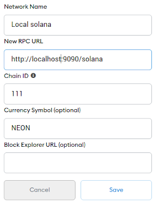
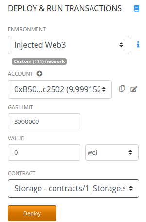

# Installation and setup

*The guide describes how to install, configure and test the local Solana cluster. This document will be useful in assisting new developers to create their development environment. You can just follow this guide step by step.*

> The *Neon EVM* is a solution that performs transaction execution outside layer 1.
> 
> The development process should run on any modern Linux or Mac system, though this document is based on Ubuntu 20.04 experience.

## Prerequisites

* [Rust, latest stable version](https://www.rust-lang.org)
* [Python 3.x](https://www.python.org/downloads)
* A Chromium-based browser for Metamask and Remix

## Repositories

* [Solana](https://github.com/neonlabsorg/solana) — a blockchain implementation
* [Solana Program Library](https://github.com/solana-labs/solana-program-library) — a collection of Solana-maintained on-chain programs
* [Proxy Server](https://github.com/neonlabsorg/proxy-model.py)

## Documentation

Solana has excellent [documentation](https://docs.solana.com). Here is a list of several topics related to this guide:
* [What is Solana?](https://docs.solana.com/introduction)
* [CLI reference](https://docs.solana.com/cli)
* [How to work with wallets](https://docs.solana.com/wallet-guide)
* [Solana Program Library](https://spl.solana.com)

## System Dependencies

Make sure that the following packages are installed on your system:
* `libssl-dev`
* `libudev-dev`
* `pkg-config`
* `zlib1g-dev`
* `llvm`
* `clang`
* `make`

Ubuntu users can install these packages using the following command:
```sh
$ sudo apt install <list-of-packages>
```

## Linux File Number Limit

Linux systems limit the number of file descriptors that any one process may open. Solana requires much more than typical Linux system permits. So we have to increase this limit by adding the following two lines to the file `/etc/security/limits.conf`:
```
<username> soft nofile 500000
<username> hard nofile 500000
```
and rebooting. Make sure to replace `<username>` with your actual user name in the system.

## Building Solana 1.6.9-resources

Currently we are using version `1.6.9` of Solana Cluster. Change to `solana` (cloned from the corresponding repository) directory, checkout branch `v1.6.9-resources` and issue the build command:
```sh
$ cargo build --workspace --release
```
It should build all packages in the workspace. The final artifacts will be placed into the `target/release` directory.

> Note: Ubuntu 20.04 Linux platform not have libssl and libssl 1.0.0 version in default packages and for sucess build need to make it's from [source](https://github.com/openssl/openssl/tree/OpenSSL_1_0_2-stable) or another binary package containing it.

## PATH

Some programs must be located in the system PATH. They include:
* `solana` — the Solana CLI utility
* `solana-keygen`
* [`solana-deploy`](#setup-and-launch-solana-cluster)
* [`emulator`](#building-neon-evm-cli)
* [`spl-token`](#building-neon-evm-program)
* [`cargo-build-bpf`](#building-bpf-compiler)

Linux users may place these programs into `~/.local/bin`, for example.

## Building BPF compiler

On-chain Solana programs should be built into eBPF virtual machine bytecode. There exists BPF compiler `cargo-build-bpf`, which should be placed in the PATH.

## Setup and launch Solana Cluster

Solana Cluster is a set of validators that work together to serve client transactions and maintain the integrity of the ledger. To select a development cluster you should issue the following command:
```sh
$ solana config set --url http://localhost:8899
```
> Note, the command `solana config get` shows current configuration.  
Now you can start the local cluster filtering out unneeded logging output:
```sh
$ export RUST_LOG='solana=error,solana_runtime::message_processor=trace'
$ export NDEBUG=1
$ ./run.sh 2>&1 | grep -v 'Program Vote111111111111111111111111111111111111111'
```

## Building Neon-EVM program

If you have a BPF compiler, you can build Solana programs.   
Change to the `evm_loader/program` directory cloned from the https://github.com/neonlabsorg/neon-evm repository.
Get `rust-evm` using the command:
```sh
$ git submodule update --init
```
Build all programs:
```sh
$ cargo build-bpf --bpf-sdk <path-to-solana_v1.6>/sdk/bpf
```
The final artifacts (`*.so` files) will be placed into the `target/deploy` directory. Each program (it's bytecode) is wrapped into a shared library. Here you are interested in `evm_loader.so` (support of EVM).

## Building Neon-EVM cli

The `neon-cli` is utility to work with Neon-EVM program and emulate method calls of Ethereum smart contracts loaded to Solana network and show used contracts. It will be necessary for another components of the system. Change to `evm_loader/cli` directory and build:
```sh
$ cargo build --release
```
The resulting artifact `target/release/neon-cli` should be placed in the PATH.

## Using the Solana Cluster

You now have all the tools you need to use and develop on Solana. You can try several possibilities here to check and make sure that the installation is working and sane.

You can check availability of Solana cluster using the following command:
```sh
$ solana cluster-version
```

### Solana Accounts

Solana account is a persistent file addressed by public key. To create new account you can use the following command:
```sh
$ solana-keygen new
```
It generates a secret key which is stored somewhere, in this case in file `~/.config/solana/id.json`, and shows corresponding public key which serves as the address of an account, for instance, `3CMCRJieHS3sWWeovyFyH4iRyX4rHf3u2zbC5RCFrRex`.

You can view your key using:
```sh
$ solana-keygen pubkey
```

You can get some SOLs on this account:
```sh
$ solana airdrop 1
```
and check it with
```sh
$ solana balance
```

### Deploying Solana programs

Solana programs are something like components or smart contracts, representing a library of methods. To make use of a program you can `deploy` it into the cluster using the following command:
```sh
$ solana program deploy <path-to>/evm_loader.so 
```
The output of deploy is a *program id*:
```
{"programId":"6Xazu21Qa1SLk1RN5594uz4tDJr6gMhr2ykCD8CF29gw"}
```
You can deploy any other program, say, `spl_token.so` and `memo.so` (from solana-program-library repository which will be needed to test the proxy).

## Setup and launch the proxy server

The `proxy server` enables `Metamask` to work with Solana seamlessly. Current version is written in Python and requires some packages to be installed with `pip3`:
* `web3`
* `typing-extensions`
* `ecdsa`
* `pysha3`
* `eth-keys`
* `rlp`
* `solana`

Apply patch `./proxy/solana-py.patch` to `solana` python library in [proxy server](https://github.com/neonlabsorg/proxy-model.py) local repository path..

The proxy server makes it possible. Export `program id` of the `evm_loader` before start of the proxy:
```sh
$ export EVM_LOADER=6Xazu21Qa1SLk1RN5594uz4tDJr6gMhr2ykCD8CF29gw
```

Now you can start it in [proxy server](https://github.com/neonlabsorg/proxy-model.py) local repository path:
```sh
$ python3 -m venv venv
$ source venv/bin/activate
(env) $ pip install -r requirements.txt
(env) $ ./proxy/run-proxy.sh
```

## Integrating Remix & Metamask with Solana cluster

Setup **Metamask** (in Chromium) to connect to the proxy:

<p align="center">  

</p>  

Open Remix (also in Chromium) and select "Injected Web3" environment. Now it should be able to deploy and call smart contracts in our EVM in Solana:

<p align="center">  

 </p>  

## Using Solana programs

A program is ready to use after successful deployment (see the cluster logs). For instance, you can write [simple client in Rust to call the memo program](https://github.com/neonlabsorg/neon-evm.docs/wiki/Example:-calling-the-memo-program).

There exists client `spl-token` (can be installed via `cargo install spl-token-cli`) to manage Solana tokens. For instance:

Create token:
```sh
$ spl-token create-token
Creating token E4gHUNesScSTYFQ32m1ypZBbu3EuJ7cxUjskiJNviuMG
Signature: b2XxdqqCAQRYPcx9cwSWaeHrYRPEyP7eKpvczrZKb5miWbwbusdY4hkDa6uqS8u4frE5uYFia84shGzC38zHPC1
```

Check the token supply (sum of all balances):
```sh
$ spl-token supply E4gHUNesScSTYFQ32m1ypZBbu3EuJ7cxUjskiJNviuMG
    0
```

Create a token account:
```sh
$ spl-token create-account E4gHUNesScSTYFQ32m1ypZBbu3EuJ7cxUjskiJNviuMG
Creating account 6XX6pJ1BTtDbxK1WK1Mtei2vMsNSz52EcJXX5MHsu96S
Signature: 5jL1yTGXRgzb61L2TUYCMqidRUxzScMTqooknGy11x3AZSYTKeewAYxV5xHdf6JcxNLQV1F4htQuKb8FmTghxho8
```

Check balance of an account:
```sh
$ spl-token balance 6XX6pJ1BTtDbxK1WK1Mtei2vMsNSz52EcJXX5MHsu96S
    0
```

Issue some tokens:
```sh
$ spl-token mint E4gHUNesScSTYFQ32m1ypZBbu3EuJ7cxUjskiJNviuMG 100 6XX6pJ1BTtDbxK1WK1Mtei2vMsNSz52EcJXX5MHsu96S
Minting 100 tokens
  Token: E4gHUNesScSTYFQ32m1ypZBbu3EuJ7cxUjskiJNviuMG
  Recipient: 6XX6pJ1BTtDbxK1WK1Mtei2vMsNSz52EcJXX5MHsu96S
Signature: 5JFPs2dmN2GzS9fMSFQheCSCxGTDfxkEoWThLaHn3GTHHrLXkwT5RYeBvtbsTJfNPCpRCFe1FHLag3A21T5g9ZDR
```

Now `supply` and `balance` should show `100`.

Wrap some SOLs in the token:
```sh
$ spl-token wrap 1
Wrapping 1 SOL into DJWUuYGEwvbcHVwMrt9iQWx7mwLH3xzaGrDMcDHr1Roz
Signature: 1WcgdAhWsLyDFQ2kVQVPFTiikYfGZV7rwqaqfiDtdkCtG6qdEkAwx9TXsuHFmowCMsu5WMHVNan1ZnVdN75enfF
```

Reverse operation:
```sh
$ spl-token unwrap DJWUuYGEwvbcHVwMrt9iQWx7mwLH3xzaGrDMcDHr1Roz
Unwrapping DJWUuYGEwvbcHVwMrt9iQWx7mwLH3xzaGrDMcDHr1Roz
  Amount: 1 SOL
  Recipient: 3CMCRJieHS3sWWeovyFyH4iRyX4rHf3u2zbC5RCFrRex
Signature: FUCoRQdbsFtwKy7o4FFGgr1o4yt9d63kJNkBg97sXruT6H5ZjRNtpa5xAcfpV9zdsy4f6qP3KMScEsAGBvvCRoL
```

Create another token account:
```sh
$ spl-token create-account E4gHUNesScSTYFQ32m1ypZBbu3EuJ7cxUjskiJNviuMG
Creating account cKUvQf6KCzvAYwe9BY7Y4VmVoBqs4dJhX14QzRsZZXD
Signature: 4dhzZfLFSJhThLEAAK78giyx5iGFon3Pw4NKvUkNCkcqHLVinThLe6pAn7ZkSBhqiqWiKWM3Qv2ToNc9bUBAhqLf
```

Transfer some tokens from the first account to the new one:
```sh
$ spl-token transfer 6XX6pJ1BTtDbxK1WK1Mtei2vMsNSz52EcJXX5MHsu96S 50 cKUvQf6KCzvAYwe9BY7Y4VmVoBqs4dJhX14QzRsZZXD
Transfer 50 tokens
  Sender: 6XX6pJ1BTtDbxK1WK1Mtei2vMsNSz52EcJXX5MHsu96S
  Recipient: cKUvQf6KCzvAYwe9BY7Y4VmVoBqs4dJhX14QzRsZZXD
```

It reflects in balances:
```sh
$ spl-token accounts
Account                                      Token                                        Balance
-------------------------------------------------------------------------------------------------
cKUvQf6KCzvAYwe9BY7Y4VmVoBqs4dJhX14QzRsZZXD  E4gHUNesScSTYFQ32m1ypZBbu3EuJ7cxUjskiJNviuMG 50
6XX6pJ1BTtDbxK1WK1Mtei2vMsNSz52EcJXX5MHsu96S E4gHUNesScSTYFQ32m1ypZBbu3EuJ7cxUjskiJNviuMG 50
```
