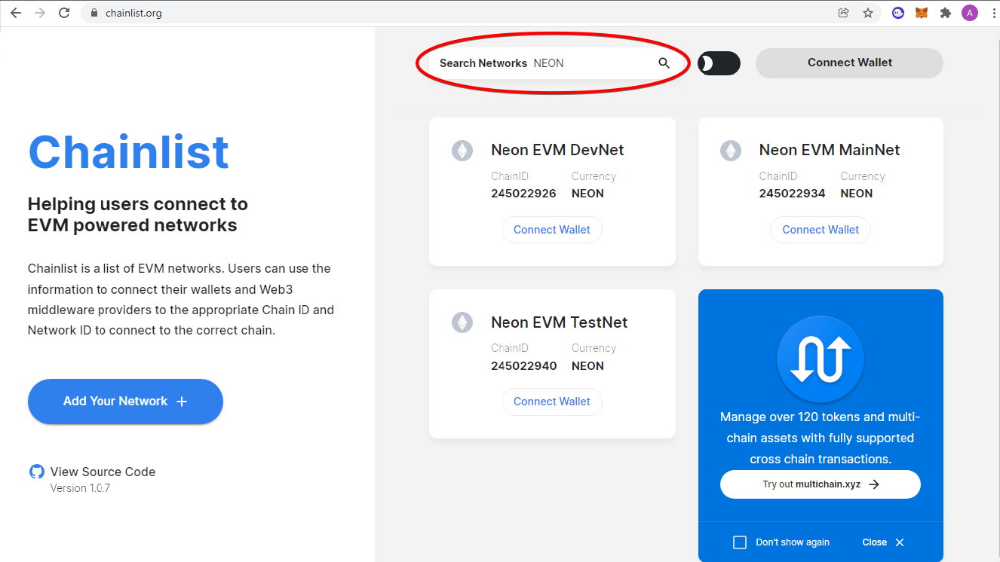
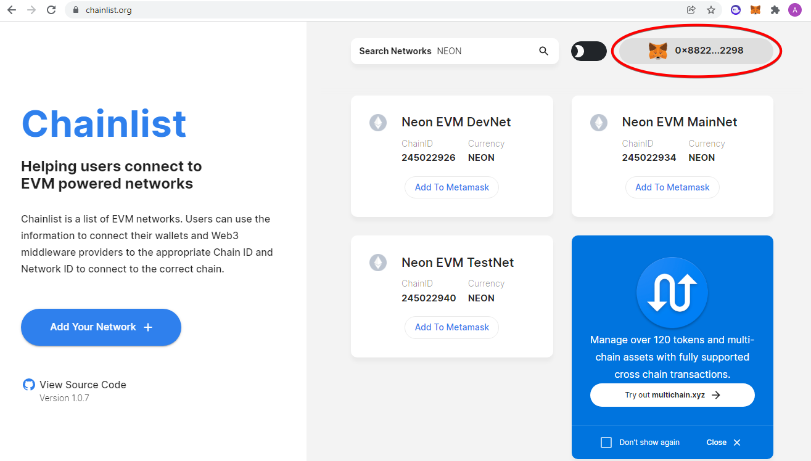
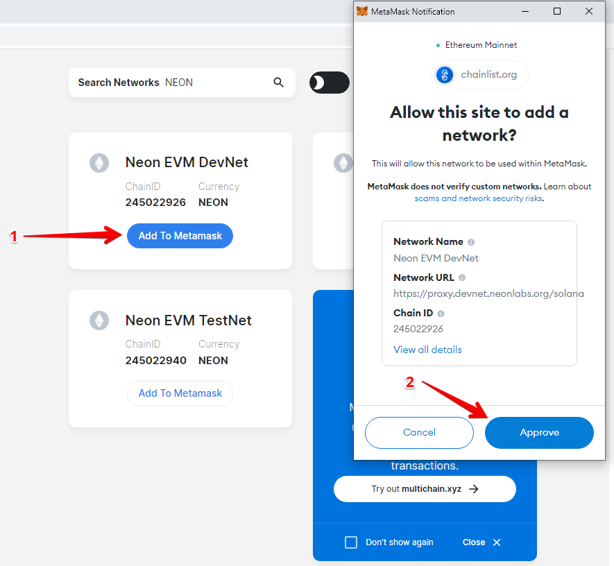
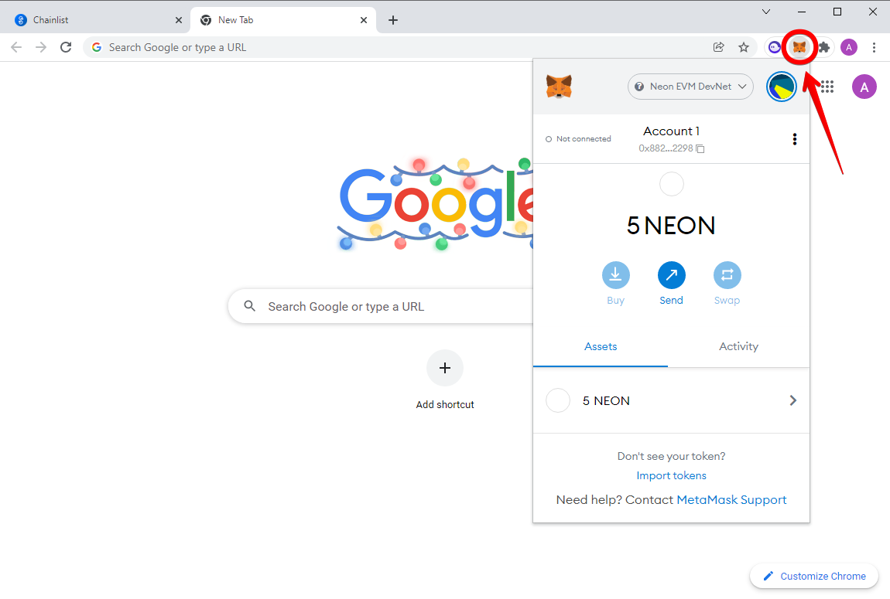

# How to Connect Metamask to Solana's Network

## Goal
To connect Metamask to Solana's network via the Neon EVM.

## Before You Begin
  * Understand the following:
    * What is the [Solana network](https://docs.solana.com/clusters)?
    * What is [MetaMask](https://metamask.io)?
  * MetaMask must be installed on your device and can be accessed from the browser you are using.

## Steps

### Step 1
Open the https://chainlist.org/ web page. In the `Search Networks` field, type the NEON token symbol.
The search will select three Neon EVM networks with their corresponding ChainIDs in which this token can be circulated.

### Step 2
In the upper right corner, click `Connect Wallet`. This field should display the address of your MetaMask wallet, which is accessible from your browser.

### Step 3
Select the Neon EVM network to which you are going to connect your wallet to perform operations and click `Add To MetaMask`. (For debugging or testing contracts, it is recommended to use the Neon EVM Devnet). The MetaMask window should appear with the selected network ID and proxy address.

Check that the data in the MetaMask fields that correspond to the network you need. Click `Approve` to complete the MetaMask connection to the Neon EVM network.

The MetaMask window will display a list of your accounts. (In our case, this will be "Account 1".)

You can start performing all operations inherent in your wallet, including creating new accounts. For debugging work in the Neon EVM Devnet/Testnet networks, five tokens will be credited to each account balance. These tokens can only be used within Devnet/Testnet. If you connect to the Neon EVM Mainnet, NEON tokens will not be credited.

### Step 4
If you want to switch MetaMask to another network, you need to click `Add To MetaMask` on the new network and click `Switch network` in the MetaMask window.

### Step 5
You can close the browser window and reopen it at any time. Don't worry, your MetaMask will keep access to the connected network. To return to the Neon EVM network session, simply open the browser to which your wallet is attached and click on the MetaMask icon in the upper right corner.

