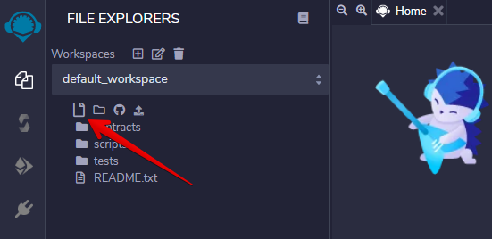

# How to Deploy an Ethereum Contract

## Goal
To deploy a smart contract for it to be available to users of an Ethereum network.  
To deploy a smart contract, you have to:
* Compile your smart contract.
* Create and send an Ethereum transaction containing the code of the compiled smart contract without specifying any recipients.

## Before You Begin
* Understand the following:
  * What is the [Ethereum network](https://ethereum.org/en/developers/docs/networks/)?
  * What is a [transaction](https://ethereum.org/en/developers/docs/transactions/)?
  * What is a [smart contract](https://ethereum.org/en/developers/docs/smart-contracts/anatomy/)?
  * What are [gas and fees](https://ethereum.org/en/developers/docs/gas/)?
  * How to compile a [smart contract](https://ethereum.org/en/developers/docs/smart-contracts/compiling/).
* Make sure you have some ETH to pay transaction fees.

## Steps

**Step 1**  
For the EVM to be able to run your contract, it needs to be in bytecode.
Let's use a simple smart contract:  
```js
pragma solidity ^0.5.12;

contract helloWorld {
    string public text = "Hello World!";

    function callHelloWorld() public view returns (string memory) {
        return text;
    }
}
```  
[Compile](https://ethereum.org/en/developers/docs/smart-contracts/compiling/) your smart contract to get the contract's bytecode.


**Step 2**  
Set your gas limit (in coins) like other transaction.
Be aware that contract deployment needs a lot more gas than a simple coin transfer.

**Step 3**  
Deploy the script or plugin.

**Step 4**  
Access an [Ethereum node](https://ethereum.org/en/developers/docs/nodes-and-clients/), either by running your own, connecting to a public node, or via an API key using a service like Infura or Alchemy.

Once deployed, your contract will have an Ethereum address like other [accounts](https://ethereum.org/en/developers/docs/accounts/).  

----  

## Example: Deploying a Smart Contract in Test Mode Using Remix

### Goal
To deploy your smart contract on an Ethereum test network.  

> Deploying a smart contract on the blockchain is just sending a transaction containing the code of the compiled smart contract without specifying any recipients.

### Steps
**Step 1**  
Visit [Remix](https://remix.ethereum.org/) and create a new file.  

<div className='neon-img-width-300' style={{textAlign: 'center'}}>



</div>

**Step 2**  
On the upper left part of the Remix interface, add the new file and enter the file name you want. In the new file, paste your smart contract code.  

<div className='neon-img-width-600' style={{textAlign: 'center'}}>


</div>

**Step 3**  
Navigate to the compile icon on the left-hand side and click `Compile`.  

<div className='neon-img-width-600' style={{textAlign: 'center'}}>


</div>


You can select the "Auto compile" option so the contract will always be compiled when you save the content on the text editor.

**Step 4**  
Navigate to the deploy icon and go to the transactions screen:

<div className='neon-img-width-600' style={{textAlign: 'center'}}>


</div>

Once you are on the `deploy and run transactions` screen, check that your contract name appears and click `Deploy`.  
The `Javascript VM` of the current environment will appear at the top of the page. It means that you will deploy and interact with the smart contract on a local test blockchain to be able to test without any fees.  

**Step 5**  
Click `Deploy`. Your contract will appear at the bottom.  
Click the arrow on the left to expand it so you can see the content of your contract.  

<div className='neon-img-width-600' style={{textAlign: 'center'}}>


</div>

If your contract contains several modules, you can see the details of each of them by clicking on the corresponding name. You can also see logs of the transactions that are made at the bottom of the window.  

----  

> **Useful links**  
> https://ethereum.org/en/developers/tutorials/deploying-your-first-smart-contract/
