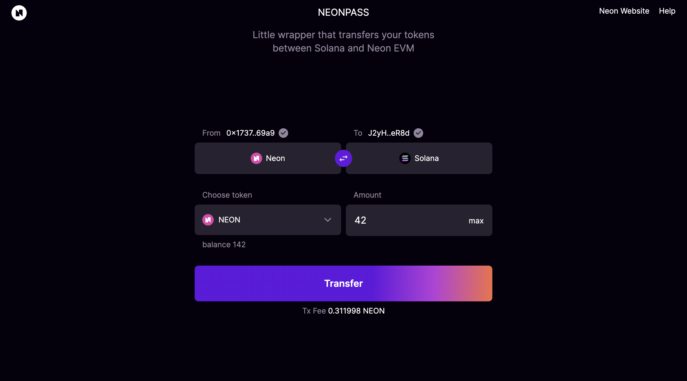
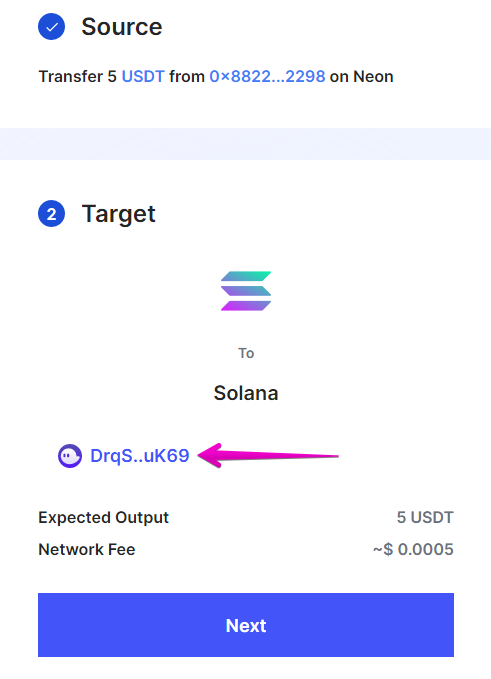
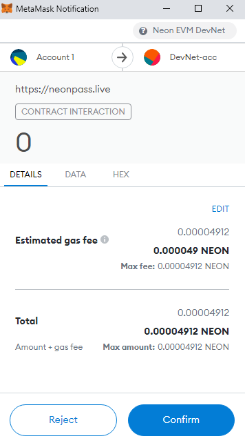
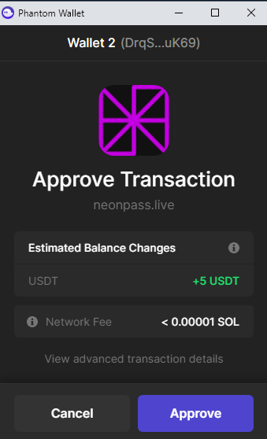

<<<<<<<< HEAD:docs/token_transferring/neonpass_usage.md
---
title: Transferring SPL Tokens
---
========
# Using the Neon Pass

Neon Pass is an open source service designed to transfer tokens between Solana and Neon EVM and provides a user with the following features:
  * Transfer of SPL tokens from Solana to Neon EVM to a non-existent account. The account with an ERC-20 balance are automatically created when transferring tokens.
  * Transfer of SPL tokens from Solana to Neon EVM to an existing account with no ERC-20 balance. The balance is automatically created when transferring tokens.
  * Transfer of SPL tokens from Solana to Neon EVM to an existing account with an ERC-20 balance.
  * Withdrawal of ERC-20 tokens from Neon EVM to an existing account with an SPL balance in Solana.
  * Withdrawal of ERC-20 tokens from Neon EVM to an existing account with no SPL balance in Solana. The balance is automatically created when transferring tokens.

Solana has its own ERC-20 tokens generated by the special application. These tokens are on the balances of SPL accounts inside Solana. Transactions with balances are possible only through a solana's wallet (for example, through [Phantom](https://docs.neon-labs.org/docs/glossary#phantom)). There is no way to directly manage these balances from the Neon EVM.

We provide you with Neon Pass that allows you to make transactions with SPL tokens quickly and conveniently. To transfer tokens from Solana to Neon EVM as well as from Neon EVM to Solana, 2 wallets are required — [Phantom](https://docs.neon-labs.org/docs/glossary#phantom) and [Metamask](https://docs.neon-labs.org/docs/glossary#metamask), which provide the addresses of a recipient and a sender. Transactions are signed with keys obtained from these addresses.

> The Neon Pass service provides Ethereum users with the ability to transfer SPL tokens to Neon EVM and withdraw them back.
>>>>>>>> develop:docs/token_transferring/neonpass_overview.md

## Overview
This guide provides instructions on how to transfer ERC-20 tokens between Solana and Neon EVM using Neon Pass. You can do it in any direction, i.e. transfer tokens from Solana to Neon EVM or withdraw them back. However, you need to keep in mind that each transaction in Neon EVM or Solana will be charged a fee in the form of NEON or SOL tokens, respectively. For example, withdrawing tokens from Neon EVM to Solana requires 2 transactions — one for Neon EVM (requires fee in NEON) and another for Solana (requires fee in SOL). Therefore, you will have to pay 2 fees.

Before you start to transfer ERC-20 tokens, you have to fulfill the following requirements:
  * On a source side, you should already have an account with the balance of tokens that will be transferred.
  * Neon Pass uses [Metamask](about/terminology.md#metamask) and [Phantom](about/terminology.md#phantom) — two popular non-custodial browser based wallets.
  * The Neon Pass application is deployed in the browser to which your wallets are attached.

## Procedure
This procedure presents the example of transferring USDT tokens from Neon EVM to Solana in Devnet. The task is to transfer 5 USDT from Neon EVM to Solana.

Initial conditions:
  * Your Neon EVM account contains non-zero USDT-balance.
  * You have a non-zero NEON balance to pay the withdrawal approval fee.
  * Your Solana account contains non-zero SOL-balance to pay fee.

Transferring tokens using Neon Pass takes 3 stages:
  * Source — connecting the Metamask wallet to Neon Pass and providing access to the sender's account balance.
  * Target — connecting the Phantom wallet to Neon Pass and providing access to the recipient's account balance.
  * Confirmation — signing the transaction and checking the result of transferring tokens.

### The Source stage

Go to the [Neon Pass](https://neonpass.live/) page in the browser to which the Phantom and Metamask wallets are attached. Make sure that the icons of these wallets are displayed at the top right. By default, the direction of transferring tokens is set from `Solana` to `Neon`. If this is not the case you have to click on the arrow icon to reverse the forwarding direction.

Click `Connect Wallet` to connect your Metamask wallet to the Neon Pass app. The Metamask window should pop up on the screen. Follow the login procedure to your wallet and make sure it is connected to Devnet. Also make sure you have enough USDT tokens in your account to transfer (there are 987.9 USDT in our example) and have a non-zero NEON balance to pay the withdrawal approval fee. Upon successful connection of the Metamask wallet to Neon Pass and access to your account balance, the inscription `Connect Wallet` will change to the public key of your account in Neon EVM.

On the Neon Pass screen, click `Select a token`. In the list that appears, select the desired token symbol and specify the quantity to be sent (in our example, it is 5 USDT).

Click `Next` to continue the token transfer procedure and proceed to the Target stage.

### The Target stage

The `Target` windows will appear on the Neon Pass screen. Click `Select Wallet` to connect your Phantom wallet to Neon Pass.

The Phantom window should pop up on the screen. Follow the login procedure to your wallet and make sure it is connected to Devnet. Also make sure you have non-zero SOL balance in your account to pay fee (there are 10 SOL in our example).

Upon successful connection of the Phantom wallet to Neon Pass and access to your account balance, the inscription `Select Wallet` will change to the public key of your account in Solana. This means that a user authorizes Neon Pass to use this key to sign transactions. Phantom stores sets of account keys, but does not store any balances. To obtain balances, Phantom will refer to the Solana blockchain.

Click `Next` to continue the token transfer procedure and proceed to the Confirmation stage.

### The Confirmation stage

Read the details of the upcoming transfer of tokens and click `Confirm`.

Metamask window will pop up on the Neon Pass screen with the amount of fee charged for using gas in Neon EVM. The fee is paid in NEON tokens. If you agree with these terms, click `Confirm`. The transaction will be signed automatically with the public key of your Neon EVM account.

You should also approve the transaction in the Phantom window, which will display the amount transferred and fee charged in SOL tokens. The transaction will be signed automatically with the public key of your Solana account.

You should receive a notification that the token transfer was successful. Open the `View on Solana Explorer` page to see the results of transferring funds using Neon Pass.

The `Token Balance Change` tab shows the change in balances upon completion of the procedure.

## Conclusion

We examined the use of Neon Pass in Devnet using the example of transferring USDT tokens from Neon EVM to Solana. The procedure for reverse transferring tokens from Solana to Neon EVM using Neon Pass is not much different from the one given, and therefore we do not consider it here. The main difference will be only in the order of connecting wallets to Neon Pass.
