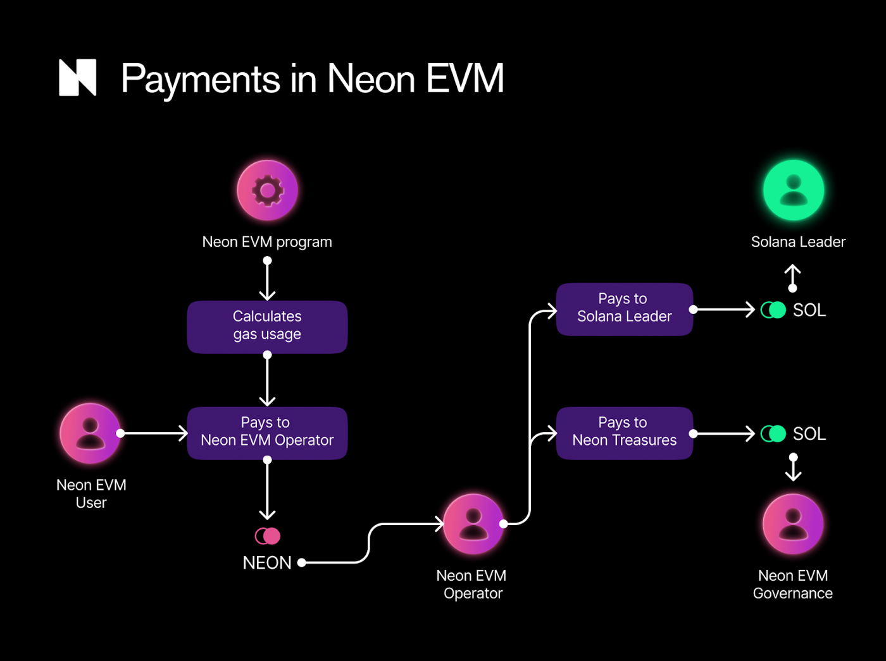

import GasPrice from '../single-source-snippets/_gas-price.mdx'

## Key takeaways

The NEON token is used to pay the “gas fees” required for transaction execution. The gas fee is the amount of NEON tokens that a user needs to pays for a transaction to execute it successfully.

On a high level, gas fee payments in the Neon EVM work as follows:
1. The **User** pays for each transaction in NEON tokens to the **Proxy Operator**.
2. The **Proxy Operator** then pays the **Solana Validator** and the **DAO Treasury**.

As depicted in the diagram above, users of dApps built on the Neon EVM pay in NEON tokens for all the resources they consume, in addition to Operator fees that differ between Operators. Operators, however, use SOL to pay for the resources they consume. Specifically, operators pay Solana validators and governance fees in SOL. Operators pay the same amount for governance as they pay to Solana validators (for the signature validation).

The gas fee that a user pays is calculated as **gas amount \* gas price**.

The **gas amount** is the amount of computational resources, such as CPU time and storage, used to execute the transaction. The gas amount is calculated mainly in accordance with Solana's rules (in fact, 1 gas unit = 1 lamport) as a sum of the following amounts:
* The **computational cost**, which is 5,000 units for each transaction (Solana charges 5,000 lamports for the signature validation for each transaction). This amount goes to Solana validator. This computational cost is **doubled** to give the same amount of gas fees to the **DAO Treasury**.
* The **storage cost**, which is 6,960 units for each newly allocated byte (Solana charges 6,960 lamports for each byte), while re-use of existing or already-allocated storage is free.

For example, for a Neon transaction with N iterations and S newly allocated bytes, the gas amount will be:

> 2 \* computational cost + storage cost

> = 2 \* 5,000 \* N + 6960 \* S  units

<GasPrice/>

## Examples
The following are some examples of gas fee calculation on Neon. They are all based on the following assumptions:
* The SOL price is $30 and the NEON price is $0.25
* The SOL-to-NEON rate is therefore 30 / 0.25 = 120.
* The Proxy Operator fee is 10%.
* The gas price is therefore (1 + 10%) \* 120 \* 10-9 NEON = 132 \* 109 Alan = 132 Galan

### Example 1: swap
The gas amount in this case is 10 \* 2 \* 5,000 (computational cost + treasury) + 5 \* 6,960 (storage cost) ≈ 134,800 units
The total gas fee is therefore 134,800 units \* 132 \* Galan = 0.01779 NEON.

### Example 2: create a new account
Within [Solana](https://docs.solana.com/storage_rent_economics), the rental cost for storage can be paid via one of two methods:
1. Set it and forget it. 

> With this approach, accounts with two years' worth of rent deposited are exempt from network rent charges. By maintaining this minimum balance, the broader network benefits from reduced liquidity and the account holder can rest assured that their data will be retained for continual access and usage.

2. Pay per byte. 

> If an account has less than two years' worth of deposited rent, the network charges rent on a per-epoch basis, in credit for the next epoch. This rent is deducted at a rate specified in genesis, in lamports per kilobyte-year.

To simplify the user experience, Neon charges two years' worth of rent deposits for each new account. The the gas cost of creating a new account is:
> 0 \* 2 \* 5,000 (computational cost + treasury) + (128 + 71) \* 6960 (storage cost for the minimum Neon account size) ≈ 1,400,000 units

Therefore, the total gas fee is 1,400,000 units \* 132 Galan = 0.1848 NEON tokens.

### Example 3: transfer

In the case of a transfer of NEON or ERC-20 tokens, the gas amount is:
> 1 \* 2 \* 5,000 (computational cost + treasury) + 0 \* 6,960 (storage cost in case the account exists) ≈ 10,000 units

Therefore, the total gas fee is 10,000 units * 132 Galan = 0.00132 NEON tokens.

## What next?

If you want to get your dApp started on Neon EVM you may be wondering how you pay for the first transactions that are required to buy the NEON required to cover gas costs. This is where our starter pack of [gasless transactions](/docs/developing/gasless) comes in.
