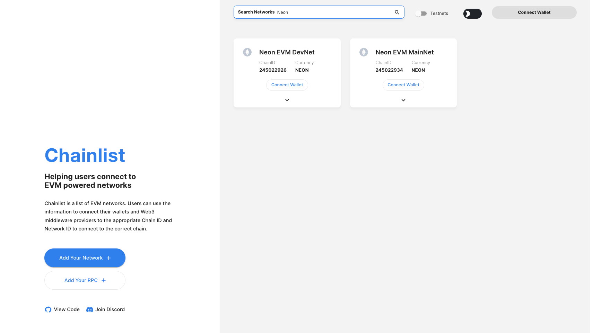
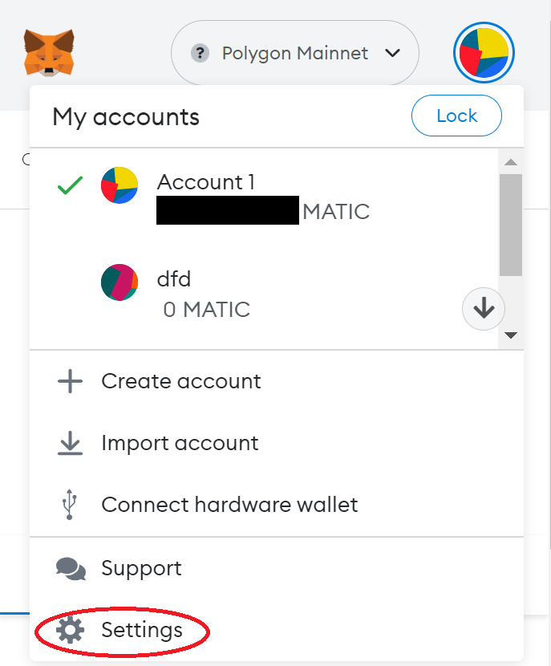
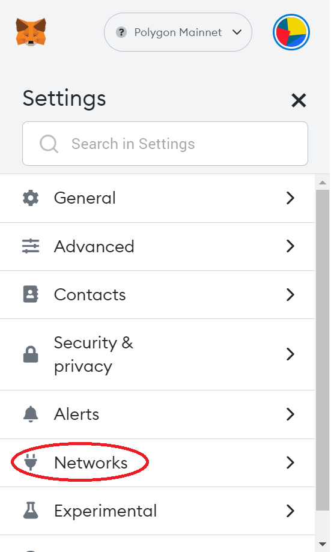
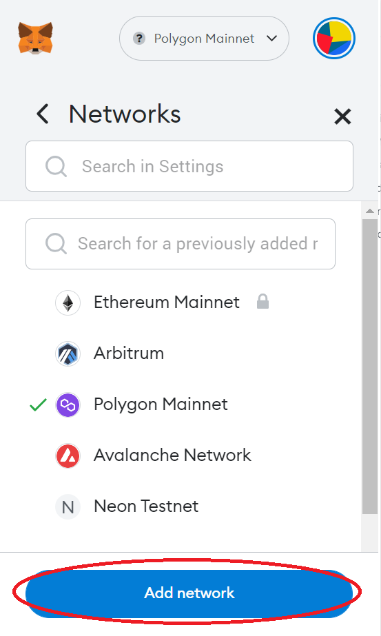
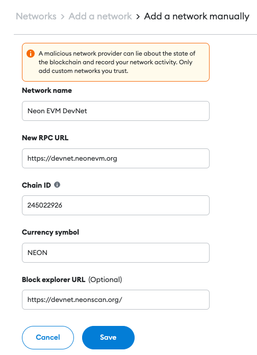

## TL;DR

RPC endpoints are available on [Chainlist](https://chainlist.org/?chain=245022926&testnets=true&search=Neon+EVM).

## Introduction 
MetaMask is a convenient and fairly easy-to-use application for storing Ethereum addresses and private keys. This tutorial will guide you, step by step, in installing MetaMask on your device and connecting the wallet to the Neon Devnet environment.  

## Configuring MetaMask

### Step 1: Install MetaMask
Go to the MetaMask [download page](https://metamask.io/download). From there, select any platform you use and follow the instructions to load and install MetaMask on your device's browser.  

### Step 2: Add the MetaMask Extension
MetaMask is essentially a plugin in the form of an extension to a browser. Therefore, MetaMask can be added to your browser as an extension. In the window click `Add extension`.  

### Step 3: Create a Wallet
Click on `Create a Wallet`. On the support page, `Help Us Improve MetaMask`, click `I agree`.

The password generation form should open on the display. Enter a secret code that must contain at least 8 symbols. A secret phrase will be generated automatically. Record the secret phrase for backup (preferably not on a device connected to the Internet). Without this phrase, your funds cannot be refunded if your device is damaged or lost. Confirm that you have written it down on the next page.  

After that, you should see your wallet linked to your account.

### Step 4: Connect MetaMask to a Remote Proxy
There are two ways to connect MetaMask to a remote Neon proxy.

#### Option A: Automatic Setup with Chainlist.org
Go to [Chainlist](https://chainlist.org/) and type `Neon` in the search bar, toggle "Testnets". You should see `Neon EVM Devnet` and `Neon EVM Mainnet`.  

Select `Neon EVM Devnet` and click `Connect Wallet`. A MetaMask pop-up window will show. Click `Next` and then `Connect`. You can now access the [Solana cluster](https://docs.solana.com/clusters) and carry out transactions.

Your MetaMask wallet has been successfully installed, configured, and is ready to use. Enjoy!

#### Option B: Manual Configuration
In the MetaMask browser extension's upper-right corner, click the multicolored circle element in the top right. Select "Settings" from the dropdown menu to connect to the proxy server.  

At this point, a window with the settings menu for selecting a network should open.  

Add a Network.  

The new window contains the settings for six default subnets. You need to use these settings to connect to the desired proxy. Click `Add Network`.  

Fill in the fields on the next page.

* `Network Name`: "Neon EVM DevNet"
* `New RPC URL`: https://devnet.neonevm.org
* `Chain ID`: 245022926
* `Currency Symbol`: NEON
* `Block Explorer URL (optional)`: https://devnet.neonscan.org

> **Note:** The `Chain ID` is specified for [Devnet](https://docs.solana.com/clusters#devnet). To choose [Testnet](https://docs.solana.com/clusters#testnet) or [Mainnet](https://docs.solana.com/clusters#mainnet-beta) in this field, you need to specify the value *245022940* or *245022934*, respectively. The `New RPC URL` must also be changed to either https://testnet.neonevm.org for Testnet, or https://mainnet.neonevm.org for Mainnet.

The wallet settings depend on the values given for the options mentioned above.

Click `Save` to keep the settings.  
Your MetaMask wallet has been successfully installed, configured, and is ready to use. Enjoy!
